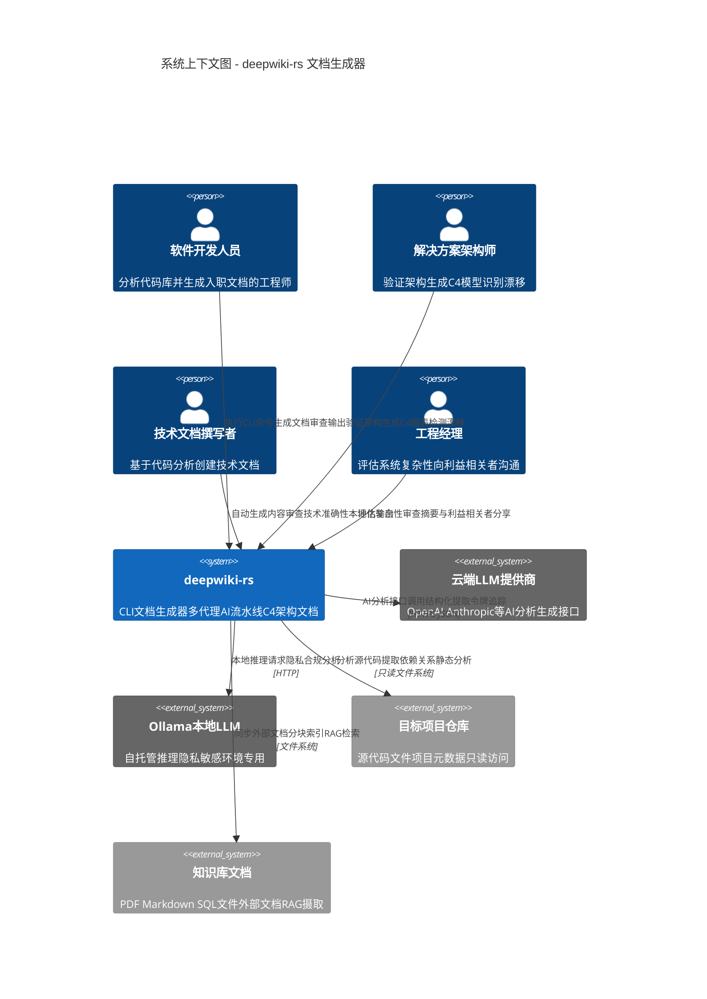

# 项目概述：deepwiki-rs 系统上下文

**文档版本：** 1.0  
**生成日期：** 2026-02-01 06:34:24 (UTC)  
**分类：** 架构文档（C4 系统上下文级别）  
**置信度评分：** 92%

---

## 1. 执行摘要

**deepwiki-rs** 是一款基于 Rust 的智能命令行界面（CLI）应用程序，旨在自动化生成软件项目的全面 C4 架构文档。通过利用复杂的多智能体 AI 流水线，该系统分析 12 种以上编程语言的源代码，并生成专业级的架构文档，包括系统上下文图、领域模块分析、工作流文档和技术边界规范。

该系统作为独立的文档生成引擎运行，通过自动化的静态分析和 AI 驱动的洞察，弥合快速演变的代码库与常常过时的手动文档之间的差距。

---

## 2. 系统概述

### 2.1 核心目标

deepwiki-rs 的主要目标是：

- **文档自动化：** 通过自动分析代码库并生成符合 C4 模型的架构文档，消除手动文档维护的开销
- **知识保留：** 在团队人员流动或时间推移导致知识流失之前，捕获机构知识和架构决策
- **加速入职：** 使软件工程师能够在不阅读每个源文件的情况下理解不熟悉的代码库
- **架构验证：** 识别文档化设计与实际实现之间的架构漂移
- **多语言支持：** 在异构技术栈（Rust、Java、Python、JavaScript/TypeScript、C#、PHP、Swift、Kotlin、C++、Go 和现代前端框架）中提供一致的文档生成

### 2.2 业务价值

deepwiki-rs 为工程组织提供可量化的价值：

| 价值维度 | 描述 |
|----------------|-------------|
| **成本降低** | 通过自动化减少文档维护工作量；通过智能缓存 LLM 响应最小化 API 成本 |
| **风险缓解** | 通过直接从源代码派生文档防止文档漂移；保留架构上下文 |
| **开发速度** | 通过全面的自动生成系统概述，将新开发人员入职时间从数周缩短至数天 |
| **质量保证** | 使架构团队能够根据文档化模式验证实现并识别技术债务 |
| **企业灵活性** | 支持云端 LLM API 和本地推理（Ollama），满足严格的数据隐私和安全要求 |

### 2.3 技术特性

- **架构模式：** 遵循领域驱动设计（DDD）原则的模块化、基于流水线的设计，具有清晰的限界上下文
- **处理模型：** 多阶段 AI 流水线（预处理 → 研究 → 组合 → 输出），利用 8 个专业研究智能体
- **语言生态系统：** 原生 Rust 实现，支持 async/await 并发，利用零成本抽象和内存安全保证
- **AI 集成：** 双提供商支持（云端 API + 本地 Ollama），支持 ReAct（推理和行动）工具增强执行
- **可扩展性：** 具有受控并发的并行处理；分层缓存层用于性能优化
- **国际化：** 支持 8 种语言的完整 i18n 支持，支持本地化输出生成

---

## 3. 目标用户和利益相关者

该系统服务于四个不同的用户角色，每个角色都有特定的交互模式和价值主张：

### 3.1 软件开发人员
**简介：** 个人贡献者和高级工程师，处理不熟悉的代码库或维护遗留系统。

**使用场景：**
- 在没有大量指导的情况下入职新团队或项目
- 理解遗留代码中的依赖关系和架构模式
- 为继承的项目生成"现状"文档
- 分析开源库以评估集成可行性

**关键需求：**
- 无需详尽阅读代码即可快速理解项目结构
- 识别关键模块和入口点
- 理解数据流和组件关系
- 与代码变更同步的最新文档

### 3.2 架构团队
**简介：** 解决方案架构师、企业架构师和首席工程师，负责跨领域关注和标准。

**使用场景：**
- 验证实现是否符合架构蓝图
- 为架构审查委员会生成基线 C4 图
- 识别长期运行项目中的架构漂移
- 跨组织边界标准化文档格式

**关键需求：**
- 自动生成 C4 模型（上下文、容器、组件、代码级别）
- 检测未经授权的依赖或边界违规
- 跨多个仓库的一致文档结构
- 与现有架构治理工作流集成

### 3.3 技术文档撰写者
**简介：** 支持工程团队的文档专家，需要对每个代码库都有深入的编程专业知识。

**使用场景：**
- 自动生成 API 文档的初始草稿
- 为用户指南创建理解系统工作流
- 跨不同技术栈生成一致的技术内容
- 减少手动记录 CLI 接口和配置选项的时间

**关键需求：**
- 从技术源代码生成人类可读的叙述
- 自动提取接口边界和使用示例
- 需要最少手动重组的结构化输出
- 支持多种输出语言以服务全球受众

### 3.4 工程经理
**简介：** 工程主管、总监和副总裁，需要了解系统复杂性以进行资源规划和利益相关者沟通。

**使用场景：**
- 评估技术债务和重构优先级
- 向非技术利益相关者沟通系统范围
- 评估微服务间的文档覆盖差距
- 规划单体系统的迁移策略

**关键需求：**
- 高级系统边界可视化
- 复杂性指标和模块重要性评分
- 快速评估外部依赖和集成点
- 适合利益相关者演示的执行摘要

---

## 4. 系统范围和边界

### 4.1 系统定义

deepwiki-rs 是一个**只读分析和文档生成工具**。它作为一个复杂的类编译器流水线运行，摄取源代码和元数据，执行多层 AI 增强分析，并发出 markdown 文档产物。系统严格在开发环境内运行，不与运行时系统交互。

### 4.2 包含的组件（范围内）

以下能力构成核心系统边界：

| 组件类别 | 具体能力 |
|-------------------|---------------------|
| **接口层** | CLI 参数解析（20+ 选项）、配置管理（基于 TOML）、环境特定覆盖 |
| **分析引擎** | 多语言静态分析器（12+ 语言处理器）、依赖提取、接口解析 |
| **AI 流水线** | 多智能体研究编排（8 个专业智能体）、ReAct 工具执行、结构化 JSON 提取 |
| **LLM 集成** | 多提供商客户端（云端 API + Ollama）、回退模型配置、令牌管理 |
| **缓存基础设施** | 基于 MD5 密钥的基于文件的响应缓存、TTL 过期、性能监控 |
| **知识集成** | RAG 风格的文档分块（Markdown/SQL 感知）、外部知识库同步 |
| **文档组合** | 符合 C4 模型的 markdown 生成、Mermaid 图合成、8 语言 i18n 支持 |
| **输出生成** | 磁盘持久化、目录结构创建、后处理（Mermaid 语法修复）、摘要报告 |

### 4.3 排除的组件（范围外）

以下内容明确在**系统边界之外**：

- **目标项目运行时：** 系统不执行、部署或与被分析代码库的运行实例交互
- **开发环境扩展：** 无 IDE 插件、编辑器扩展或语言服务器协议（LSP）集成
- **文档托管：** 无 Web 服务器、Wiki 平台或文档管理系统功能
- **版本控制操作：** 除了读取仓库文件外，无 Git 集成、仓库克隆或版本历史分析
- **CI/CD 流水线集成：** 除了生成适合流水线消费的输出产物外，无原生 Jenkins/GitHub Actions/GitLab CI 集成
- **协作功能：** 无实时编辑、审查工作流或多用户同步
- **源代码修改：** 系统保持严格的只读策略；未实现重构、代码生成或"修复"建议

### 4.4 系统边界原理

边界定义旨在保持文档生成引擎与更广泛软件开发生命周期工具链之间的**关注点分离**。deepwiki-rs 作为一个专门的编译器运行：输入是源代码，输出是文档。与版本控制、CI/CD 或托管平台的集成是外部工作流编排工具的责任，这些工具可以将 deepwiki-rs 作为子进程调用。

---

## 5. 外部系统交互

系统与四类外部系统交互，每类服务于不同的功能需求：

### 5.1 云端 LLM 提供商
**系统：** OpenAI GPT-4、Claude 或兼容的 API 提供商  
**交互类型：** 使用身份验证的同步 HTTPS/JSON API 调用  
**数据流：** 
- 出站：源代码洞察、压缩的项目上下文、结构化提示
- 入站：AI 生成的分析结果、架构洞察、自然语言描述

**关键性：** 高 - AI 驱动分析阶段的核心依赖  
**弹性：** 通过重试逻辑、指数退避和回退模型配置实现

### 5.2 本地 LLM 推理（Ollama）
**系统：** 自托管 Ollama 服务器  
**交互类型：** 本地/组织服务器的 HTTP API  
**数据流：**
- 出站：分析提示、代码片段（用于隐私敏感环境）
- 入站：本地推理结果、架构分析

**关键性：** 高 - 气隙环境或数据主权环境的主要选项  
**配置：** 可选的双模型设置，支持云端回退

### 5.3 目标项目文件
**系统：** 包含要分析的源代码的文件系统  
**交互类型：** 只读文件系统操作  
**访问模式：**
- 递归目录遍历
- 文件内容读取（源代码、Cargo.toml、package.json 等配置文件）
- 导入/依赖解析

**约束：** 
- 强制执行只读访问（无写入、修改或删除操作）
- 尊重 .gitignore 和自定义排除模式
- 支持符号链接处理和循环检测

### 5.4 知识库文档
**系统：** 外部文档仓库（PDF、Markdown、SQL 文件、纯文本）  
**交互类型：** 文件摄取和分块处理  
**处理：**
- 变更检测和缓存失效
- 语义分块（Markdown 标题感知、SQL 语句感知）
- RAG 风格的检索用于上下文增强

**用例：** 
- 集成现有架构决策记录（ADR）
- 整合代码中不存在的业务领域知识
- 参考手册集成以获取准确的 API 文档

---

## 6. 系统上下文图（C4 级别 1）

下图说明了 deepwiki-rs 运行的高级上下文，显示用户、系统和外部依赖。

### 6.1 关键交互流程

**主要流程 - 文档生成：**
1. 用户（开发人员/架构师）使用目标项目路径调用 CLI
2. 系统读取目标仓库文件（静态分析）
3. 系统可选地同步知识库文档
4. 系统执行多智能体 AI 流水线（利用云端 LLM 或 Ollama）
5. 系统将生成的 markdown 文档持久化到本地文件系统
6. 用户审查生成的 C4 架构文档

**次要流程 - 知识集成：**
1. 技术文档撰写者维护外部知识文档（ADR、领域文档）
2. 系统在同步阶段摄取和分块文档
3. AI 智能体在研究阶段检索相关上下文
4. 生成的文档整合外部业务上下文

---

## 7. 关键架构决策

### 7.1 多智能体 AI 流水线架构
**决策：** 实现 8 个专业研究智能体，在不同 C4 抽象级别运行，而不是单一的单一 AI 模型。

**原理：** 分阶段依赖模式确保高级上下文（C1 系统上下文）指导详细分析（C3-C4 模块洞察），减少幻觉并提高一致性。

### 7.2 只读分析约束
**决策：** 严格执行对目标项目的只读文件系统访问。

**原理：** 确保生产代码库的安全；消除文档工具损坏源代码的风险；支持"可在任何地方安全运行"的部署模型。

### 7.3 双 LLM 提供商支持
**决策：** 抽象 LLM 集成以通过统一接口支持云端 API 和本地 Ollama 推理。

**原理：** 满足企业安全要求（气隙环境），同时保持云端灵活性；通过本地推理敏感数据实现成本优化。

### 7.4 语言无关预处理
**决策：** 基于特性的语言处理器架构，通过可插拔模块支持 12+ 语言。

**原理：** 在异构技术栈中最大化核心 AI 流水线的重用；允许特定领域的解析（例如 React 组件边界与 Rust 模块层次结构）。

### 7.5 基于文件的缓存层
**决策：** 使用性能监控实现 LLM 响应的持久化 MD5 缓存。

**原理：** 显著降低迭代文档生成的成本；支持离线重放以前的分析；提供 AI 推理的审计跟踪。

---

## 8. 数据和控制流摘要

系统实现具有清晰数据转换边界的**四阶段流水线架构**：

| 阶段 | 输入 | 处理 | 输出 |
|-------|-------|------------|--------|
| **预处理** | 原始源文件 | 特定语言解析、依赖提取、AI 增强代码分类 | CodeInsight 对象、项目结构 |
| **研究** | 预处理产物 | 8 智能体并行分析（系统上下文 → 领域 → 架构 → 边界） | 结构化研究报告（JSON） |
| **组合** | 研究数据、知识库 | 基于模板的 markdown 生成、图合成、i18n 本地化 | Markdown 文档、Mermaid 图 |
| **输出** | 生成的文档 | 文件持久化、语法验证、摘要统计 | 文档目录、性能报告 |

**控制流：** 由核心生成域编排，具有线程安全状态管理（Arc<RwLock<T>>），确保在跨多智能体流水线的并发处理安全，同时保持确定性输出排序。

---

## 9. 合规性和约束

- **隐私：** 本地 Ollama 支持确保在需要时源代码不会离开组织边界
- **安全：** 只读访问模型；无网络入口要求；无权限提升
- **可扩展性：** 通过项目级并行化实现水平扩展；有界并发防止资源耗尽
- **可维护性：** Rust 的内存安全保证；全面的错误处理；整个流水线的结构化日志

---

**文档所有者：** 架构团队  
**审查周期：** 每个主要版本  
**相关文档：** C4 容器图、领域模型规范、研究智能体架构

*本文档代表 deepwiki-rs 的 C4 系统上下文（级别 1）视图，提供适合技术和非技术利益相关者的战略概述。*
