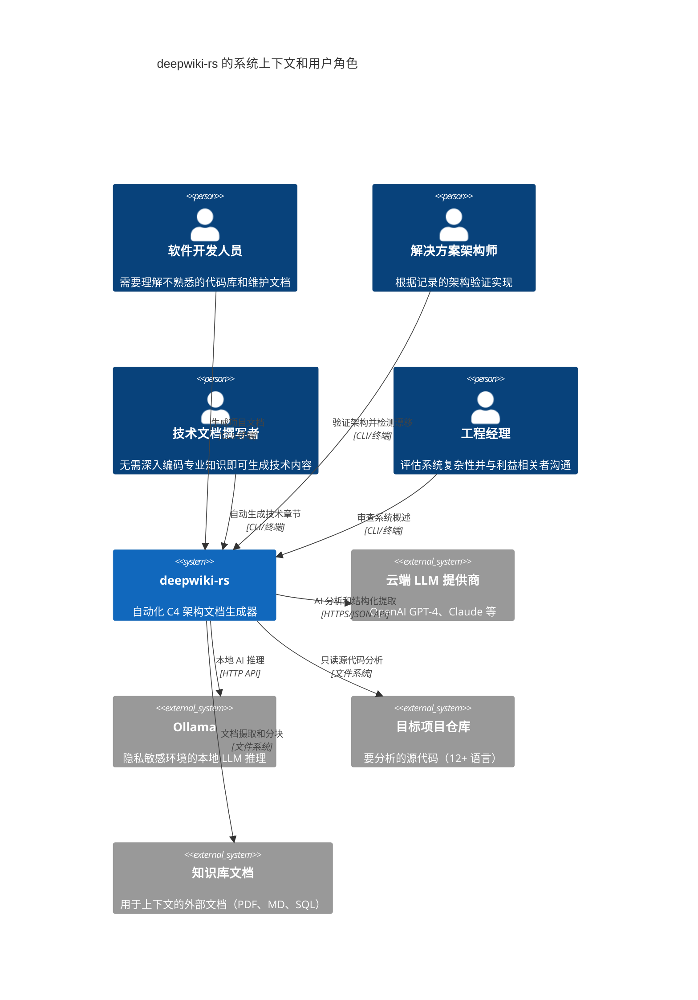
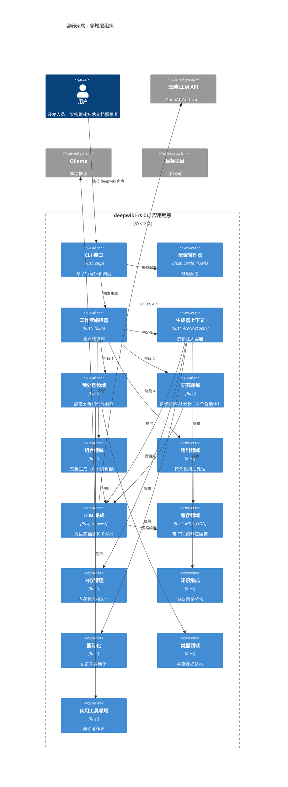
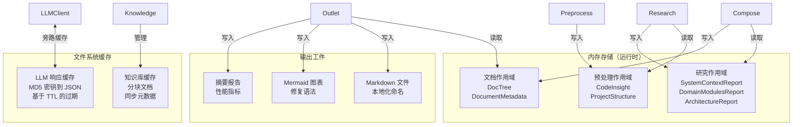
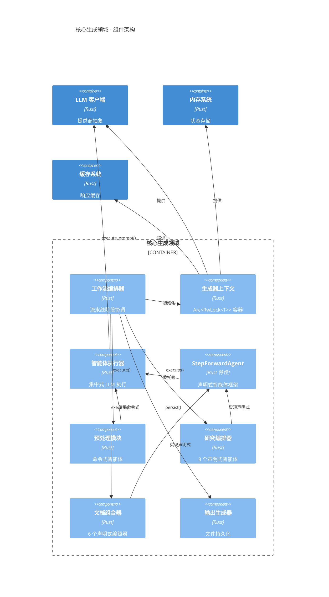
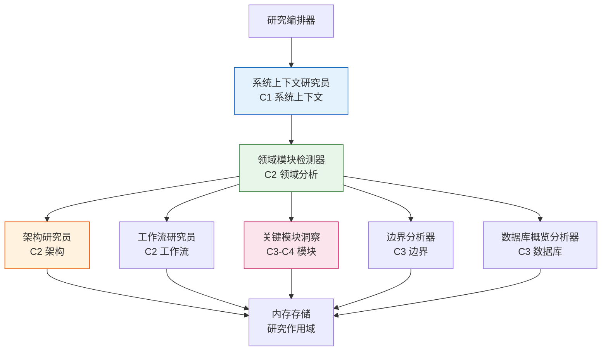
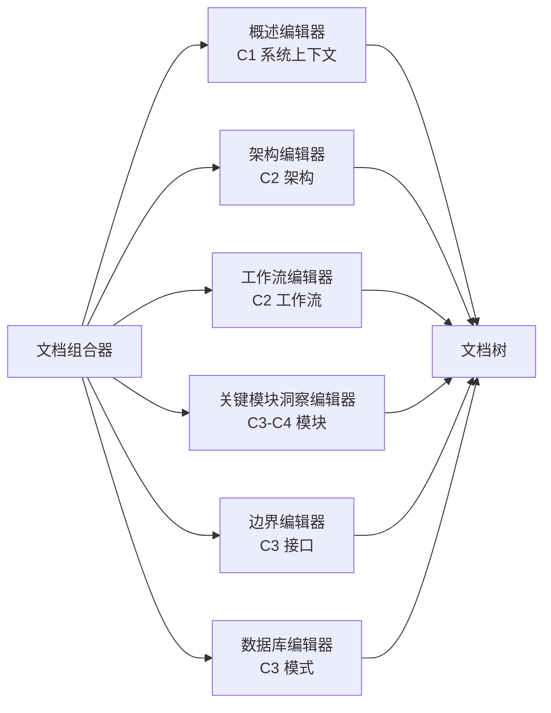
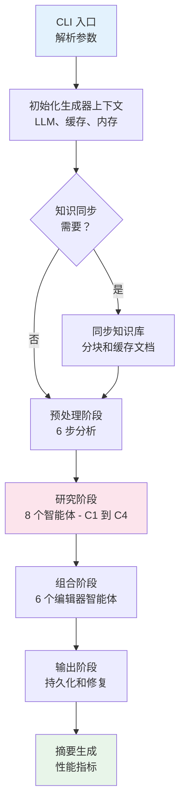
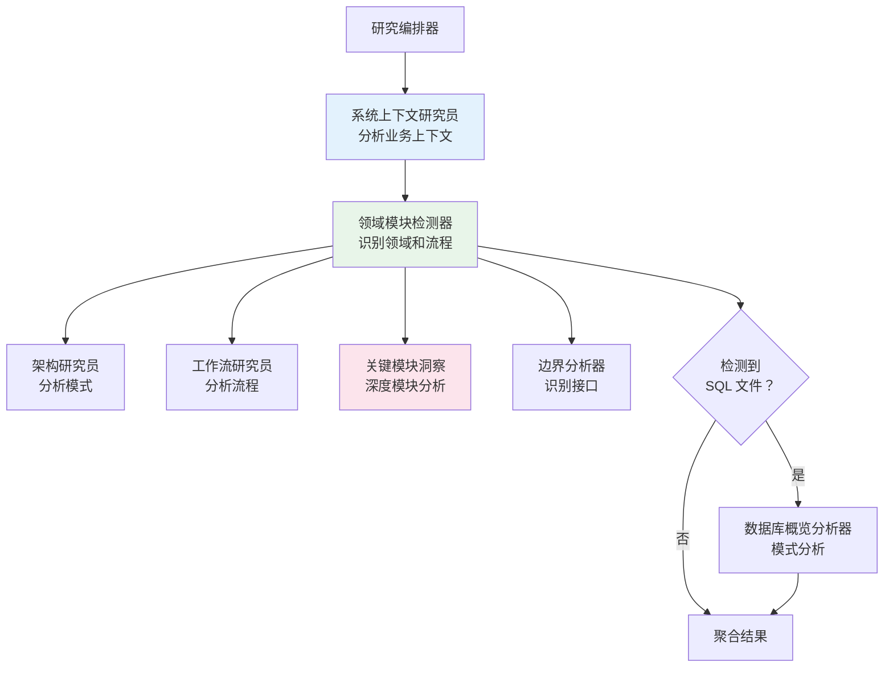
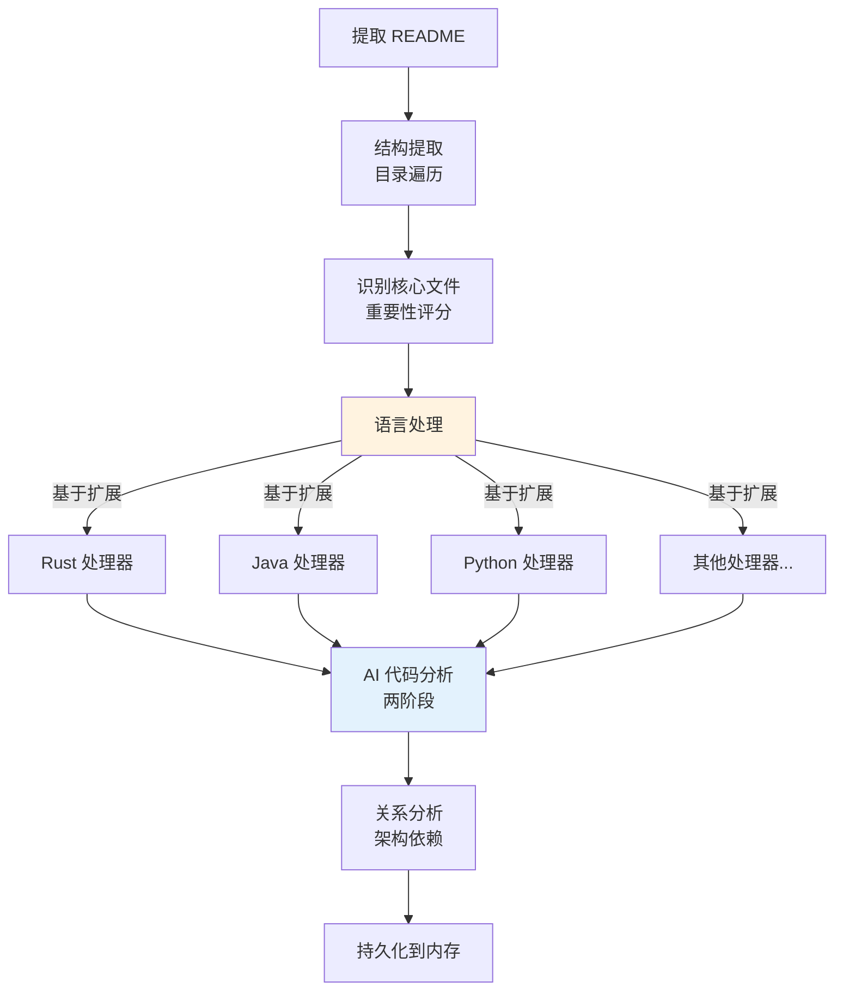

# 系统架构文档：deepwiki-rs

**版本：** 1.0  
**分类：** 内部架构文档  
**生成日期：** 2026-02-01 06:35:32 (UTC)

---

## 1. 架构概述

### 1.1 设计理念

deepwiki-rs 实现了一个**多智能体 AI 流水线架构**，旨在弥合源代码仓库与全面的 C4 架构文档之间的差距。该系统遵循四个基本设计原则：

**1. 基于流水线的关注点分离**  
架构将复杂的文档生成过程分解为四个离散阶段——预处理、研究、组合和输出——每个阶段作为一个限界上下文运行，具有明确定义的输入和输出。这确保了单向数据流并防止循环依赖。

**2. 声明式智能体定义**  
研究和组合逻辑通过 `StepForwardAgent` 特性封装，支持声明式智能体配置，包括数据源、提示模板和输出模式。这种模式将智能体*做什么*与*如何做*分离，促进快速智能体开发和测试。

**3. 语言无关分析**  
通过 `LanguageProcessor` 特性系统，架构在统一接口后面抽象特定语言的解析，支持 12+ 种编程语言，具有一致的依赖提取和复杂性指标。

**4. 上下文感知智能**  
系统通过外部知识集成实现检索增强生成（RAG）能力，允许架构决策、领域知识和现有文档为 AI 分析提供信息。

### 1.2 核心架构模式

| 模式 | 实现 | 目的 |
|---------|---------------|---------|
| **流水线模式** | `WorkflowOrchestrator` 协调 4 个顺序阶段 | 强制执行处理顺序和阶段隔离 |
| **多智能体系统** | 8 个专业研究智能体 + 6 个组合编辑器 | 并行领域专业应用 |
| **策略模式** | `LanguageProcessor` 特性，12+ 实现 | 语言无关代码分析 |
| **上下文模式** | `GeneratorContext` 使用 `Arc<RwLock<T>>` | 线程安全依赖注入 |
| **模板方法** | `StepForwardAgent` 特性生命周期 | 标准化智能体执行流程 |
| **旁路缓存** | 集成 `CacheManager` 的 LLM 客户端 | API 成本优化 |
| **断路器** | 阶段特定错误边界 | 优雅降级和部分故障处理 |

### 1.3 技术栈概述

**核心语言和运行时**
- **Rust (2021 版)**：内存安全，无垃圾回收，零成本抽象，出色的异步性能
- **Tokio**：用于文件系统和网络边界非阻塞 I/O 操作的异步运行时

**关键库和框架**
- **clap**：使用派生宏的声明式 CLI 参数解析
- **Serde + TOML**：配置序列化和结构化数据持久化
- **reqwest**：用于 LLM API 通信的 HTTP 客户端
- **Mermaid**：用于 C4 可视化输出的图表生成

**AI 和 LLM 集成**
- **ReAct 模式**：支持工具增强 LLM 执行的推理和行动框架
- **结构化提取**：类型安全 AI 输出的 JSON 模式验证
- **双提供商支持**：云端 API（OpenAI、Anthropic）和本地推理（Ollama）

---

## 2. 系统上下文（C4 级别 1）

### 2.1 系统定位和价值主张

deepwiki-rs 作为一个**独立 CLI 工具**运行，自动化创建 C4 架构文档。它充当智能文档工程师，能够分析多种编程语言的软件项目并生成专业架构文档，包括系统上下文图、容器视图、组件层次结构和代码级洞察。

**业务价值：**
- **消除文档漂移**：自动将文档与代码库变更同步
- **知识保留**：通过 AI 分析实现模式捕获机构知识
- **加速入职**：减少新开发人员理解不熟悉架构的时间
- **企业灵活性**：支持云端和气隙（本地 LLM）部署场景

### 2.2 目标用户角色



**用户需求分析：**

1. **软件开发人员**：需要快速理解代码库，无需详尽阅读文件；需要 API 文档和依赖可视化
2. **架构团队**：需要 C4 模型合规性、架构漂移检测和跨组织组合的标准执行
3. **技术文档撰写者**：需要从源代码自动生成内容，减少手动 API 文档工作量
4. **工程经理**：需要高级复杂性指标、关键路径识别和利益相关者沟通工件

### 2.3 外部系统交互

| 外部系统 | 交互类型 | 数据交换 | 安全考虑 |
|----------------|-----------------|---------------|------------------------|
| **云端 LLM 提供商** | 使用 Bearer Token 认证的 HTTPS REST API | 源代码片段、提示（压缩）、结构化 JSON 输出 | API 密钥存储在配置文件中；源代码无持久日志 |
| **Ollama** | 到 localhost 的 HTTP API（可配置） | 与云端提供商相同 | 适用于气隙环境；无外部数据传输 |
| **目标项目文件** | 只读文件系统访问 | 源代码、配置文件、文档 | 尊重 `.gitignore`；支持显式排除模式 |
| **知识库文档** | 文件摄取（PDF、MD、SQL、YAML） | 带元数据的分块文档内容 | 仅本地处理；知识库无云端上传 |

### 2.4 系统边界定义

**边界内包含：**
- CLI 参数解析和配置层次结构管理
- 多语言静态代码分析器（Rust、Java、Python、JavaScript、TypeScript、C#、PHP、Swift、Kotlin、React、Vue、Svelte）
- 具有 8 个专业研究智能体的 AI 智能体编排系统
- 具有缓存、重试逻辑和 ReAct 功能的 LLM 客户端
- 遵循 C4 模型标准的文档组合引擎
- 基于 MD5 密钥的基于文件的缓存基础设施
- 支持 8 种语言的国际化框架
- 外部知识库同步和分块
- 使用 Mermaid 图表语法的 Markdown 输出生成

**明确排除：**
- 目标项目的运行时环境或部署基础设施
- IDE 扩展、编辑器插件或语言服务器协议（LSP）实现
- 基于 Web 的文档托管或内容管理系统
- 除读取仓库文件外的版本控制操作（Git 命令）
- 持续集成/持续部署流水线集成
- 实时协作或多用户编辑功能

---

## 3. 容器视图（C4 级别 2）

### 3.1 领域驱动架构层

系统按照领域驱动设计（DDD）原则组织为**12 个限界上下文**，采用分层架构：



### 3.2 领域模块职责

**主要业务领域（核心）**

| 领域 | 职责 | 关键抽象 |
|--------|--------------|------------------|
| **核心生成** | 流水线编排和上下文管理 | `WorkflowOrchestrator`、`GeneratorContext` |
| **预处理** | 跨 12+ 语言的静态代码分析 | `LanguageProcessor` 特性、`CodeInsight` |
| **研究** | 多智能体架构分析（C1-C4） | `StepForwardAgent`、8 个研究智能体 |
| **组合** | 从研究合成文档 | 文档组合器、6 个编辑器智能体 |
| **输出** | 工件持久化和后处理 | `Outlet` 特性、`DiskOutlet`、Mermaid 修复 |

**支持领域**

| 领域 | 职责 | 关键抽象 |
|--------|--------------|------------------|
| **LLM 集成** | 提供商抽象和 ReAct 执行 | `LLMClient`、`AgentBuilder`、工具系统 |
| **知识集成** | 外部文档摄取和 RAG | `KnowledgeSync`、分块策略 |

**基础设施领域**

| 领域 | 职责 | 关键抽象 |
|--------|--------------|------------------|
| **配置管理** | 分层配置和 CLI 解析 | `Config`、`CliArgs`、项目推断 |
| **缓存** | LLM 响应优化 | `CacheManager`、`PerformanceMonitor` |
| **内存管理** | 智能体间状态传输 | `Memory`、作用域键值存储 |
| **国际化** | 多语言支持 | `TargetLanguage`、本地化模板 |
| **类型** | 共享领域模型 | `CodeInsight`、`DocTree`、研究报告 |
| **实用工具** | 横切技术功能 | `PromptCompressor`、`TokenEstimator` |

### 3.3 存储架构

系统采用**混合存储策略**，结合内存状态管理和持久化缓存：



**存储特性：**
- **内存作用域**：三个与流水线阶段对齐的不同生命周期，消费后清除以管理内存占用
- **缓存密钥**：提示内容 + 模型配置的 MD5 哈希，确保确定性查找
- **持久化格式**：使用 Serde 序列化的 JSON，人类可读以便调试
- **无外部数据库**：系统完全在文件系统和内存存储上运行，简化部署

---

## 4. 组件视图（C4 级别 3）

### 4.1 核心生成引擎

核心生成领域通过四个主要组件实现应用程序的架构主干：



**组件职责：**

**工作流编排器**
- 实现流水线执行的模板方法模式
- 管理阶段转换和时间指标收集
- 处理允许部分流水线成功的错误边界（例如，知识同步失败时继续）

**生成器上下文**
- 聚合所有基础设施依赖（`Arc<LLMClient>`、`Arc<RwLock<CacheManager>>` 等）
- 为并发智能体间的共享资源提供线程安全访问
- 实现依赖注入容器模式

**智能体执行器**
- 具有三种执行模式的集中式 LLM 调用工具：
  1. 简单提示执行
  2. 工具增强执行（ReAct 模式）
  3. 带 JSON 模式验证的结构化提取
- 实现自动响应缓存的旁路缓存模式
- 处理重试逻辑和回退模型配置

**StepForwardAgent 特性**
- 智能体定义的声明式框架，指定：
  - **数据源**：从内存或文件系统检索输入数据
  - **提示模板**：带变量替换的动态提示构造
  - **输出模式**：带验证的结构化输出类型
  - **内存作用域**：结果的目标存储
- 使研究和组合智能体专注于领域逻辑而非样板代码

### 4.2 预处理流水线组件


**语言处理器架构：**
实现策略模式，每种语言提供以下具体实现：
- `extract_dependencies()`：解析导入语句和模块引用
- `complexity_metrics()`：计算圈复杂度和认知复杂度
- `parse_interfaces()`：提取公共 API、结构和特性/类

支持的语言：Rust、Java、Python、JavaScript、TypeScript、C#、PHP、Swift、Kotlin、React（JSX/TSX）、Vue（SFC）、Svelte。

### 4.3 研究智能体生态系统

研究领域实现了一个**分阶段多智能体系统**，有八个专业智能体在不同 C4 抽象级别运行：



**智能体专业化：**

1. **系统上下文研究员（C1）**：生成高级系统上下文，包括业务价值、用户角色和外部系统边界
2. **领域模块检测器（C2）**：应用领域驱动设计原则识别限界上下文和领域关系
3. **架构研究员（C2）**：分析架构模式、技术栈并生成容器/组件图
4. **工作流研究员（C2）**：识别业务流程、执行路径和编排机制
5. **关键模块洞察（C3-C4）**：对各个模块进行深入分析，提取实现细节和代码级洞察
6. **边界分析器（C3）**：识别系统接口，包括 CLI 命令、API 端点和配置结构
7. **数据库概览分析器（C3）**：分析 SQL 模式、表、视图和存储过程（条件执行）

### 4.4 组合层组件

组合领域通过六个专业编辑器将研究输出转换为结构化文档：



每个编辑器从内存系统的 `STUDIES_RESEARCH` 作用域检索特定的研究报告，并生成带 Mermaid 图表的本地化 Markdown 内容。

---

## 5. 关键流程

### 5.1 主要文档生成工作流

端到端文档生成流程通过 8 步流水线编排所有领域：



**阶段详情：**

**阶段 1：预处理**（命令式模式）
1. README 提取以获取项目元数据
2. 尊重 `.gitignore` 的递归目录遍历
3. 通过重要性评分识别核心文件
4. 基于扩展的语言特定处理（12+ 处理器）
5. AI 增强代码分析（并行执行）
6. 架构关系分析
7. 持久化到 `PREPROCESSING` 内存作用域

**阶段 2：研究**（声明式模式）
- 顺序 C1 → C2 → C3/C4 执行确保上下文可用性
- 系统上下文研究员为领域模块检测器提供基础
- 在依赖允许的情况下并行执行（架构、工作流、模块、边界）
- 结果存储在 `STUDIES_RESEARCH` 作用域中

**阶段 3：组合**
- 顺序编辑器执行以保持文档一致性
- 每个编辑器消费特定的研究报告并生成 Markdown 章节
- 使用本地化文件命名的文档树构造
- 存储在 `DOCUMENTATION` 作用域中

**阶段 4：输出**
- 磁盘输出将文档树持久化到带国际化路径的文件系统
- MermaidFixer 后处理图表以进行语法验证
- 摘要生成器编译性能指标和研究统计信息

### 5.2 多智能体研究流水线

此工作流通过分层抽象级别实现系统的核心 AI 分析能力：



**执行策略：**
- **C1 级别**：系统上下文建立业务词汇和边界
- **C2 级别**：领域和架构分析在 C1 完成后并行运行
- **C3-C4 级别**：详细模块分析消费领域上下文以提供技术深度
- **条件逻辑**：数据库分析仅对 SQL 繁重的项目执行

### 5.3 静态代码分析工作流

预处理阶段实现复杂的语言无关分析：



**两阶段分析：**
1. **静态分析**：基于规则的依赖、接口和复杂性指标提取
2. **AI 增强**：LLM 驱动的功能目的和架构角色分类
3. **并行执行**：通过信号量控制并行性以防止资源耗尽

---

## 6. 技术实现

### 6.1 关键架构模式

**双智能体执行模型**
系统实现两种互补的智能体模式：

```rust
// 命令式模式（预处理）
// 直接控制执行流程
let insights = agent_executor
    .execute_tool_augmented(prompt, tools)
    .await?;

// 声明式模式（研究/组合）  
// 框架驱动执行
impl StepForwardAgent for ArchitectureResearcher {
    fn data_sources(&self) -> Vec<DataSource> { ... }
    fn prompt_template(&self) -> String { ... }
    fn output_schema(&self) -> JsonSchema { ... }
}
```

**上下文模式实现**
通过 Arc 和 RwLock 实现线程安全依赖管理：

```rust
pub struct GeneratorContext {
    pub config: Arc<Config>,
    pub llm_client: Arc<LLMClient>,
    pub cache_manager: Arc<RwLock<CacheManager>>,
    pub memory: Arc<RwLock<Memory>>,
    pub knowledge_base: Option<Arc<KnowledgeBase>>,
    // 跨并发智能体的线程安全共享
}
```

**分阶段状态管理**
通过内存作用域的单向数据流：

```rust
// 阶段 1：预处理 → PREPROCESSING 作用域
memory.set("PREPROCESSING", "code_insights", insights).await?;

// 阶段 2：研究读取 PREPROCESSING，写入 STUDIES_RESEARCH
let insights: Vec<CodeInsight> = memory.get("PREPROCESSING", "code_insights").await?;
memory.set("STUDIES_RESEARCH", "architecture_report", report).await?;

// 阶段 3：组合读取 STUDIES_RESEARCH
```

### 6.2 数据结构

**核心领域类型**

| 结构 | 目的 | 关键字段 |
|-----------|---------|------------|
| **CodeInsight** | 丰富的代码分析结果 | file_path、dependencies、complexity、functional_purpose、ai_analysis |
| **SystemContextReport** | C1 级别文档 | business_value、target_users、external_systems、confidence_score |
| **DomainModule** | DDD 限界上下文 | name、description、sub_modules、business_flows、importance_score |
| **DocTree** | 分层文档 | sections、file_paths、metadata、cross_references |
| **CacheEntry** | LLM 响应缓存 | key_hash、response、token_usage、timestamp |

### 6.3 并发和并行性

**并行执行策略：**
- **预处理**：具有信号量限制并发性的并行文件分析（默认：5 个并发文件）
- **研究**：在依赖允许的情况下并行智能体执行（C1 完成后 C2 智能体并发运行）
- **组合**：顺序编辑器执行以保持叙述一致性，但关键模块洞察编辑器内的并行模块处理

**同步机制：**
- `Arc<RwLock<T>>` 用于共享可变状态（缓存、内存）
- `tokio::sync::Semaphore` 用于限制并发 LLM 调用和文件操作
- 基于通道的通信用于流式进度更新（未来扩展点）

### 6.4 性能优化

**缓存策略：**
- **LLM 响应缓存**：基于 MD5 的密钥消除冗余 API 调用；跟踪命中率和估计成本节省
- **知识库缓存**：基于时间戳的变更检测防止未变更文档的重新分块
- **提示压缩**：自动截断和压缩，用于大型代码库以适应 LLM 上下文窗口

**资源管理：**
- **流式处理**：批量处理大型项目以控制内存占用
- **延迟加载**：知识库文档仅在智能体引用时加载
- **基于 TTL 的过期**：可配置缓存过期（默认：持久）并自动清理

---

## 7. 部署架构

### 7.1 运行时环境

**系统要求：**
- **操作系统**：Linux、macOS、Windows（通过交叉编译）
- **Rust 运行时**：不需要（静态链接二进制文件）
- **外部依赖**：
  - 网络访问（用于云端 LLM 提供商）或本地 Ollama 实例
  - 对目标项目和输出目录的文件系统访问
  - 可选：Node.js（用于通过外部工具修复 Mermaid 图表）

**部署模型：**
deepwiki-rs 作为**独立 CLI 二进制文件**部署，无需服务器组件、数据库或外部服务（LLM API 除外）。

### 7.2 配置层次结构

配置按以下优先级应用（从高到低）：
1. CLI 参数（例如，`--llm-provider`、`--output-path`）
2. 环境变量（例如，`DEEPWIKI_API_KEY`）
3. 本地配置文件（`./deepwiki.toml`）
4. 用户配置文件（`~/.config/deepwiki/config.toml`）
5. 默认值

### 7.3 可扩展性考虑

**水平扩展：**
- **项目分片**：可以通过在子目录上调用多个实例来分析大型单体仓库
- **并行执行**：通过配置控制内部并行性以防止资源耗尽

**垂直扩展：**
- **内存使用**：与项目大小成比例；大型项目（10k+ 文件）可能需要 8GB+ RAM
- **令牌限制**：自动提示压缩处理超过 LLM 上下文窗口的项目，优先处理重要文件

**扩展点：**
- **新语言处理器**：实现 `LanguageProcessor` 特性并在处理器管理器中注册
- **自定义研究智能体**：实现 `StepForwardAgent` 以进行特定领域分析（安全、性能）
- **替代输出**：实现 `Outlet` 特性以进行自定义持久化（例如，Confluence、Notion API）

### 7.4 监控和可观测性

**内置指标：**
- **性能监控器**：跟踪缓存命中率、节省的推理时间、令牌使用情况和估计成本节省
- **时间指标**：工作流完成时记录每个阶段执行时间
- **文件统计**：处理的文件计数、语言分布、复杂性聚合

**日志策略：**
- **结构化日志**：通过国际化框架支持双语（英语/中文）
- **进度指示器**：实时控制台输出显示当前流水线阶段和智能体活动
- **调试模式**：LLM 提示和响应的详细日志记录（可配置）

**运营考虑：**
- **优雅降级**：如果单个文件分析失败或外部知识同步失败，流水线继续
- **幂等性**：使用相同配置重新运行工具会产生一致的结果（确定性缓存）
- **资源清理**：内存作用域在消费后自动清除；临时文件在退出时清理

### 7.5 安全架构

**数据隐私控制：**
- **本地 LLM 支持**：Ollama 集成支持气隙环境，零外部数据传输
- **只读保证**：系统架构防止对源代码的写入操作；分析严格是观察性的
- **无代码执行**：仅静态分析；无目标代码的动态评估或沙盒执行
- **缓存加密**：对缓存的 LLM 响应进行可选的静态加密（取决于实现）

**访问控制：**
- **文件系统**：尊重操作系统级权限；仅以用户权限运行
- **知识库**：基于智能体的访问控制允许将敏感文档限制到特定分析阶段

---

## 附录 A：架构决策记录（ADR）

**ADR 1：Rust 作为实现语言**
- **决策**：使用 Rust 实现内存安全、性能和部署简单性（单二进制文件）
- **后果**：贡献者的学习曲线更陡；文件系统操作的出色性能

**ADR 2：基于文件的缓存 vs. 数据库**
- **决策**：实现基于 MD5 的文件缓存而不是 SQLite 或 Redis
- **后果**：零部署依赖；大规模（>100 万缓存响应）时潜在性能下降

**ADR 3：双智能体模式（命令式 vs. 声明式）**
- **决策**：维护两种模式——命令式用于预处理（数据转换），声明式用于研究（知识合成）
- **后果**：开发人员的认知开销；最适合每个领域的需求

**ADR 4：内存状态传输**
- **决策**：使用作用域内存存储 vs. 消息队列或事件总线进行阶段间通信
- **后果**：简化部署；将可扩展性限制为单节点执行（对 CLI 工具可接受）

---

**文档结束**
