# 核心工作流

## 1. 工作流概述

### 1.1 系统架构与工作流理念

**deepwiki-rs** 系统实现了一个复杂的多智能体 AI 流水线，用于自动化软件文档生成。工作流架构遵循**分阶段流水线模式**，在四个主要执行阶段之间有明确的职责分离：**预处理**、**研究**、**组合**和**输出**。

系统采用 **C4 模型抽象层次结构** 来确保架构分析从高级系统上下文（C1）到容器和组件（C2），再到详细的代码级分析（C3-C4）逐步进行。这种分层方法确保详细的技术分析始终基于更广泛的架构背景。

### 1.2 核心执行路径

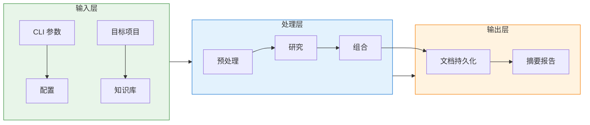

### 1.3 关键流程节点

| 流程节点 | 领域 | 职责 | 输出 |
|---------|------|------|------|
| **CLI 入口** | 配置管理 | 参数解析、配置层次结构解析 | Config, GeneratorContext |
| **PreProcessAgent** | 预处理领域 | 6步分析流水线 | CodeInsights, ProjectStructure |
| **ResearchOrchestrator** | 研究领域 | 8智能体架构分析 | 研究报告 (C1-C4) |
| **DocumentationComposer** | 组合领域 | 6编辑器文档生成 | Markdown 章节 |
| **DiskOutlet** | 输出领域 | 持久化和后处理 | 文档制品 |

### 1.4 流程协调机制

系统利用三种主要的协调机制：

1. **分层内存作用域**：跨 `PREPROCESSING`、`STUDIES_RESEARCH` 和 `DOCUMENTATION` 作用域的类型化存储支持有状态的智能体间通信
2. **依赖感知编排**：智能体按照数据依赖的有向无环图（DAG）执行
3. **资源受限并行**：CPU 密集型和 IO 密集型操作利用 `do_parallel_with_limit` 来遵守 LLM 速率限制和系统资源

---

## 2. 主要工作流

### 2.1 端到端文档生成工作流

这是编排从项目摄取到文档交付完整生命周期的主要业务流程。

#### 2.1.1 流程图

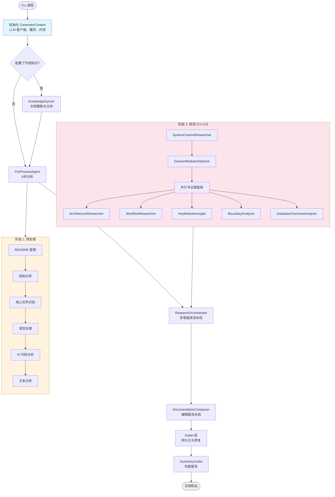

#### 2.1.2 详细流程步骤

**步骤 1: 上下文初始化**
- **输入**: CLI 参数、配置文件 (`litho.toml`)、环境变量
- **处理过程**: 
  - `Config` 解析，支持多格式项目名称推断 (Cargo.toml, package.json, pom.xml, .csproj)
  - `GeneratorContext` 构建，聚合 LLM 客户端、CacheManager、内存系统
  - Token 估算器和性能监视器初始化
- **输出**: 使用 `Arc<RwLock<T>>` 保护共享状态的已初始化 `GeneratorContext`

**步骤 2: 知识同步**
- **触发**: 基于 `knowledge_base` 配置的的条件执行
- **处理过程**:
  - 通过文件 mtime 比较和 HashSet 对称差集进行变更检测
  - 多格式文档处理 (PDF, Markdown, SQL, YAML, JSON)
  - 智能分块：语义型（Markdown/SQL 感知）、段落型或固定大小带重叠
  - 分类组织 (架构、数据库、API、ADR)
- **输出**: 可用于 RAG 风格检索的缓存、分块文档

**步骤 3: 预处理流水线**
- **处理过程**: 六个顺序子步骤：
  1. **原始文档提取**: README.md 发现和内容提取
  2. **结构提取**: 递归目录遍历，智能过滤（排除构建产物、node_modules、.git）
  3. **核心文件识别**: 重要性评分算法，识别"核心"代码文件与样板文件
  4. **语言处理**: 基于扩展名分发到 12+ 个 `LanguageProcessor` 实现
  5. **AI 代码分析**: 两阶段分析（静态提取 → AI 增强），受控并行
  6. **关系分析**: 项目级架构依赖分析，提示压缩
- **输出**: 包含 `Vec<CodeInsight>`、`ProjectStructure`、`RelationshipAnalysis` 的 `PreprocessingResult`

**步骤 4: 多智能体研究**
- **处理过程**: 三层 C4 分析流水线（详见 2.2 节）
- **关键特性**: 分阶段执行确保 C1 上下文通知 C2 分析，C2 通知 C3-C4 深入分析

**步骤 5: 文档组合**
- **处理过程**: 专业编辑器的顺序执行：
  1. `OverviewEditor`: C4 系统上下文文档
  2. `ArchitectureEditor`: C4 容器/组件/代码视图与 Mermaid 图表
  3. `WorkflowEditor`: 流程文档（此分析输出）
  4. `KeyModulesInsightEditor`: 并发模块深入分析
  5. `BoundaryEditor`: CLI/API/路由接口文档
  6. `DatabaseEditor`: 条件 SQL 模式文档（仅在检测到 `.sql` 文件时执行）
- **输出**: 文件路径映射到生成内容的已填充 `DocTree`

**步骤 6: 输出与持久化**
- **处理过程**:
  - 创建目录结构，支持国际化命名 (`4.Deep-Exploration` vs `4、深入探索`)
  - 从 `MemoryScope::DOCUMENTATION` 检索内容
  - 通过外部 `mermaid-fixer` 工具修复 Mermaid 图表语法
  - 生成摘要报告（完整和简要模式）
- **输出**: 磁盘上的 Markdown 文件、性能指标报告

### 2.2 多智能体研究流水线

此工作流实现了系统的核心知识产权——遵循 C4 模型抽象级别的 AI 驱动架构分析。

#### 2.2.1 C4 抽象级别

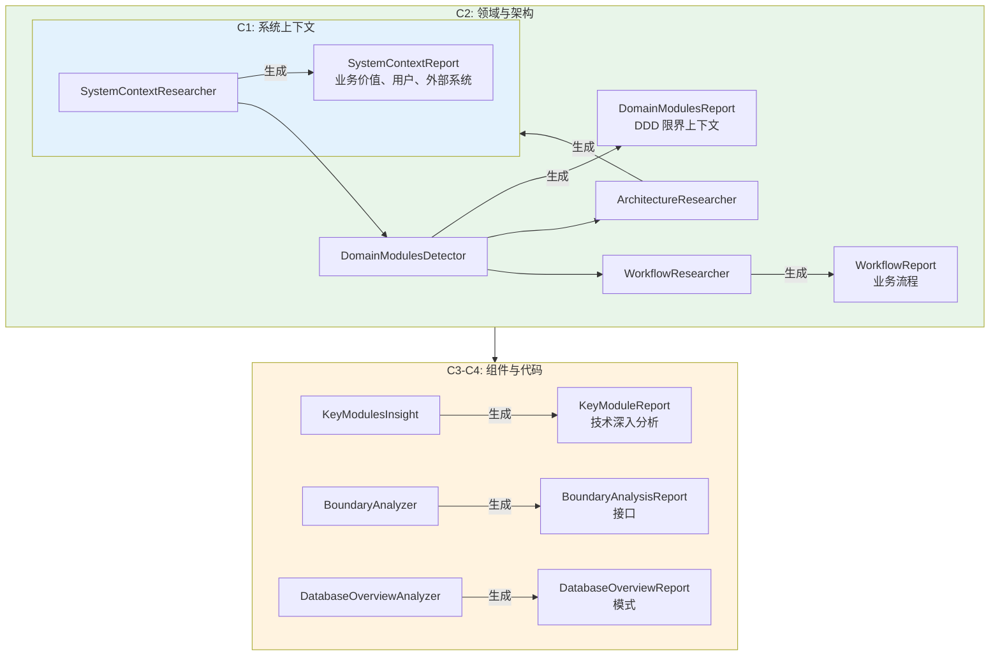

#### 2.2.2 智能体依赖与数据流

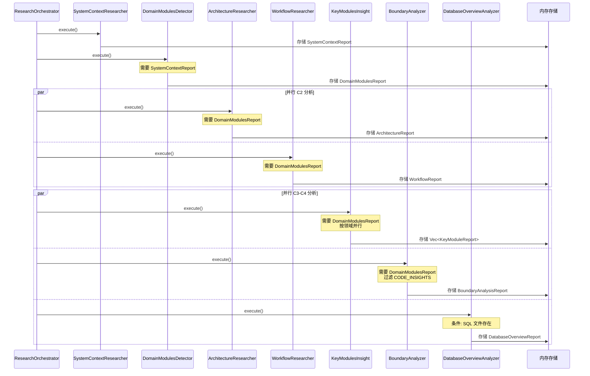

#### 2.2.3 智能体专业化

| 智能体 | C4 级别 | 输入数据源 | 输出 | 关键功能 |
|--------|---------|-----------|------|----------|
| **SystemContextResearcher** | C1 | ProjectStructure, CodeInsights, README | SystemContextReport | 识别业务价值、利益相关者、外部依赖 |
| **DomainModulesDetector** | C2 | SystemContextReport, CodeInsights | DomainModulesReport | DDD 领域分解、限界上下文 |
| **ArchitectureResearcher** | C2 | DomainModulesReport, External Knowledge | ArchitectureReport | C4 图表、架构模式、漂移检测 |
| **WorkflowResearcher** | C2 | DomainModulesReport, CodeInsights | WorkflowReport | 业务流程流、执行路径 |
| **KeyModulesInsight** | C3-C4 | DomainModulesReport, 过滤的 CodeInsights | Vec<KeyModuleReport> | 按领域并行技术深入分析 |
| **BoundaryAnalyzer** | C3-C4 | CodeInsights (Entry/Api/Controller) | BoundaryAnalysisReport | CLI、API、路由接口提取 |
| **DatabaseOverviewAnalyzer** | C3-C4 | SQL 文件, DAO 代码 | DatabaseOverviewReport | 模式、过程、ER 图 |

### 2.3 静态代码分析工作流

此工作流通过语言无关处理和 AI 增强将原始源代码转换为结构化的 `CodeInsight` 对象。

#### 2.3.1 两阶段分析架构

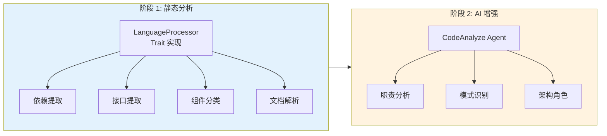

#### 2.3.2 语言处理矩阵

`LanguageProcessorManager` 根据扩展名将文件分发到专用处理器：

| 语言/框架 | 处理器 | 关键能力 |
|----------|--------|---------|
| Rust | `RustProcessor` | use/mod 语句、unsafe 块、trait/impl 分析 |
| Java | `JavaProcessor` | Import/package 提取、Javadoc 解析、注解检测 |
| Python | `PythonProcessor` | Import 分析、docstring 提取、类型注解解析 |
| JavaScript/TypeScript | `TypeScriptProcessor` | ES6/CommonJS 导入、JSDoc、async/await 检测 |
| C# | `CsharpProcessor` | Namespace/usings、XML 文档、特性分析 |
| PHP | `PhpProcessor` | Namespace/use、DocBlock、Composer 依赖检测 |
| Swift | `SwiftProcessor` | Import 特性、optionals、泛型解析 |
| Kotlin | `KotlinProcessor` | Android 特定检测 (Activity/ViewModel)、协程支持 |
| React | `ReactProcessor` | Hook 检测、JSX 分析、组件层次结构 |
| Vue | `VueProcessor` | `<script>` 提取、Composition API 检测 |
| Svelte | `SvelteProcessor` | 响应式语句、store 订阅 |

#### 2.3.3 并行处理控制

`CodeAnalyze` 智能体实现受控并发：

```rust
// 基于代码分析的概念工作流
do_parallel_with_limit(
    files_to_analyze,
    max_parallels,  // 来自 config.llm.max_concurrent_requests
    |file| async {
        // 1. 通过 LanguageProcessor 进行静态分析
        let static_insight = processor.analyze(file);
        
        // 2. 构建上下文感知提示
        let prompt = build_prompt(project_context, static_insight);
        
        // 3. LLM 提取
        let ai_insight = agent_executor::extract::<CodeInsight>(prompt).await;
        
        // 4. 合并静态 + AI 结果
        merge_insights(static_insight, ai_insight)
    }
).await;
```

**Token 管理策略**：
- **截断**: 大文件被截断以防止提示溢出 (DatabaseOverviewAnalyzer 限制为 50 个最重要文件)
- **压缩**: `PromptCompressor` 工具在保留语义的同时减小内容大小
- **过滤**: 重要性评分阈值 (0.6) 从关系分析中过滤低价值文件

### 2.4 文档组合工作流

将结构化研究数据转换为遵循 C4 模型标准的人类可读 Markdown。

#### 2.4.1 编辑器智能体流水线

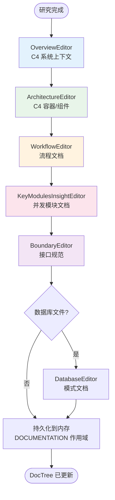

#### 2.4.2 KeyModulesInsightEditor 并发模型

此编辑器实现两级架构用于并行文档生成：

1. **编排器级别** (`KeyModulesInsightEditor` 复数)：
   - 从研究内存检索所有 `KeyModuleReport` 对象
   - 为每个模块创建并发任务
   - 使用 `do_parallel_with_limit` 控制 LLM 并发

2. **智能体级别** (`KeyModuleInsightEditor` 单数)：
   - 实现 `StepForwardAgent` trait
   - 生成单个模块文档
   - 使用本地化文件路径更新 `DocTree`

---

## 3. 流程协调与控制

### 3.1 集中式上下文管理

`GeneratorContext` 充当依赖容器和资源管理器，实现**上下文模式**以避免跨异步边界的参数激增。

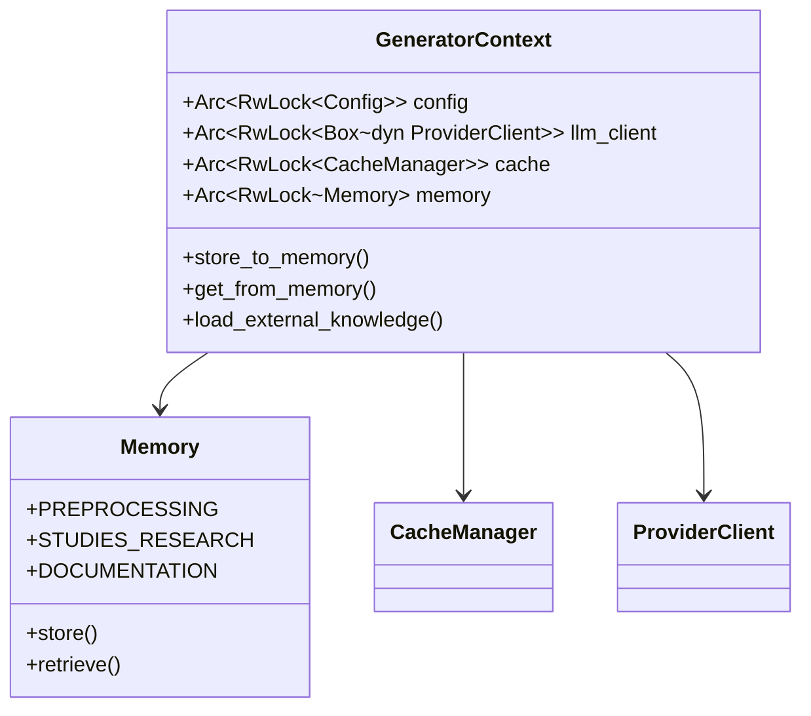

**线程安全模型**：
- 所有可变共享状态受 `Arc<RwLock<T>>` 保护
- 锁粒度在服务级别（粗粒度）而非操作级别
- 通过 `tokio::sync::RwLock` 实现异步感知锁定

### 3.2 内存作用域与数据共享

```mermaid
flowchart LR
    subgraph 预处理["PREPROCESSING 作用域"]
        P1[CodeInsights]
        P2[ProjectStructure]
        P3[RelationshipAnalysis]
        P4[README 内容]
    end
    
    subgraph 研究["STUDIES_RESEARCH 作用域"]
        R1[SystemContextReport]
        R2[DomainModulesReport]
        R3[ArchitectureReport]
        R4[WorkflowReport]
        R5[KeyModuleReports]
        R6[BoundaryAnalysis]
        R7[DatabaseOverview]
    end
    
    subgraph 组合["DOCUMENTATION 作用域"]
        C1[概述 Markdown]
        C2[架构 Markdown]
        C3[工作流 Markdown]
        C4[模块 Markdown]
        C5[边界 Markdown]
        C6[数据库 Markdown]
    end
    
    预处理 --> 研究 --> 组合
    
    style 预处理 fill:#e3f2fd
    style 研究 fill:#e8f5e9
    style 组合 fill:#fff3e0
```

**数据检索模式**：
- **必需数据**: 硬依赖通过 `AgentDataConfig` 验证 (例如，DomainModulesDetector 需要 SystemContextResearcher 输出)
- **可选数据**: 通过 `ExternalKnowledgeByCategory` 实现的软依赖 (例如，来自知识库的架构文档)
- **源数据**: 按路径模式过滤的原始代码洞察，用于领域特定分析

### 3.3 执行调度与并行

系统实现三种并发策略：

1. **流水线并行**: 阶段顺序执行（预处理 → 研究 → 组合），但数据在它们之间异步流动
2. **数据并行**: 独立智能体并发执行 (ArchitectureResearcher || WorkflowResearcher || BoundaryAnalyzer)
3. **任务并行**: 智能体内文件级并行处理 (CodeAnalyze, KeyModulesInsight)

**资源限制**：
- 来自 LLM 配置的 `max_parallels` 控制并发 API 调用
- `do_parallel_with_limit` 工具提供背压并防止资源耗尽

### 3.4 状态转换与生命周期

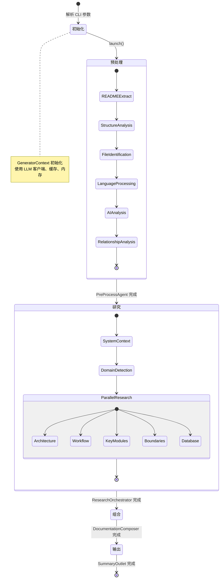

---

## 4. 异常处理与恢复

### 4.1 错误处理架构

系统采用 **anyhow** 进行符合人体工程学的错误传播和上下文，实现关键错误的**快速失败**策略和非关键组件的**优雅降级**。

#### 4.1.1 错误分类与策略

| 错误类别 | 策略 | 实现 |
|---------|------|------|
| **配置错误** | 快速失败 | `main.rs` 中的 `?` 传播，通过 i18n 提供用户友好的消息 |
| **LLM API 错误** | 指数退避重试 | 内置 `ProviderClient`，可配置重试 |
| **缓存错误** | 降级到直接执行 | 缓存错误已记录但不会阻塞执行 |
| **智能体分析错误** | 部分成功 | `KeyModulesInsight` 在单个域失败时继续 |
| **文件系统错误** | 快速失败 | `DiskOutlet` 立即传播 IO 错误 |

### 4.2 弹性模式

#### 4.2.1 断路器（隐式）

缓存层充当 LLM 调用的断路器：
- 缓存命中 → 跳过 API 调用（减少中断期间的负载）
- 缓存未命中 → 尝试带超时的 API 调用
- API 失败 → 传播错误（分析不降级到过期数据）

#### 4.2.2 并行处理中的优雅降级

```rust
// 来自 KeyModulesInsight 分析
let results: Vec<_> = futures::future::join_all(tasks).await
    .into_iter()
    .filter_map(|result| {
        match result {
            Ok(report) => Some(report),
            Err(e) => {
                log::warn!("域分析失败: {}", e);
                None // 继续使用部分结果
            }
        }
    })
    .collect();
```

#### 4.2.3 Token 溢出保护

`DatabaseOverviewAnalyzer` 实现防御性截断：
1. 过滤到前 50 个最重要的 SQL 文件
2. 对单个大型文件应用截断
3. 使用 `PromptCompressor` 进行紧急内容缩减
4. 如果压缩失败，回退到仅目录视图

### 4.3 恢复机制

**部分流水线恢复**：
- 预处理结果缓存在内存中；如果前一阶段完好，研究可以在不重新预处理的情况下恢复
- 研究报告持久化到 `STUDIES_RESEARCH` 作用域；组合可以在不重新研究的情况下重新运行
- `DOCUMENTATION` 作用域中的生成文档允许在不重新生成的情况下重新输出

**Mermaid 图表恢复**：
- `MermaidFixer` 使用外部工具后处理生成的图表
- 自动修复语法错误，无需用户干预
- 如果修复失败，保留原始内容并记录警告日志

### 4.4 监控与可观察性

**性能监控**：
- `CachePerformanceMonitor` 跟踪命中率、成本节省和推理时间节省
- `TimingScope` 记录每个流水线阶段的持续时间
- 摘要报告包括效率比率（每秒成本、改进倍数）

**错误上下文**：
- 所有错误通过 `anyhow::Context` 包括智能体类型和操作上下文
- 通过 `TargetLanguage` 的双语日志记录（英语/中文）确保可访问性

---

## 5. 关键流程实现

### 5.1 StepForwardAgent 框架

`StepForwardAgent` trait 提供**模板方法模式**用于标准化智能体执行，确保一致的数据验证、提示构建和结果存储。

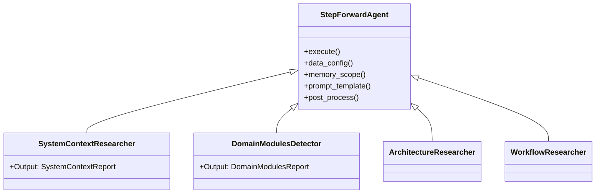

**生命周期钩子**：
1. **数据配置**: 通过 `AgentDataConfig` 声明必需/可选数据源
2. **数据收集**: 从内存作用域或外部知识检索
3. **内容格式化**: `DataFormatter` 应用分层格式化和压缩
4. **提示工程**: `GeneratorPromptBuilder` 构建多语言提示
5. **LLM 调用**: 支持 `Extract` (JSON)、`Prompt` (自由文本)、`PromptWithTools` (ReAct)
6. **后处理**: 验证、副作用和本地化日志记录

### 5.2 语言处理器架构

`LanguageProcessor` trait 实现多语言代码分析的**策略模式**：

```rust
// 概念 trait 结构
trait LanguageProcessor {
    fn extensions(&self) -> &[&str];
    fn extract_dependencies(&self, content: &str) -> Vec<Dependency>;
    fn extract_interfaces(&self, content: &str) -> Vec<InterfaceInfo>;
    fn determine_type(&self, file: &FileInfo) -> ComponentType;
    fn calculate_complexity(&self, content: &str) -> ComplexityMetrics;
}
```

**基于 Regex 的解析策略**：
- 使用预编译的正则表达式模式以提高性能（避免 AST 解析开销）
- 处理语言特定结构（Swift optionals、Python 装饰器、Rust 生命周期）
- 对不支持的构造回退到通用模式
- 权衡：速度 vs. 复杂嵌套泛型的完美准确性

### 5.3 缓存策略（Cache-Aside 模式）

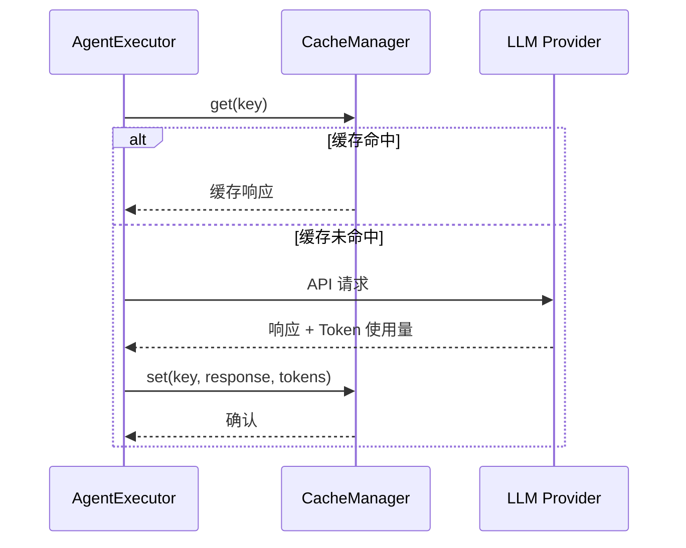

**缓存键生成**：
- 复合键：`system_prompt + user_prompt + operation_type` 的 MD5 哈希
- 确保不同执行模式之间的隔离（Extract vs Prompt）
- 基于类别的目录结构用于缓存组织

**Token 保留**：
- 缓存条目存储输入/输出 token 数量
- 即使在缓存命中时也支持准确的成本分析
- 支持缓存性能监控指标

### 5.4 提示工程与压缩

**模板结构**：
1. **系统指令**: 角色定义和输出约束
2. **开场指令**: 任务框架和上下文设置
3. **研究材料**: 来自前一阶段的结构化数据
4. **结尾指令**: 特定分析要求和格式强制

**压缩算法**：
```rust
// 分层压缩策略
1. 按重要性评分排序内容（降序）
2. 截断低重要性项目
3. 语义压缩（删除样板，保留语义）
4. 紧急截断（硬字符限制）
```

**多语言支持**：
- 向提示注入 `TargetLanguage` 枚举
- 8 种支持语言，带原生脚本显示名称
- AI 指令模板指导 LLM 以目标语言生成文档

### 5.5 国际化 (i18n) 集成

系统在整个工作流中保持**区域感知**：

- **文件系统**: 本地化目录名称 (`1.Overview` vs `1、项目概述`)
- **控制台输出**: 跨 8 种语言的 16+ 消息模板翻译
- **文档内容**: LLM 被提示以目标语言生成
- **错误消息**: 用于调试的双语错误上下文

**实现**：
- `TargetLanguage` 枚举上的穷尽 match 表达式（8 种变体）
- 接受高循环复杂度 (54) 以换取编译时穷尽性保证
- Emoji 指示器提供无论语言的视觉反馈

---

## 附录：工作流性能特征

| 工作流阶段 | 时间复杂度 | 瓶颈 | 优化策略 |
|-----------|-----------|------|---------|
| **预处理** | O(n) where n=files | AI 代码分析 | 使用 `max_parallels` 限制的并行处理 |
| **研究** | O(d) where d=domains | KeyModulesInsight（按域并行） | 并发智能体执行 |
| **组合** | O(s) where s=sections | 顺序编辑器依赖 | N/A（固有顺序） |
| **输出** | O(docs) | MermaidFixer 外部工具 | 使用 tokio 的异步 I/O |
| **整体** | O(n + d + s) | LLM API 延迟 | 缓存、重试逻辑、token 优化 |

**资源利用**：
- **CPU**: 正则解析和文件 I/O 期间高
- **网络**: 具有可配置并发的 LLM API 调用
- **内存**: 随项目大小扩展（CodeInsights 存储在内存中）
- **磁盘**: 缓存存储与唯一提示数量成比例
