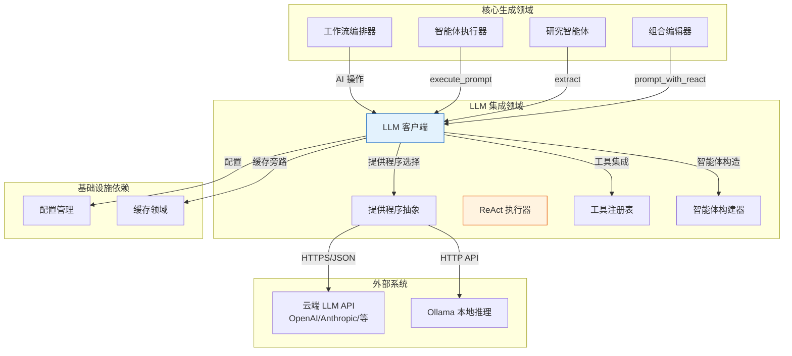
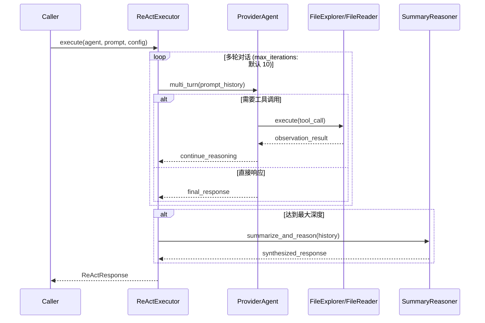
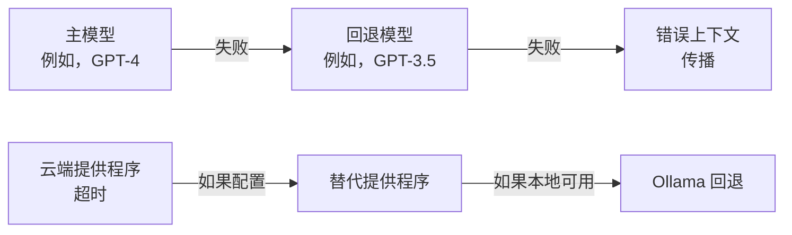
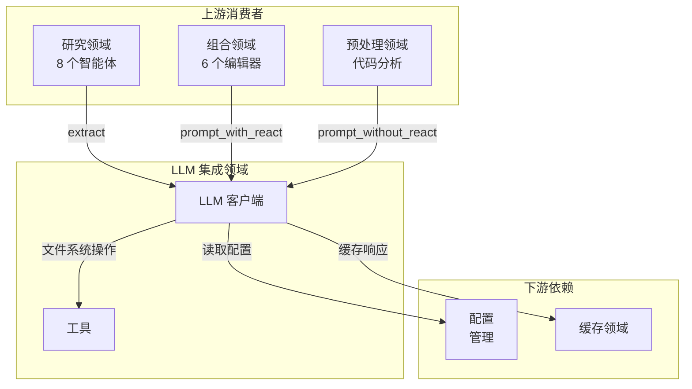

**LLM 集成领域技术文档**

**版本:** 1.0  
**最后更新:** 2026-02-01 06:39:05 (UTC)  
**分类:** 内部技术文档  
**范围:** 基础设施领域 - 核心 AI 抽象层

---

## 1. 执行概述

**LLM 集成领域**为 deepwiki-rs 文档生成系统提供基础 AI 抽象层。该领域封装了与大型语言模型 (LLM) 提供程序的所有交互，在异构 AI 服务背后实现统一接口，同时支持 ReAct（推理 + 行动）、结构化模式提取和工具增强对话等高级模式。

### 1.1 目的与职责

- **提供程序抽象**: 在通用接口后统一 8 个不同的 LLM 提供程序（OpenAI、Moonshot、DeepSeek、Mistral、OpenRouter、Anthropic、Gemini 和 Ollama）
- **执行模式**: 支持简单提示执行、具有工具集成的多轮 ReAct 对话和类型安全结构化提取
- **弹性**: 实现指数退避重试逻辑、自动模型回退链和优雅降级策略
- **成本优化**: 与缓存领域集成以避免冗余 API 调用，并跟踪 token 使用以进行成本估算
- **本地推理**: 为 Ollama 部署提供专门处理，以实现气隙和隐私敏感环境

### 1.2 领域上下文



---

## 2. 架构与组件结构

该领域实现分层架构，在提供程序特定实现、执行模式和工具集成之间有清晰分离。

### 2.1 组件层次结构

| 组件 | 位置 | 模式 | 职责 |
|------|------|------|------|
| **LLMClient** | `src/llm/client/mod.rs` | 外观 | 具有重试和回退逻辑的所有 AI 操作的主要接口 |
| **ProviderClient** | `src/llm/client/providers.rs` | 适配器 | 8 个提供程序特定客户端的基于枚举的统一 |
| **AgentBuilder** | `src/llm/client/agent_builder.rs` | 构建器 | 使用预设配置构造工具增强或裸智能体 |
| **ReActExecutor** | `src/llm/client/react_executor.rs` | 策略 | 实现具有深度管理的多轮推理和行动循环 |
| **工具注册表** | `src/llm/tools/mod.rs` | 注册表 | 用于智能体增强的文件系统和时间感知工具 |
| **OllamaExtractor** | `src/llm/client/ollama_extractor.rs` | 包装器 | 用于本地推理兼容性的文本到 JSON 转换层 |

### 2.2 提供程序抽象架构

系统使用三层基于枚举的抽象来隐藏提供程序异构性：

```rust
// 跨所有提供程序的统一接口
pub enum ProviderClient { /* 8 个变体 */ }
pub enum ProviderAgent { /* 8 个变体 */ }
pub enum ProviderExtractor<T> { /* 8 个变体 */ }
```

**提供程序支持矩阵：**

| 提供程序 | 结构化输出 | ReAct 工具 | 回退支持 | 认证 |
|----------|-----------|-----------|----------|------|
| OpenAI | 原生 | 是 | 是 | Bearer Token |
| Anthropic | 原生 | 是 | 是 | Bearer Token |
| Gemini | 原生 | 是 | 是 | API 密钥 |
| Moonshot | 原生 | 是 | 是 | Bearer Token |
| DeepSeek | 原生 | 是 | 是 | Bearer Token |
| Mistral | 原生 | 是 | 是 | Bearer Token |
| OpenRouter | 原生 | 是 | 是 | Bearer Token |
| **Ollama** | **模拟** | 是 | N/A | 无（本地） |

> **关于 Ollama 的说明**: 由于 Ollama 缺乏原生 JSON 模式强制，
> `OllamaExtractorWrapper` 实现多策略解析（Markdown 代码块提取、
> 原始 JSON 解析、正则提取）和验证重试循环。

---

## 3. 核心组件深度解析

### 3.1 LLMClient - 主要外观

`LLMClient` 结构作为所有 AI 操作的中央协调点，实现 `Clone` 以在异步上下文中进行线程安全共享。

**关键能力：**

```rust
impl LLMClient {
    // 具有自动重试和模型回退的结构化提取
    pub async fn extract<T: JsonSchema + DeserializeOwned>(
        &self,
        system_prompt: &str,
        user_prompt: &str
    ) -> Result<T, LLMError>;
    
    // 简单单轮执行
    pub async fn prompt_without_react(
        &self,
        system_prompt: &str,
        user_prompt: &str
    ) -> Result<String, LLMError>;
    
    // 具有工具增强的完整 ReAct 执行
    pub async fn prompt_with_react(
        &self,
        system_prompt: &str,
        user_prompt: &str,
        config: ReActConfig
    ) -> Result<ReActResponse, LLMError>;
}
```

**弹性机制：**
- **重试逻辑**: 所有操作包装在 `retry_with_backoff()` 中，具有可配置指数退避
- **模型回退**: 在主模型失败时结构化提取自动尝试辅助模型
- **Token 管理**: 集成 token 估算以进行成本跟踪和上下文窗口管理
- **缓存**: 使用提示的 MD5 哈希键的缓存旁路模式集成

### 3.2 ReAct 执行引擎

ReAct（推理 + 行动）实现使复杂的多步分析工作流成为可能，智能体可以在其中：
1. **推理**当前状态和所需行动
2. **行动**通过调用工具（文件探索、内容读取）
3. **观察**结果并迭代直到任务完成

**执行流程：**



**配置选项：**
- `max_iterations`: 最大推理步数（默认：10）
- `return_partial_on_max_depth`: 如果达到限制则返回累积结果（默认：true）
- `enable_summary_reasoning`: 达到深度限制时使用摘要智能体（默认：true）

### 3.3 AgentBuilder - 构造模式

为具有适当工具配置的智能体实例化提供工厂方法：

```rust
impl AgentBuilder {
    // 为简单推理任务创建轻量级智能体
    pub fn build_agent_without_tools(&self, system_prompt: &str) -> Agent;
    
    // 创建具有文件系统能力的工具增强智能体
    pub fn build_agent_with_tools(&self, system_prompt: &str) -> Agent;
}
```

**工具预设配置：**
当 `disable_preset_tools` 为 false 时，构建器自动注入：
- **FileExplorer**: 目录遍历、glob 模式匹配、文件元数据检查
- **FileReader**: 行范围读取、编码检测、内容提取
- **Time**: 时间戳生成、UTC/本地时间查询以获取时间上下文

### 3.4 工具系统

工具实现标准 Rig `Tool` trait 并使智能体能够与执行环境交互：

| 工具 | 目的 | 关键操作 |
|------|------|---------|
| **AgentToolFileExplorer** | 文件系统导航 | `list_directory`、`search_files`、`get_file_metadata` |
| **AgentToolFileReader** | 内容提取 | `read_file`、`read_lines`、`detect_encoding` |
| **AgentToolTime** | 时间上下文 | `current_timestamp`、`utc_now`、`local_time` |

**工具调用安全性：**
- 所有文件操作尊重 `.gitignore` 模式和显式排除列表
- 只读访问；不向智能体授予写入或执行权限
- 路径规范化防止目录遍历攻击

---

## 4. 结构化提取系统

该领域使用编译时模式生成通过 `schemars` 提供类型安全 JSON 提取。

### 4.1 模式感知提取

```rust
// 示例：提取架构组件
#[derive(JsonSchema, Deserialize)]
struct ArchitectureAnalysis {
    domain_modules: Vec<DomainModule>,
    confidence_score: f32,
    patterns: Vec<String>,
}

// 使用
let analysis: ArchitectureAnalysis = llm_client
    .extract(system_prompt, code_context)
    .await?;
```

**验证流水线：**
1. 使用 `schemars` 从 Rust 类型生成 JSON 模式
2. 提交给具有模式约束（或 Ollama 格式指令）的提供程序
3. 使用多策略方法解析响应
4. 使用 `serde_json` 针对模式验证
5. 返回强类型结果或触发带错误上下文的重试

### 4.2 Ollama 兼容性层

由于 Ollama 不支持原生结构化输出，`OllamaExtractor` 实现：

```rust
impl<T: JsonSchema + DeserializeOwned> OllamaExtractor<T> {
    pub async fn extract(&self, prompt: &str) -> Result<T, ExtractionError> {
        // 策略 1: 在 Markdown 代码块中请求 JSON
        // 策略 2: 从响应解析原始 JSON
        // 策略 3: 用于格式错误响应的正则提取
        // 策略 4: 验证失败时使用澄清提示重试
    }
}
```

---

## 5. 配置与提供程序管理

### 5.1 配置驱动架构

LLMClient 从全局 `Config` 结构初始化，支持：

```toml
[llm]
provider = "OpenAI"
primary_model = "gpt-4"
fallback_model = "gpt-3.5-turbo"
temperature = 0.2
max_tokens = 4096

[llm.ollama]
base_url = "http://localhost:11434"
model = "llama2:13b"
```

**提供程序选择逻辑：**
- 初始化时基于配置的枚举分发
- 每个提供程序的凭证管理（API 密钥、基础 URL）
- 每个提供程序类型的超时和重试配置

### 5.2 回退策略

对于结构化提取操作，系统实现级联回退：



---

## 6. 错误处理与可观察性

### 6.1 错误分类

| 错误类型 | 描述 | 恢复策略 |
|----------|------|---------|
| `ProviderError` | API 故障 (5xx、4xx) | 指数退避重试 |
| `ExtractionError` | JSON 解析/验证失败 | 使用澄清重试 |
| `RateLimitError` | API 配额超出 | 带抖动的扩展退避 |
| `ContextLengthError` | 超出 token 限制 | 提示压缩和重试 |
| `OllamaUnavailable` | 本地服务离线 | 故障转移到云端提供程序 |

### 6.2 本地化

所有用户可见的错误消息通过 `TargetLanguage` 配置支持国际化：
- 域边界的本地化错误消息
- 日志中保留技术诊断细节
- 主要错误路径的双语支持（EN/ZH）

---

## 7. 集成模式

### 7.1 领域依赖

LLM 集成领域作为更高级别领域的基础设施：



### 7.2 缓存集成

实现缓存旁路模式以进行成本优化：

```rust
async fn cached_operation(&self, prompt: &str) -> Result<String, Error> {
    let cache_key = generate_md5_hash(prompt, &self.config);
    
    if let Some(cached) = self.cache.get(&cache_key).await {
        return Ok(cached.value);
    }
    
    let response = self.provider.complete(prompt).await?;
    self.cache.set(cache_key, response.clone()).await?;
    Ok(response)
}
```

**缓存键组合：**
- 规范化提示 + 模型标识符 + 温度的 MD5 哈希
- 文件系统缓存中的分层目录结构
- 支持缓存失效的 TTL

---

## 8. 实现细节

### 8.1 并发模型

- **线程安全**: `LLMClient` 使用 `Arc<InnerClient>` 在异步任务间进行廉价克隆
- **并行执行**: 研究智能体使用基于信号量的限制（参见线程工具）进行受控并行执行
- **连接池**: HTTP 客户端 (reqwest) 为每个提供程序维护连接池

### 8.2 提示工程框架

该领域与核心生成领域中的 `StepForwardAgent` trait 协作以支持：

1. **数据源解析**: 来自内存系统的动态上下文注入
2. **模板处理**: 具有变量替换的提示构造
3. **压缩**: 当接近 token 限制时使用 `PromptCompressor` 工具进行自动提示截断

### 8.3 安全考虑

- **凭证隔离**: API 密钥仅存储在 `Config` 中，并通过头部传递给提供程序
- **无提示持久化**: 用户提示永远不会记录到磁盘（仅当显式配置时才缓存）
- **沙盒工具**: 文件系统工具尊重项目边界和排除模式

---

## 9. 使用示例

### 9.1 简单提取

```rust
let client = context.llm_client.clone();
let system = "分析以下代码并提取依赖项。";

let deps: Vec<Dependency> = client
    .extract(system, &code_content)
    .await?;
```

### 9.2 带工具的 ReAct

```rust
let config = ReActConfig {
    max_iterations: 15,
    verbose: true,
    ..Default::default()
};

let response = client
    .prompt_with_react(system_prompt, user_prompt, config)
    .await?;

if response.tool_calls > 0 {
    println!("智能体使用 {} 个工具完成分析", response.tool_calls);
}
```

### 9.3 自定义提供程序配置

```rust
// 通过配置运行时提供程序切换
let mut config = Config::default();
config.llm.provider = ProviderType::Ollama;
config.llm.ollama.base_url = "http://internal-ollama:11434";

let local_client = LLMClient::new(config);
```

---

## 10. 维护与扩展

### 10.1 添加新提供程序

要添加对新 LLM 提供程序的支持：

1. 在配置中扩展 `ProviderType` 枚举
2. 在 `providers.rs` 中实现提供程序客户端，遵循适配器模式
3. 向 `ProviderClient`、`ProviderAgent` 和 `ProviderExtractor` 枚举添加变体
4. 实现从配置到提供程序特定客户端的转换
5. 更新智能体构建器以处理提供程序特定的工具兼容性

### 10.2 扩展工具集

要为智能体添加新能力：

1. 为新能力实现 `Tool` trait
2. 向 `工具` 注册表添加工具
3. 更新 `AgentBuilder` 以在预设配置中包含该工具（如适用）
4. 更新系统提示以记录新工具的使用

---

## 附录：文件组织

```
src/llm/
├── client/
│   ├── mod.rs              # LLMClient 外观和错误类型
│   ├── providers.rs        # 提供程序枚举定义和适配器
│   ├── agent_builder.rs    # 智能体构造逻辑
│   ├── react.rs            # ReAct 配置类型
│   ├── react_executor.rs   # 多轮执行引擎
│   └── ollama_extractor.rs # 用于本地推理的文本到 JSON 包装器
└── tools/
    ├── mod.rs              # 工具 trait 定义和注册表
    ├── file_explorer.rs    # 目录和文件列表工具
    ├── file_reader.rs      # 内容提取工具
    └── time.rs             # 时间上下文工具
```

**依赖：**
- **Rig 框架**: 智能体和工具的核心抽象
- **Schemars**: JSON 模式生成
- **Reqwest**: 用于 API 通信的 HTTP 客户端
- **Tokio**: 异步运行时集成

---

**文档控制：**
- **所有者:** 架构团队
- **审查周期:** 每个主要版本或提供程序 API 更改
- **相关文档**: 
  - 核心生成领域文档
  - 配置管理领域文档
  - 缓存领域性能规范

**文档结束**
