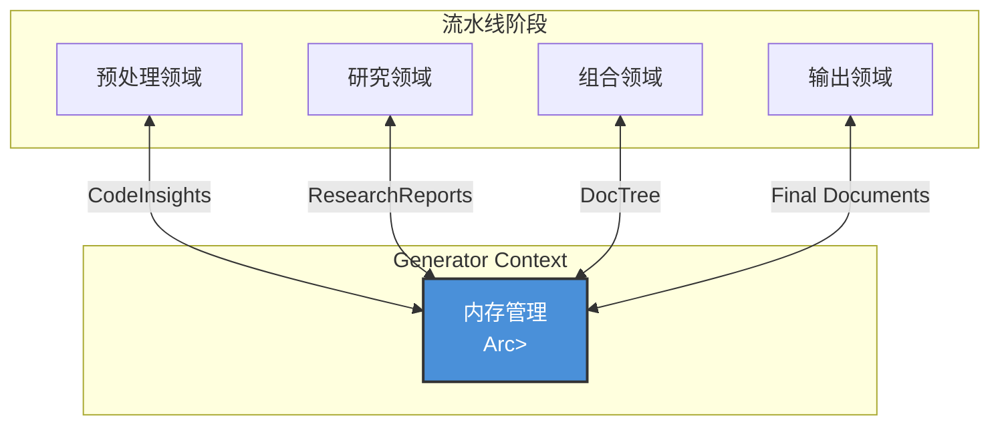
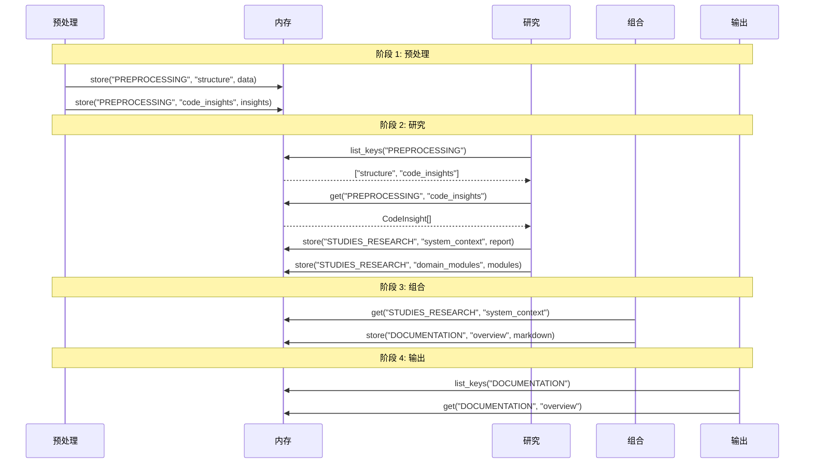

**内存管理领域技术文档**

**版本:** 1.0  
**模块:** `src/memory/mod.rs`  
**领域类型:** 基础设施领域  
**最后更新:** 2026-02-01 06:38:26 (UTC)

---

## 1. 概述

内存管理领域为 deepwiki-rs 文档生成流水线提供集中式内存状态持久化和智能体间通信基础设施。它实现了一个类型安全的、按作用域组织的键值存储系统，在维护多智能体 AI 工作流跨运行时状态的同时，实现不同处理阶段之间的无缝数据传输。

### 1.1 目的与职责

- **状态持久化**: 跨流水线阶段维护临时数据（预处理 → 研究 → 组合 → 输出）
- **智能体间通信**: 促进专业 AI 智能体之间的数据交换，无需紧耦合
- **类型安全存储**: 为复杂数据结构提供通用序列化/反序列化能力
- **运营指标**: 跟踪访问模式、数据大小和使用统计以进行性能监控
- **作用域组织**: 通过基于命名空间的数据隔离强制执行逻辑关注点分离

### 1.2 业务上下文

在 deepwiki-rs 架构中，内存管理领域作为无状态 AI 智能体之间的桥梁的临时数据层。虽然缓存领域通过持久文件存储优化 LLM API 调用，但内存域管理单个执行工作流期间的活动工作分析结果、研究报告和文档制品集。

---

## 2. 架构与设计原则

### 2.1 架构定位

内存管理领域在核心生成领域的依赖容器 (`GeneratorContext`) 中作为基础基础设施服务运行。它在工作流初始化期间实例化一次，并通过线程安全引用计数 (`Arc<RwLock<Memory>>`) 在所有流水线阶段共享。



### 2.2 设计原则

**基于作用域的隔离**  
数据被组织到三个反映流水线阶段的逻辑作用域：
- `PREPROCESSING`: 原始代码分析结果和结构元数据
- `STUDIES_RESEARCH`: 架构分析报告和领域洞察  
- `DOCUMENTATION`: 生成的 markdown 章节和文档树

**通过序列化实现类型安全**  
所有数据通过 `serde` 进行 JSON 序列化，在为通用方法实现 `Serialize`/`Deserialize` trait 的同时，通过通用方法保持 Rust 的编译时类型安全。

**原子操作**  
存储和检索操作是原子的，确保元数据一致性（时间戳、访问计数、大小计算）与底层数据存储保持同步。

**元数据透明**  
运营指标（访问模式、数据大小）自动收集，无需客户端代码插桩，支持资源监控和调试。

---

## 3. 核心组件

### 3.1 数据结构

#### 内存
实现内存数据库模式的主存储容器。

```rust
pub struct Memory {
    /// 使用复合键（作用域:键）的核心键值存储
    storage: HashMap<String, Value>,
    
    /// 运营指标跟踪
    metadata: MemoryMetadata,
}
```

#### MemoryMetadata
跟踪运营特征和资源利用。

```rust
pub struct MemoryMetadata {
    /// 每个条目的创建时间戳
    created_at: HashMap<String, DateTime<Utc>>,
    
    /// 最后修改时间戳
    last_updated: HashMap<String, DateTime<Utc>>,
    
    /// 访问频率计数器
    access_counts: HashMap<String, u64>,
    
    /// 单个条目大小（字节）
    data_sizes: HashMap<String, usize>,
    
    /// 跨所有条目的聚合大小
    total_size: usize,
}
```

### 3.2 键模式

**复合键格式**: `{scope}:{key}`  
- **作用域**: 逻辑命名空间（例如，`PREPROCESSING`、`STUDIES_RESEARCH`）
- **键**: 领域特定标识符（例如，`code_insights`、`system_context`）
- **示例**: `STUDIES_RESEARCH:domain_modules`

**值存储**: JSON `Value` 对象（通过 `serde_json::Value`）在保持可序列化结构的同时提供灵活性。

---

## 4. API 规范

### 4.1 存储操作

#### `store<T>()`
将类型化数据持久化到特定作用域，自动更新元数据。

```rust
pub fn store<T>(&mut self, scope: &str, key: &str, data: T) -> Result<()>
where
    T: Serialize
```

**参数：**
- `scope`: 逻辑命名空间（例如，"PREPROCESSING"）
- `key`: 作用域内的唯一标识符
- `data`: 任何实现 `Serialize` 的类型

**行为：**
1. 将数据序列化为 JSON Value
2. 计算序列化表示的字节大小
3. 在元数据中更新 `data_sizes` 和 `total_size`
4. 记录 `created_at`（新条目）或更新 `last_updated`（现有条目）
5. 使用复合键 `{scope}:{key}` 插入存储

**错误条件：**
- 序列化失败（罕见，通常指示不可序列化类型）

---

### 4.2 检索操作

#### `get<T>()`
具有自动反序列化和访问跟踪的类型安全检索。

```rust
pub fn get<T>(&mut self, scope: &str, key: &str) -> Option<T>
where
    T: DeserializeOwned
```

**参数：**
- `scope`: 逻辑命名空间
- `key`: 条目标识符

**返回：**
- 成功检索和反序列化时返回 `Some(T)`
- 键不存在或反序列化失败时返回 `None`

**行为：**
1. 构造复合键 `{scope}:{key}`
2. 递增键的 `access_counts`
3. 从存储中检索 JSON Value
4. 尝试反序列化为类型 `T`
5. 返回反序列化对象或类型不匹配时返回 `None`

**注意**: 反序列化失败时返回 `None` 以允许存储和检索之间的类型不匹配得到优雅处理。

---

### 4.3 查询操作

#### `list_keys()`
返回特定作用域内的所有键，去除作用域前缀。

```rust
pub fn list_keys(&self, scope: &str) -> Vec<String>
```

**用例**: 发现作用域内的可用数据条目（例如，列出所有研究报告）。

**实现**: 按键前缀 `{scope}:` 过滤存储键，仅返回后缀。

---

#### `has_data()`
无需数据检索的高效存在检查。

```rust
pub fn has_data(&self, scope: &str, key: &str) -> bool
```

**用例**: 基于数据可用性的条件逻辑，无反序列化开销。

---

### 4.4 管理操作

#### `get_usage_stats()`
按作用域聚合内存消耗。

```rust
pub fn get_usage_stats(&self) -> HashMap<String, usize>
```

**返回**: 作用域名称到消耗总字节数的映射。

**用例**: 资源监控、调试内存膨胀和流水线优化。

---

## 5. 数据流与生命周期

### 5.1 流水线阶段集成



### 5.2 数据生命周期

1. **创建**: 预处理智能体存储原始分析结果
2. **消费**: 研究智能体读取预处理数据，存储精细分析
3. **转换**: 组合智能体读取研究数据，存储生成的文档
4. **持久化**: 输出智能体读取文档数据并写入文件系统
5. **清理**: 当 `GeneratorContext` 超出范围时内存被丢弃（工作流结束）

---

## 6. 集成模式

### 6.1 消费者领域

| 领域 | 交互模式 | 数据作用域 | 目的 |
|------|---------|-----------|------|
| **预处理** | 写密集 | `PREPROCESSING` | 存储代码分析结果 |
| **研究** | 读/写 | `PREPROCESSING`（读）、`STUDIES_RESEARCH`（写） | 消费原始数据，产生洞察 |
| **组合** | 读/写 | `STUDIES_RESEARCH`（读）、`DOCUMENTATION`（写） | 将研究转换为 markdown |
| **输出** | 只读 | `DOCUMENTATION` | 检索最终文档以进行持久化 |

### 6.2 线程安全

内存管理领域通过 `GeneratorContext` 中的 `Arc<RwLock<Memory>>` 访问：
- **读取操作**: 多个智能体可以并发读取（例如，并行研究智能体）
- **写入操作**: 存储操作期间需要独占锁
- **模式**: 短生命周期锁以最小化争用；必要时克隆数据

### 6.3 错误处理策略

- **反序列化失败**: 返回 `None` 而非 panic，允许回退逻辑
- **缺失键**: 返回 `None` 或空向量，启用可选数据模式
- **序列化失败**: 为写入操作返回 `Result::Err`（传播给调用者）

---

## 7. 实现细节

### 7.1 序列化架构

该模块利用 `serde_json` 进行类型擦除和恢复：

```rust
// 存储: 类型 -> JSON Value
let json_value = serde_json::to_value(&data)?;
self.storage.insert(full_key, json_value);

// 检索: JSON Value -> 类型  
let value = self.storage.get(&full_key)?;
let typed_data: T = serde_json::from_value(value.clone())?;
```

这种方法在单个 HashMap 中实现异构数据存储，同时在 API 边界保持类型安全。

### 7.2 元数据跟踪

**大小计算**: 使用 `serde_json::to_string().len()` 估算内存占用（字节）。

**访问模式**: 维护读取操作的单调查数器以识别热点数据和优化机会。

**时间元数据**: 使用 `chrono::DateTime<Utc>` 作为创建和更新时间戳，支持调试和缓存失效逻辑。

### 7.3 内存效率考虑

- **数据复制**: JSON Value 在检索期间被克隆（Rust 所有权必需），意味着活动处理期间双内存使用
- **作用域清理**: 目前，作用域保留数据直到进程终止；未来优化可以在阶段完成后实现特定作用域的清除
- **大数据处理**: 对于大量数据集（例如，大型代码库），考虑流式或文件支持存储以防止过度堆增长

---

## 8. 使用示例

### 8.1 存储分析结果

```rust
// 预处理智能体存储代码洞察
let insights = analyze_source_files(&project_path)?;
context.memory.write().await.store(
    "PREPROCESSING",
    "code_insights",
    &insights
)?;
```

### 8.2 带类型安全的检索

```rust
// 研究智能体访问预处理结果
if let Some(insights) = context.memory.write().await
    .get::<Vec<CodeInsight>>("PREPROCESSING", "code_insights") {
    // 处理洞察
} else {
    // 处理缺失或不兼容的数据
}
```

### 8.3 条件处理

```rust
// 在昂贵计算之前检查现有数据
if !context.memory.read().await.has_data("STUDIES_RESEARCH", "system_context") {
    let report = generate_system_context().await?;
    context.memory.write().await.store(
        "STUDIES_RESEARCH",
        "system_context",
        &report
    )?;
}
```

### 8.4 资源监控

```rust
// 记录内存使用统计
let stats = context.memory.read().await.get_usage_stats();
for (scope, bytes) in stats {
    println!("作用域 {}: {} KB", scope, bytes / 1024);
}
```

---

## 9. 最佳实践

1. **作用域一致性**: 始终使用预定义的作用域常量（`PREPROCESSING`、`STUDIES_RESEARCH`、`DOCUMENTATION`）以避免碎片化
2. **类型稳定性**: 确保存储的类型在反序列化时保持向后兼容性（考虑演进结构的版本控制）
3. **键命名**: 使用描述性、分层键（例如，`domain_modules_core`、`api_endpoints_auth`）以促进调试
4. **错误处理**: 始终优雅地处理 `None` 返回；流水线阶段应该对缺失的可选数据具有弹性
5. **内存意识**: 在开发期间监控 `get_usage_stats()` 以识别来自过度数据保留的内存膨胀

---

## 10. 依赖

- **serde**: 序列化框架
- **serde_json**: 用于值存储的 JSON 后端
- **chrono**: 元数据的时间戳处理
- **std::collections::HashMap**: 核心存储实现

---

**相关文档：**
- [核心生成领域](./core-generation-domain.md)
- [预处理领域](./preprocessing-domain.md)
- [缓存领域](./caching-domain.md)（用于持久存储替代方案）

**文档结束**
