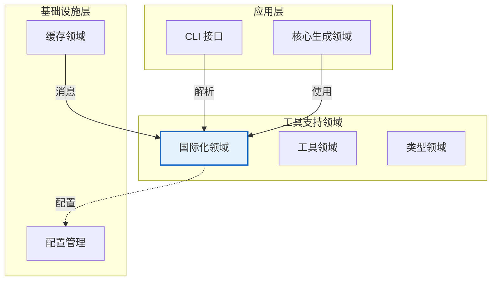
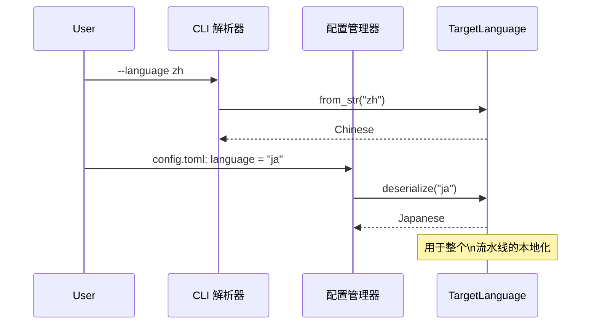

**国际化领域技术文档**

**版本:** 1.0  
**领域类型:** 工具支持领域  
**置信度评分:** 0.92 (高)  
**分类:** 内部文档

---

## 1. 执行摘要

**国际化领域** (i18n) 作为 deepwiki-rs 文档生成系统的中央本地化中心。实现为紧凑的单文件模块 (`src/i18n.rs`)，它通过强类型的 Rust 枚举架构提供跨 **8 种语言**的全面多语言支持。

该领域提供三类主要功能：(1) 用于 AI 提示本地化和显示渲染的 **语言元数据管理**；(2) 用于生成文化适当目录结构和文档文件名的 **文件系统本地化**；以及 (3) 提供标准化、表情符号指示的用户反馈的 **控制台消息国际化**，适用于所有支持的语言环境。

通过利用 Rust 的类型系统和 Serde 序列化，该领域确保语言覆盖的编译时保证，同时保持运行时性能的零成本抽象。

---

## 2. 架构定位

### 2.1 领域上下文

在系统的领域驱动设计架构中，国际化领域位于 **工具支持领域** 层，为更高级别的业务领域提供跨领域本地化能力。



### 2.2 领域依赖

国际化领域保持最小依赖，作为共享内核组件运行：

**该领域的消费者：**
- **核心生成领域**: 用于本地化输出路径和 AI 提示语言注入
- **配置管理领域**: 依赖于从配置文件解析语言代码
- **缓存领域**: 用于双语性能监控消息
- **CLI 接口**: 用于语言参数解析和控制台输出

**依赖：**
- **Serde**: 用于双向序列化/反序列化
- **标准库**: `std::fmt::Display`、`std::str::FromStr`、`std::default::Default`

---

## 3. 核心设计与实现

### 3.1 类型系统架构

该领域围绕单个穷尽枚举 `TargetLanguage` 展开，实现多个 Rust trait 以在应用程序栈中无缝集成。

```rust
#[derive(Debug, Deserialize, Serialize, Clone, PartialEq)]
pub enum TargetLanguage {
    #[serde(rename = "zh")]
    Chinese,
    #[serde(rename = "en")]
    English,
    #[serde(rename = "ja")]
    Japanese,
    #[serde(rename = "ko")]
    Korean,
    #[serde(rename = "de")]
    German,
    #[serde(rename = "fr")]
    French,
    #[serde(rename = "ru")]
    Russian,
    #[serde(rename = "vi")]
    Vietnamese,
}
```

### 3.2 Trait 实现

| Trait | 目的 | 实现细节 |
|-------|------|---------|
| **Default** | 回退语言 | 返回 `English` 作为系统默认值 |
| **Display** | 字符串序列化 | 输出 ISO 639-1 代码（例如，"zh"、"en"） |
| **FromStr** | 解析灵活性 | 不区分大小写地接受语言代码、英文名称或本地名称 |
| **Serialize/Deserialize** | 配置集成 | 使用 Serde 重命名属性进行 JSON/TOML 映射 |

### 3.3 语言支持矩阵

| 语言 | 代码 | 本地显示 | 提示指令支持 |
|------|------|---------|-------------|
| 中文 | `zh` | 中文 | 是 |
| 英语 | `en` | English | 是 |
| 日语 | `ja` | 日本語 | 是 |
| 韩语 | `ko` | 한국어 | 是 |
| 德语 | `de` | Deutsch | 是 |
| 法语 | `fr` | Français | 是 |
| 俄语 | `ru` | Русский | 是 |
| 越南语 | `vi` | Tiếng Việt | 是 |

---

## 4. 功能能力

### 4.1 语言元数据服务

**显示名称本地化**
```rust
pub fn display_name(&self) -> &'static str
```
返回其本地脚本中的语言名称（例如，日语返回 "日本語"）用于 UI 渲染和用户选择接口。

**AI 提示本地化**
```rust
pub fn prompt_instruction(&self) -> &'static str
```
提供注入 LLM 提示的语言特定指令，确保文档生成尊重目标语言的语法结构和技术写作约定。

### 4.2 文件系统本地化

该领域生成遵循本地化命名约定的文化适当目录结构和文件名：

**目录名生成**
```rust
pub fn get_directory_name(&self, dir_type: &str) -> String
```

**本地化目录示例：**

| 目录类型 | 英语 | 中文 | 日语 |
|----------|------|------|------|
| 概述 | `1.Overview` | `1、项目概述` | `1.プロジェクト概要` |
| 架构 | `2.System-Architecture` | `2、系统架构` | `2.システムアーキテクチャ` |
| 深入探索 | `4.Deep-Exploration` | `4、深入探索` | `4.詳細分析` |

**文档文件名生成**
```rust
pub fn get_doc_filename(&self, doc_type: &str) -> String
```

生成文档制品的本地化文件名：
- **英语**: `1.Overview.md`, `2.Architecture.md`
- **中文**: `1、项目概述.md`, `2、系统架构.md`
- **日语**: `1-プロジェクト概要.md`, `2-システムアーキテクチャ.md`

### 4.3 控制台消息系统

该领域为系统操作提供 **16+ 个标准化消息模板**，确保所有支持语言的一致用户体验。每条消息包括适当的表情符号指示器以提供视觉反馈。

**消息类别：**

1. **缓存操作**
   - `msg_cache_hit()`: "✅ 使用缓存的 AI 分析结果"
   - `msg_cache_miss()`: "⌛ 缓存未命中，执行 AI 分析"
   - `msg_cache_write()`: "💾 缓存 AI 分析结果"
   - `msg_cache_error()`: "❌ 缓存操作失败"

2. **AI 分析状态**
   - `msg_analyzing()`: "🤖 AI 分析中: {filename}"
   - `msg_ai_insights()`: "🤖 AI 研究洞察"

3. **配置与警告**
   - `msg_config_not_found()`: "⚠️ 未找到配置文件，使用默认值"
   - `msg_mermaid_fixer_not_found()`: "⚠️ 未找到 Mermaid 修复器"

4. **文件操作**
   - `msg_file_read_error()`: "❌ 读取文件错误: {path}"
   - `msg_reading_file()`: "📄 读取文件: {filename}"

**实现模式：**
```rust
pub fn msg_cache_hit(&self) -> &'static str {
    match self {
        TargetLanguage::Chinese => "   ✅ 使用缓存的AI分析结果: {}",
        TargetLanguage::English => "   ✅ Using cached AI analysis result: {}",
        TargetLanguage::Japanese => "   ✅ キャッシュされたAI分析結果を使用: {}",
        // ... 所有 8 种语言的穷尽匹配
    }
}
```

---

## 5. 集成模式

### 5.1 配置集成

`FromStr` 实现支持通过 CLI 参数和配置文件进行灵活的语言指定：

```rust
// 接受多种输入格式：
"zh" | "chinese" | "中文" → TargetLanguage::Chinese
"en" | "english" | "english" → TargetLanguage::English
"ja" | "japanese" | "日本語" → TargetLanguage::Japanese
```

**配置流程：**


### 5.2 AI 服务集成

`prompt_instruction()` 方法将语言指令注入 LLM 提示：

```rust
impl TargetLanguage {
    pub fn prompt_instruction(&self) -> &'static str {
        match self {
            TargetLanguage::Chinese => "请使用中文编写文档...",
            TargetLanguage::English => "Please write documentation in English...",
            TargetLanguage::Japanese => "日本語でドキュメントを作成してください...",
            // ...
        }
    }
}
```

### 5.3 输出生成集成

核心生成领域和输出领域利用文件系统本地化方法创建语言特定的文档树：

```rust
// 示例：生成本地化输出结构
let lang = TargetLanguage::Chinese;
let dir = lang.get_directory_name("architecture"); // "2、系统架构"
let filename = lang.get_doc_filename("overview");  // "1、项目概述.md"
```

---

## 6. 技术特征

### 6.1 复杂度分析

**循环复杂度:** 54 (高)  
高复杂度源于 16+ 个消息方法跨 8 种语言变体的穷尽 `match` 表达式。这是一个有意为之的权衡，倾向于：

- **编译时穷尽性检查**: Rust 编译器确保处理所有语言
- **零运行时开销**: 无堆分配的静态字符串字面量
- **类型安全**: 无效语言状态不可表示

### 6.2 性能特征

| 指标 | 值 | 说明 |
|------|-----|------|
| **内存占用** | ~10KB | 仅静态字符串字面量 |
| **运行时成本** | O(1) | 枚举变体匹配 |
| **分配** | 零 | 返回 `&'static str` 引用 |
| **序列化** | O(1) | Serde 派生宏 |

### 6.3 维护考虑

**添加新语言：**
1. 使用 `#[serde(rename = "code")]` 将变体添加到 `TargetLanguage` 枚举
2. 在 **所有** 消息方法中实现匹配臂（由编译器强制执行）
3. 在 `FromStr` 实现中添加解析逻辑
4. 更新显示名称和提示指令方法

**添加新消息：**
1. 定义新的 `msg_*` 方法
2. 为所有 8 种语言实现穷尽匹配表达式
3. 为视觉一致性包含适当的表情符号指示器

### 6.4 约束与限制

1. **静态编译**: 语言是编译时常量；不支持运行时语言添加
2. **仅字符串字面量**: 所有翻译必须在编译时已知（无外部 i18n 文件）
3. **高循环复杂度**: 更改需要修改多个匹配臂，增加 PR 复杂性
4. **无复数形式**: 当前设计不处理具有多种复数形式语言的复杂复数规则

---

## 7. 使用示例

### 7.1 CLI 参数解析

```rust
use std::str::FromStr;

let lang = TargetLanguage::from_str("ja")
    .unwrap_or_default(); // 如果无效则回退到英语

println!("选择的语言: {}", lang.display_name()); // "日本語"
```

### 7.2 配置文件反序列化

```rust
use serde::Deserialize;

#[derive(Deserialize)]
struct Config {
    language: TargetLanguage, // 自动处理 "zh"、"en" 等
}

// TOML: language = "de" → TargetLanguage::German
```

### 7.3 本地化文件路径生成

```rust
fn generate_doc_path(lang: &TargetLanguage, doc_type: &str) -> PathBuf {
    let dir = lang.get_directory_name("deep_exploration");
    let filename = lang.get_doc_filename("key_modules");
    
    PathBuf::from(dir).join(filename)
}

// 中文: "4、深入探索/4、核心模块.md"
// 英语: "4.Deep-Exploration/4.Key-Modules.md"
// 日语: "4.詳細分析/4-主要モジュール.md"
```

### 7.4 带本地化的控制台输出

```rust
impl GeneratorContext {
    pub fn log_cache_hit(&self, key: &str) {
        let msg = self.config.language.msg_cache_hit();
        println!(msg, key); // 自动本地化并带表情符号
    }
}
```

---

## 8. 测试策略

鉴于枚举的穷尽性质，测试侧重于：

1. **序列化往返**: 确保所有 8 种语言的 `serialize(deserialize(x)) == x`
2. **FromStr 解析**: 验证代码、英文名称和本地名称的不区分大小写解析
3. **文件名生成**: 验证每种语言约定的文件名格式合规性
4. **消息完整性**: 静态分析确保所有 `msg_*` 方法处理所有变体

---

## 9. 附录：术语表

| 术语 | 定义 |
|------|------|
| **TargetLanguage** | 代表支持本地化目标的中央枚举 |
| **静态字符串** | 存储在二进制只读数据段中的编译时字符串字面量 |
| **Serde** | Rust 序列化框架（Serialize/Deserialize trait） |
| **表情符号指示器** | 提供即时状态识别的视觉前缀（⚠️、✅、🤖） |
| **提示指令** | 注入 LLM 系统提示的语言指令 |

---

**文档控制：**
- **模块路径:** `src/i18n.rs`
- **领域分类:** 工具支持领域
- **置信度评分:** 0.92 (高)
- **审查周期:** 在添加新支持的语言或消息模板时

**文档结束**
