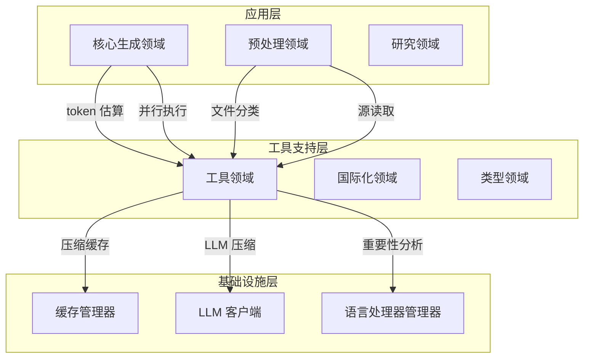
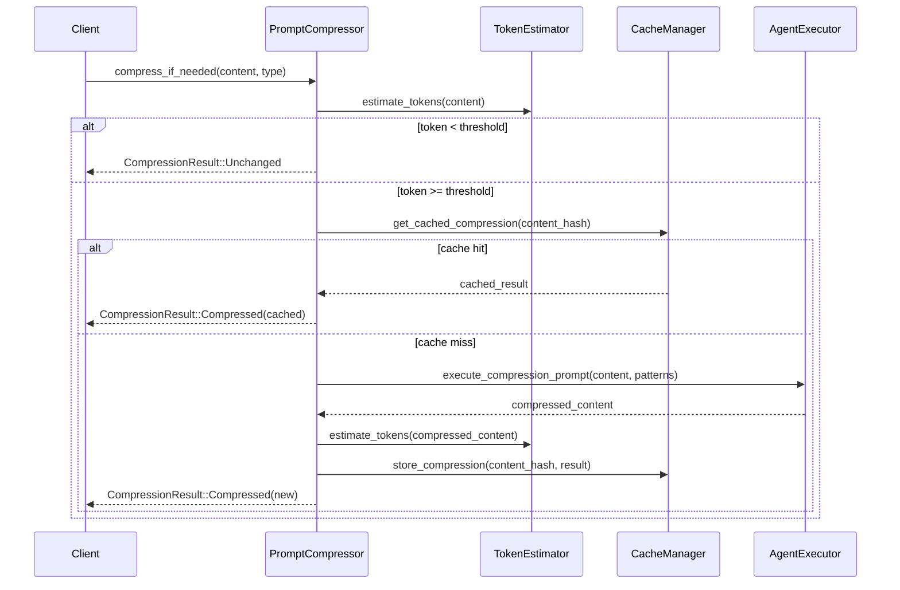

**工具领域技术文档**

**版本:** 1.0  
**分类:** 工具支持领域（共享基础设施层）  
**范围:** 用于 token 管理、并发控制和文件系统操作的跨领域实用服务

---

## 1. 领域概述

**工具领域**为整个 deepwiki-rs 文档生成流水线提供基础基础设施服务。在共享内核层作为**工具支持领域**运行，它提供用于资源优化、并发执行管理和语言感知文件处理的专业实用程序。

该领域将复杂操作（如 LLM token 估算、智能内容压缩和信号量控制并行）抽象为被核心生成、预处理和研究领域消费的组件。

### 1.1 架构定位



---

## 2. 子模块技术规范

### 2.1 Token 估算模块 (`token_estimator.rs`)

**目的:** 计算 LLM API 成本估算和上下文窗口管理的近似 token 消耗。

**算法实现:**

该模块实现基于字符的 token 估算，具有 Unicode 范围感知分类：

- **CJK 字符检测:** 使用 Unicode 范围识别中文、日文和韩文字符：
  - CJK 统一表意文字: `U+4E00` – `U+9FFF`
  - CJK 扩展 A-G: `U+3400` – `U+3134F`
  
- **Token 化比率:**
  - CJK 字符: **每 token 1.5 个字符**（经验平均值）
  - 英语/ASCII: **每 token 4.0 个字符**
  - 基础开销: **50 token**（可配置）

**接口：**
```rust
pub struct TokenEstimation {
    pub total_tokens: usize,
    pub chinese_chars: usize,
    pub english_chars: usize,
    pub overhead: usize,
}

pub fn estimate_tokens(text: &str) -> TokenEstimation
```

**使用上下文:** LLM 调用前的飞行前检查、提示压缩阈值评估和成本跟踪指标。

---

### 2.2 提示压缩模块 (`prompt_compressor.rs`)

**目的:** 智能减少超过 LLM 上下文窗口的大型输入的 token 计数，同时保留语义关键的代码模式。

**压缩策略:**

1. **基于阈值的激活：**
   - 默认触发: **64,000 token**
   - 硬安全限制: **150,000 token**（防止过度消耗的故障安全）

2. **模式保留规则：**
   压缩器在压缩期间维护高价值语法元素：
   - `FunctionSignatures`（函数/方法声明）
   - `TypeDefinitions`（结构、枚举、接口）
   - `ImportStatements`（依赖声明）
   - `InterfaceDefinitions`（trait/协议声明）
   - `ErrorHandling`（异常模式）
   - `Configuration`（设置/构建定义）

3. **缓存集成：**
   - 使用 `CacheManager` 存储按键为内容哈希和内容类型的压缩结果
   - 避免相同压缩请求的冗余 LLM 调用

**执行流程：**


**接口：**
```rust
pub struct CompressionResult {
    pub original_tokens: usize,
    pub compressed_tokens: usize,
    pub compression_ratio: f64,
    pub content: String,
    pub was_cached: bool,
}

pub async fn compress_if_needed(
    context: &GeneratorContext,
    content: &str,
    content_type: ContentType,
) -> Result<CompressionResult>
```

---

### 2.3 并发执行模块 (`threads.rs`)

**目的:** 提供信号量控制的并行执行，以防止批 LLM 操作和文件处理期间的资源耗尽。

**实现细节：**

- **基于信号量的节流:** 使用 `Arc<>` 包装的 `tokio::sync::Semaphore` 在异步任务间共享所有权
- **死锁预防:** 自动将 `max_concurrent=0` 默认为 `1` 以防止许可饥饿
- **完成同步:** 使用 `futures::future::join_all` 进行结果收集

**算法：**
```rust
pub async fn do_parallel_with_limit<T, F>(
    futures: Vec<F>,
    max_concurrent: usize,
) -> Vec<T>
where
    F: Future<Output = T> + Send + 'static,
    T: Send + 'static,
{
    let limit = if max_concurrent == 0 { 1 } else { max_concurrent };
    let semaphore = Arc::new(Semaphore::new(limit));
    
    // 生成带许可获取的任务
    // join_all 用于同步
}
```

**使用上下文:** 跨多个文件的并行代码分析、并发研究智能体执行、具有速率限制的批 LLM API 调用。

---

### 2.4 文件操作套件

#### 2.4.1 文件分类 (`file_utils.rs`)

**目的:** 无需内容检查的快速基于路径的分类。

**能力：**

- **测试文件检测:** 跨语言约定的模式匹配：
  - Python: `test_*.py`、`*_test.py`
  - JavaScript/TypeScript: `*.test.js`、`*.spec.ts`
  - Java: `*Test.java`、`*IT.java`（集成测试）
  - Rust: `*_test.rs`、`#cfg(test)` 模块（按约定）
  - Go: `*_test.go`

- **二进制文件检测:** 基于扩展名的非文本文件过滤：
  - 图像: `.png`、`.jpg`、`.svg`、`.ico`
  - 媒体: `.mp3`、`.mp4`、`.wav`
  - 归档: `.zip`、`.tar.gz`、`.rar`
  - 文档: `.pdf`、`.docx`、`.xlsx`
  - 可执行文件: `.exe`、`.dll`、`.so`

**接口：**
```rust
pub fn is_test_file(path: &Path) -> bool
pub fn is_test_directory(name: &str) -> bool
pub fn is_binary_file_path(path: &Path) -> bool
```

#### 2.4.2 源代码管理 (`sources.rs`)

**目的:** 具有基于重要性的截断和依赖解析的智能文件读取。

**关键特征：**

1. **重要性感知截断：**
   - 将行分类为"重要"（函数签名、结构定义、导入）vs"实现"（逻辑、注释）
   - 截断到 `max_length`（默认 8KB）时优先处理重要行
   - 通过 `LanguageProcessorManager` 进行语言感知分类

2. **依赖解析：**
   - 常见语言的硬编码路径约定：
     - Rust: `src/`、`lib.rs`、`main.rs`
     - JavaScript/TypeScript: `node_modules` 排除、`src/` 包含
     - Java: `src/main/java`、Maven/Gradle 结构
     - Python: `site-packages` 排除、virtualenv 检测

**接口：**
```rust
pub async fn read_code_source(
    absolute_path: &Path,
    max_length: usize,
) -> Result<String>

pub async fn read_dependency_code_source(
    base_path: &Path,
    dependency_name: &str,
    language: &str,
) -> Result<String>
```

#### 2.4.3 项目结构格式化 (`project_structure_formatter.rs`)

**目的:** 生成人类可读的 ASCII 树表示的项目层次结构。

**实现：**

- **确定性排序:** 使用 `BTreeMap` 进行排序、可重现的输出
- **视觉连接器:** ASCII 艺术树绘制 (`├──`, `└──`, `│`)
- **双模式：**
  - 完整树: 文件和目录
  - 仅目录: 隐藏单个文件以获取高级视图

**规范化:** 去除 `./` 前缀和冗余分隔符以保持一致呈现。

---

## 3. 集成架构

### 3.1 领域依赖

工具领域作为具有最小上游依赖的服务提供者运行：

| 消费者领域 | 实用功能 | 集成模式 |
|------------|---------|---------|
| **核心生成** | Token 估算、并行执行 | 通过 `GeneratorContext` 直接函数调用 |
| **预处理** | 文件分类、源读取、树格式化 | 直接模块导入 |
| **缓存** | 压缩结果存储 | 反向依赖（工具使用缓存） |
| **LLM 集成** | 压缩执行 | 工具委托给 `AgentExecutor` |

### 3.2 横切数据流

```mermaid
flowchart LR
    A[预处理智能体] -->|读取| B[源文件]
    A -->|通过| C[FileUtils] 分类
    A -->|通过| D[Sources] 读取
    
    E[研究智能体] -->|大提示| F[PromptCompressor]
    F -->|估算| G[TokenEstimator]
    F -->|检查| H[CacheManager]
    F -->|委托| I[AgentExecutor]
    
    J[工作流编排器] -->|批操作| K[Threads]
    K -->|信号量限制| L[Tokio 运行时]
    
    M[输出生成器] -->|格式化| N[ProjectStructureFormatter]
```

---

## 4. 性能特征

### 4.1 Token 估算准确性

| 字符集 | 比率 | 准确性 |
|--------|------|--------|
| CJK 统一表意文字 | 1.5:1 | ±10% (经验) |
| 拉丁/ASCII | 4.0:1 | ±5% (经验) |
| 混合内容 | 加权 | ±12% |

*注意: 这些比率近似现代子词 token 化算法 (GPT-4/Claude)。*

### 4.2 压缩效率

- **触发阈值:** 64,000 token（可配置）
- **典型压缩比率:** 源代码的 40-60%
- **缓存命中优化:** 在迭代工作流中消除 60-80% 的压缩 LLM 调用

### 4.3 并发限制

- **默认信号量:** 10 个并发操作（每个工作流可配置）
- **开销:** 每个任务 <1ms 用于许可获取
- **内存安全:** 基于 Arc 的共享防止数据竞争

### 4.4 文件操作性能

- **分类:** 通过扩展名哈希 O(1)
- **源读取:** O(n) 其中 n = 文件大小；在 8KB 软限制发生截断
- **树格式化:** 由于 BTreeMap 排序 O(n log n)

---

## 5. 配置与可扩展性

### 5.1 环境配置

工具尊重全局 `Config` 结构：

```toml
[compression]
threshold_tokens = 64000
max_tokens = 150000
preserve_patterns = ["FunctionSignatures", "TypeDefinitions"]

[execution]
max_concurrent_llm_calls = 10
max_file_read_size = 8192
```

### 5.2 扩展点

- **语言支持:** 新语言扩展预处理域中的 `LanguageProcessor` trait；工具通过 `sources.rs` 自动利用重要性分类
- **压缩模式:** 其他 `ContentType` 变体可以定义自定义保留规则
- **文件模式:** 测试/二进制检测支持自定义扩展列表

---

## 6. 错误处理与安全

所有实用函数通过 I18n 领域返回具有国际化错误消息的 `anyhow::Result<T>`。关键安全机制包括：

1. **提示压缩防护栏:** 硬 150K token 天花板防止意外 API 成本爆炸
2. **并发死锁预防:** 零值限制自动纠正为 1
3. **路径遍历保护:** 文件操作尊重 `.gitignore` 模式和显式排除列表
4. **Unicode 安全:** CJK 检测处理完整 Unicode 平面而无疑似代理对问题

---

## 7. 附录：模块文件映射

| 文件路径 | 职责 | 关键导出 |
|----------|------|---------|
| `src/utils/mod.rs` | 模块聚合 | 公共重新导出 |
| `src/utils/token_estimator.rs` | Token 计数 | `estimate_tokens()` |
| `src/utils/prompt_compressor.rs` | 内容压缩 | `compress_if_needed()` |
| `src/utils/threads.rs` | 并行执行 | `do_parallel_with_limit()` |
| `src/utils/file_utils.rs` | 路径分类 | `is_test_file()`、`is_binary_file_path()` |
| `src/utils/sources.rs` | 智能文件读取 | `read_code_source()` |
| `src/utils/project_structure_formatter.rs` | 树可视化 | `format_as_tree()` |

---

**文档控制：**  
- **作者:** 系统架构团队  
- **审查状态:** 针对源实现验证  
- **依赖:** 缓存领域、LLM 集成领域、类型领域  
- **下次审查:** 在添加新实用程序类别时（例如，加密、网络实用程序）

**文档结束**
