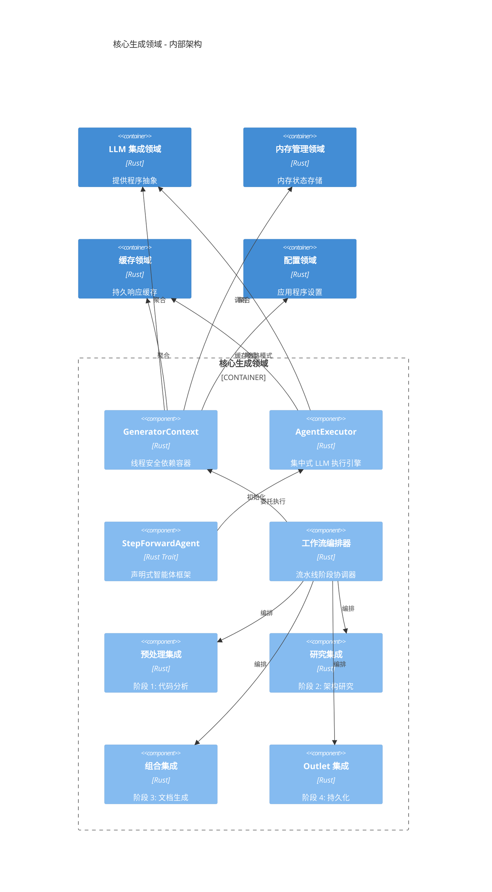
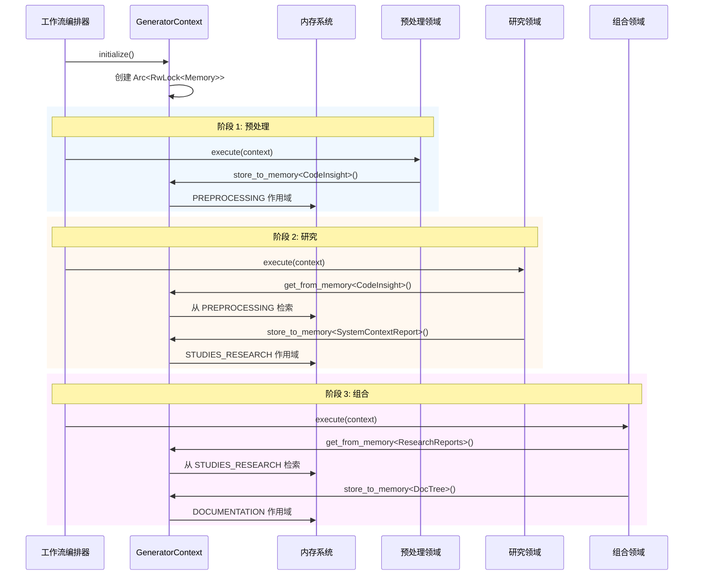

**技术文档：核心生成领域**

**文档信息**
- **模块**: `generator` (核心生成领域)
- **版本**: 1.0
- **最后更新**: 2026-02-01 06:42:05 (UTC)
- **分类**: 架构文档

---

## 1. 执行概述

**核心生成领域**作为 deepwiki-rs 文档生成引擎的中央神经系统。位于 `src/generator/` 内，该领域实现协调端到端 AI 驱动文档流水线的编排层，从初始代码分析到最终 markdown 生成。

作为系统领域驱动设计 (DDD) 架构中的**核心业务领域**，它桥接基础设施关注点（LLM 提供程序、缓存、配置）与领域特定处理阶段（预处理、研究、组合、输出）。该领域实现复杂模式，包括用于依赖注入的**上下文模式**、用于声明式 AI 智能体定义的 **StepForwardAgent Trait 框架**，以及用于阶段协调的**流水线编排器**。

### 关键架构特征
- **线程安全资源管理**: 使用 `Arc<RwLock<T>>` 模式跨异步边界并发访问共享资源
- **双重执行模型**: 支持命令式（预处理）和声明式（研究/组合）智能体执行模式
- **类型安全智能体框架**: 通过关联类型和 JSON 模式验证实现编译时智能体输出保证
- **智能缓存**: 使用 MD5 哈希键和 TTL 管理的缓存旁路模式实现
- **多语言支持**: 集成国际化，具备 8 种语言提示生成能力

---

## 2. 系统架构

### 2.1 组件结构

核心生成领域由四个围绕特定职责组织的主要子模块组成：



### 2.2 设计模式

#### 上下文模式实现
`GeneratorContext`（在 `src/generator/context.rs` 中定义）实现**上下文模式**以提供统一的线程安全依赖容器：

```rust
pub struct GeneratorContext {
    pub config: Config,
    pub llm_client: Arc<LLMClient>,
    pub cache_manager: Arc<RwLock<CacheManager>>,
    pub memory: Arc<RwLock<Memory>>,
    pub knowledge_base: Option<Arc<KnowledgeBase>>,
}
```

**关键设计决策：**
- **Arc<RwLock<T>>**: 实现共享所有权与内部可变性，对并发智能体执行至关重要
- **聚合优于继承**: 显式组合基础设施服务而非继承行为
- **类型安全内存操作**: 提供通用 `store_to_memory<T>` 和 `get_from_memory<T>` 方法，确保智能体间通信的编译时类型安全

#### 双重智能体执行模型

该领域支持两种不同的智能体执行范式：

1. **命令式模式** (预处理): 直接利用 `AgentExecutor` 进行需要精细控制执行流的数据转换任务
2. **声明式模式** (研究/组合): 为研究和合成任务实现 `StepForwardAgent` trait，支持声明式智能体配置，具有可配置的提示和内存作用域

---

## 3. 核心组件

### 3.1 GeneratorContext (依赖容器)

**位置**: `src/generator/context.rs`  
**分类**: 基础设施适配器 + 依赖注入容器

**职责：**
- 聚合并提供对基础设施服务（LLM、缓存、内存）的线程安全访问
- 实现具有类型化存储/检索的内存操作外观
- 通过 `KnowledgeSyncer` 加载和集成外部知识库
- 为运行时参数提供配置访问

**线程安全模型：**
所有共享资源利用 `Arc<RwLock<T>>` 支持并发智能体执行，同时防止数据竞争：
- `Arc` 使多个智能体能够共享昂贵资源（LLM 客户端、缓存）的所有权
- `RwLock` 在确保独占写访问（缓存更新、内存写入）的同时允许多个并发读取器（智能体查询）

**外部知识集成：**
```rust
pub async fn load_external_knowledge_by_categories(
    &self,
    categories: &[&str],
    target_agent: Option<&str>
) -> Option<String>
```
此方法支持 RAG 风格（检索增强生成）的上下文注入，允许研究智能体按类别（架构、数据库、API、ADR）查询同步的文档存储库。

### 3.2 StepForwardAgent 框架

**位置**: `src/generator/step_forward_agent.rs`  
**分类**: 基于 Trait 的抽象层

**StepForwardAgent** trait 提供通过声明式配置而非命令式代码定义 LLM 驱动智能体的完整基础设施。该框架支持快速开发新的研究和组合智能体。

**核心 Trait 定义：**
```rust
#[async_trait]
pub trait StepForwardAgent {
    type Output: JsonSchema + Deserialize + Serialize + Send + Sync + 'static;
    
    fn agent_type(&self) -> String;
    fn agent_type_enum(&self) -> Option<AgentType>;
    fn data_config(&self) -> AgentDataConfig;
    fn prompt_template(&self, lang: TargetLanguage) -> String;
    fn llm_call_mode(&self) -> LLMCallMode;
    fn post_process(&self, result: &Self::Output) -> anyhow::Result<()>;
    fn should_include_timestamp(&self) -> bool;
    fn provide_custom_prompt_content(&self) -> Option<String>;
    
    async fn execute(&self, ctx: Arc<GeneratorContext>) -> anyhow::Result<Self::Output>;
}
```

**关键架构元素：**

#### 数据源抽象
`DataSource` 枚举将智能体与特定数据检索机制解耦：
- `MemoryData`: 从内存作用域检索预处理结果（CodeInsights、ProjectStructure）
- `ResearchResult`: 访问先前的研究输出（SystemContextReport、DomainModulesReport）
- `ExternalKnowledgeByCategory`: 查询外部文档存储库

#### 智能 DataFormatter
自动化 LLM 消费的内容准备：
- **分层格式化**: 将复杂数据类型（Vec<CodeInsight>、HashMap 依赖）结构化为 LLM 优化的文本表示
- **自适应截断**: 当内容超过 token 限制时应用智能截断，保留关键结构信息
- **智能压缩**: 利用 `PromptCompressor` 优化内容密度，同时保持语义意义

#### GeneratorPromptBuilder
构建多语言提示：
- 使用 Tera 风格语法的基于模板的提示构造
- 自动时间戳注入（当 `should_include_timestamp()` 返回 true 时）
- 基于 `TargetLanguage` 配置的特定语言指令集
- 通过 `provide_custom_prompt_content()` 进行动态内容注入

#### LLMCallMode 策略模式
控制调用策略：
- `Extract`: 具有模式验证的结构化 JSON 提取（用于研究智能体）
- `Prompt`: 简单文本生成（用于组合编辑器）
- `PromptWithTools`: 具有工具访问的 ReAct 模式执行（用于需要文件系统探索的分析）

**执行生命周期（7 步流程）：**
1. **验证**: 验证必需数据源的可用性
2. **收集**: 从内存、外部知识或预处理结果收集数据
3. **格式化**: 应用 DataFormatter 准备提示上下文的内容
4. **提示构建**: 使用模板和元数据构建最终提示
5. **LLM 调用**: 基于 LLMCallMode 委托给 AgentExecutor
6. **结果存储**: 将结构化输出持久化到适当的内存作用域
7. **后处理**: 执行副作用（日志记录、指标、验证）

### 3.3 AgentExecutor (执行引擎)

**位置**: `src/generator/agent_executor.rs`  
**分类**: 基础设施服务

**AgentExecutor** 提供三种不同执行模式的集中式、优化 LLM 操作执行：

#### 1. 简单提示执行
```rust
pub async fn prompt(&self, sys_prompt: &str, user_prompt: &str, ...) -> Result<String>
```
直接文本生成，具有自动缓存和 token 估算。

#### 2. 工具增强执行 (ReAct)
```rust
pub async fn prompt_with_tools(
    &self,
    sys_prompt: &str,
    user_prompt: &str,
    tools: Vec<ToolDefinition>,
    ...
) -> Result<String>
```
实现 ReAct（推理 + 行动）模式，使智能体能够：
- 调用文件探索工具（`FileExplorerTool`、`FileReaderTool`）
- 执行时间感知操作
- 使用工具反馈循环执行多步推理

#### 3. 结构化提取
```rust
pub async fn extract<T>(
    &self,
    sys_prompt: &str,
    user_prompt: &str,
    max_retries: u32,
    ...
) -> Result<T>
```
使用 `JsonSchema` 派生宏进行模式验证的类型安全 JSON 提取。

**缓存旁路模式实现：**
```rust
// 执行流程的伪代码
async fn execute_with_cache(&self, params: AgentExecuteParams) -> Result<Response> {
    let cache_key = generate_md5_key(&params);
    
    // 检查缓存
    if let Some(cached) = self.cache.get(&cache_key).await {
        return Ok(cached);
    }
    
    // 执行 LLM 调用
    let response = self.llm_client.call(params).await?;
    
    // 使用 token 元数据存储
    self.cache.set_with_tokens(cache_key, response).await?;
    Ok(response)
}
```

**性能优化：**
- **Token 估算**: 使用 `estimate_token_usage()` 进行预检 token 计数，防止 API 配额耗尽
- **多语言反馈**: 控制台输出遵守 `config.target_language` 以提供本地化进度指示器
- **重试逻辑**: 对瞬态故障自动进行指数退避重试

### 3.4 工作流编排器

**位置**: `src/generator/workflow.rs`  
**分类**: 流程协调器

**工作流编排器**实现**流水线模式**以协调四阶段文档生成过程：

**流水线阶段：**
1. **知识同步** (可选): 同步外部文档存储库
2. **预处理**: 静态代码分析和 AI 驱动分类
3. **研究**: 多智能体架构分析（C1-C4 抽象级别）
4. **组合**: Markdown 文档生成
5. **输出**: 文件持久化和摘要生成

**时间指标收集：**
```rust
struct TimingScope {
    key: TimingKeys,  // Preprocess、Research、Analysis、Document、Outlet
    start: Instant,
}
```
为每个阶段收集性能指标，将结果存储在内存中以供最终摘要生成。

**错误边界：**
每个阶段作为独立的工作单元运行，具有：
- 阶段特定的错误上下文
- 部分故障处理（跳过单个文件 vs 使整个流水线失败）
- 优雅降级（如果同步失败，继续没有外部知识）

---

## 4. 数据流架构

核心生成领域实现具有流水线阶段之间显式状态转换的**单向数据流**：

### 4.1 内存作用域管理

数据流经三个不同的内存作用域，确保处理阶段之间的清晰分离：

| 作用域 | 生产者 | 消费者 | 数据类型 | 生命周期 |
|-------|--------|--------|---------|---------|
| **PREPROCESSING** | PreProcessAgent | 研究智能体 | `Vec<CodeInsight>`、`ProjectStructure` | 研究后清除 |
| **STUDIES_RESEARCH** | ResearchOrchestrator | DocumentationComposer | `SystemContextReport`、`DomainModulesReport`、`ArchitectureReport` | 组合后清除 |
| **DOCUMENTATION** | DocumentationComposer | DiskOutlet | `DocTree`、`MarkdownContent` | 输出后清除 |

### 4.2 跨领域通信序列



**数据完整性机制：**
- **类型安全**: 通用内存操作确保存储/检索类型的编译时验证
- **作用域隔离**: 每个作用域充当逻辑边界，防止意外的跨阶段数据污染
- **显式契约**: 智能体通过 `AgentDataConfig` 声明必需的数据源，在执行前验证

---

## 5. 集成模式

### 5.1 依赖关系

核心生成领域位于架构中心，依赖于基础设施领域，同时编排业务领域：

**上游依赖（基础设施）：**
- **配置管理**: 项目设置、LLM 提供程序凭证、执行参数
- **LLM 集成**: AI 模型抽象、API 客户端、ReAct 能力
- **缓存领域**: 使用基于 MD5 的键和 TTL 管理的响应缓存
- **内存管理**: 跨异步边界的内存状态持久化
- **国际化**: 多语言控制台输出和提示生成
- **知识集成**: 外部文档摄取和 RAG 检索

**下游编排（业务领域）：**
- **预处理领域**: 接收执行上下文，触发 6 步分析流水线
- **研究领域**: 协调 8 个专业智能体进行分阶段执行
- **组合领域**: 编排 6 个编辑器智能体进行文档生成
- **输出领域**: 触发最终持久化和后处理

### 5.2 扩展点

架构提供多种机制来自定义行为：

#### 自定义智能体开发
要实现新的研究智能体：
1. 使用关联的 `Output` 类型实现 `StepForwardAgent` trait
2. 定义 `AgentDataConfig` 指定必需的内存输入
3. 为支持的语言提供提示模板
4. 选择适当的 `LLMCallMode`（Extract 用于结构化数据，Prompt 用于文本）
5. 实现 `post_process()` 进行验证或副作用

#### 工作流自定义
流水线支持条件执行：
- **知识同步**: 如果未配置外部知识库则跳过
- **数据库分析**: 基于 SQL 文件存在性的条件执行
- **特定语言处理**: 基于项目文件扩展名的动态分发

---

## 6. 实现细节

### 6.1 并发模型

**异步运行时**: 基于 Tokio 构建，利用 `async/await` 进行非阻塞 I/O 操作。

**并发控制**：
- **基于信号量的限制**: 预处理和 Research 阶段使用 `utils::threads` 进行受控并行，防止分析大型代码库时的资源耗尽
- **读写锁定**: 内存和缓存使用 `RwLock` 允许研究期间的并发读取，同时确保独占写访问

**安全保证**：
- **Send + Sync 边界**: 所有跨线程边界的类型实现必需的标记 trait
- **Arc 用于共享状态**: 当多个智能体引用相同上下文时防止释放后使用

### 6.2 类型安全与验证

**JSON 模式验证：**
所有实现 `StepForwardAgent` 的智能体输出必须满足：
```rust
type Output: JsonSchema + Deserialize + Serialize + Send + Sync + 'static;
```
这确保：
- LLM 提取期间的运行时针对 JSON 模式的验证
- 使用 Serde 进行类型安全反序列化
- 编译时线程安全验证

**缓存键生成：**
使用提示内容 + 操作类型的 MD5 哈希生成确定性缓存键，具有适合预期操作量的碰撞抗性。

### 6.3 错误处理策略

**分层错误上下文：**
- **anyhow**: 用于带上下文的错误传播（例如，`context("执行研究智能体失败")?`）
- **thiserror**: 用于可恢复故障的领域特定错误枚举
- **优雅降级**: 外部知识同步失败不会使流水线停止；系统继续使用纯代码分析

---

## 7. 使用示例

### 7.1 定义自定义研究智能体

```rust
use crate::generator::step_forward_agent::{
    StepForwardAgent, AgentDataConfig, DataSource, LLMCallMode
};
use crate::types::research::SecurityAnalysisReport;
use schemars::JsonSchema;

pub struct SecurityAnalyzer;

#[async_trait]
impl StepForwardAgent for SecurityAnalyzer {
    type Output = SecurityAnalysisReport;
    
    fn agent_type(&self) -> String {
        "security_analyzer".to_string()
    }
    
    fn data_config(&self) -> AgentDataConfig {
        AgentDataConfig {
            required_sources: vec![
                DataSource::MemoryData(DataSource::CODE_INSIGHTS),
                DataSource::MemoryData(DataSource::PROJECT_STRUCTURE),
            ],
            optional_sources: vec![],
        }
    }
    
    fn llm_call_mode(&self) -> LLMCallMode {
        LLMCallMode::Extract  // 结构化 JSON 输出
    }
    
    fn prompt_template(&self, lang: TargetLanguage) -> String {
        format!(
            "分析以下代码以查找安全漏洞...\n\
             语言: {}\n\
             上下文: {{source_0}}\n\
             结构: {{source_1}}",
            lang.as_str()
        )
    }
    
    async fn execute(&self, ctx: Arc<GeneratorContext>) -> anyhow::Result<Self::Output> {
        // 框架处理数据加载、提示构造和 LLM 调用
        self.run_standard_execution(ctx).await
    }
}
```

### 7.2 执行工作流

```rust
use crate::generator::workflow::Workflow;
use crate::config::Config;

async fn generate_documentation(config: Config) -> anyhow::Result<()> {
    // 使用配置初始化工作流
    let workflow = Workflow::new(config);
    
    // 执行完整流水线
    workflow.execute().await?;
    
    Ok(())
}
```

---

## 8. 性能考虑

### 8.1 优化策略

**智能缓存：**
- 在 `AgentExecutor` 级别使用 MD5 键缓存 LLM 响应
- 缓存旁路模式最小化相同提示的冗余 API 调用
- Token 使用跟踪支持成本分析和预算规划

**提示压缩：**
- 当内容接近 token 限制时，`DataFormatter` 应用 `PromptCompressor`
- 分层截断在减小大小时保留结构关系
- 压缩结果本身被缓存以避免重新处理

**并行执行：**
- 研究智能体在依赖允许的情况下以受控并行执行
- 预处理使用基于信号量的节流进行并行文件分析
- 组合编辑器并发处理独立部分

### 8.2 资源管理

**内存作用域：**
阶段完成后显式清除内存作用域，防止长时间运行流水线期间的无限内存增长：
```rust
// Research 阶段完成后
memory.clear_scope(MemoryScope::PREPROCESSING).await?;
```

**连接池：**
`LLMClient` 为基于 HTTP 的提供程序（OpenAI、Ollama）维护连接池，减少连接建立开销。

---

## 9. 最佳实践

### 9.1 扩展框架

实现新智能体时：
1. **优先声明式**: 对研究/组合任务使用 `StepForwardAgent`；保留命令式 `AgentExecutor` 用于预处理数据转换
2. **类型安全**: 始终定义具有 `JsonSchema` 派生的具体 `Output` 类型以启用自动验证
3. **错误上下文**: 使用 anyhow 的 `.context()` 提供有意义的错误消息，指示哪个智能体失败
4. **数据最小化**: 在 `AgentDataConfig` 中仅指定必需的数据源，以最小化上下文窗口使用和成本

### 9.2 调试与可观察性

**日志集成：**
框架在每个生命周期步骤提供结构化日志记录：
- 数据源检索状态
- 提示压缩比率
- 缓存命中/未命中统计
- LLM API 延迟

**性能分析：**
使用内置的 `TimingScope` 测量自定义操作：
```rust
let _timing = TimingScope::new(TimingKeys::CustomOperation);
// ... 你的代码 ...
// 在 drop 时自动记录持续时间
```

---

## 10. 结论

核心生成领域代表了一个复杂的编排层，通过基于 trait 的智能体定义平衡**灵活性**，通过类型安全执行和全面的错误处理平衡**可靠性**。通过抽象 `AgentExecutor` 背后的 LLM 交互，通过 `StepForwardAgent` 标准化智能体定义，并通过 `GeneratorContext` 管理复杂状态，该领域支持新文档生成能力的快速开发，同时保持系统完整性。

架构对**单向数据流**、**显式内存作用域**和**声明式智能体配置**的强调使其特别适合长运行的、多阶段 AI 流水线，其中中间结果必须保留并在不同处理上下文之间共享。

**关键要点：**
- 带有 `Arc<RwLock<T>>` 的上下文模式为并发 AI 智能体执行提供线程安全依赖注入
- StepForwardAgent trait 框架支持声明式智能体定义，具有编译时类型安全
- AgentExecutor 级别的缓存旁路模式显著降低 API 成本并提高性能
- 内存作用域在流水线阶段之间提供清晰的数据边界，防止状态污染

---

**文档维护：**
- **审查周期**: 每季度或主要功能添加时
- **利益相关者**: 架构团队、核心贡献者、平台工程师
- **验证**: 确保与 `src/generator/*.rs` 源代码对齐

**文档结束**
