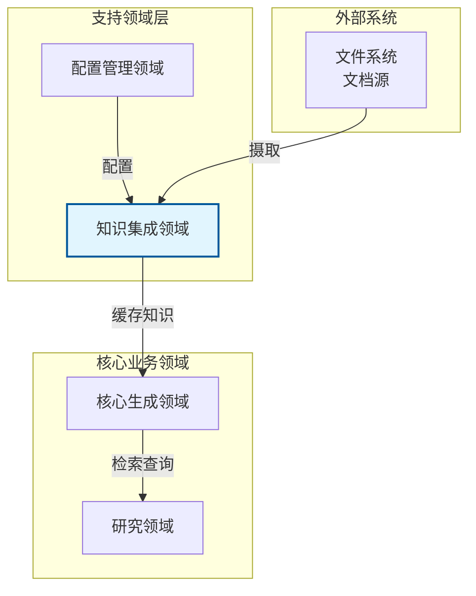
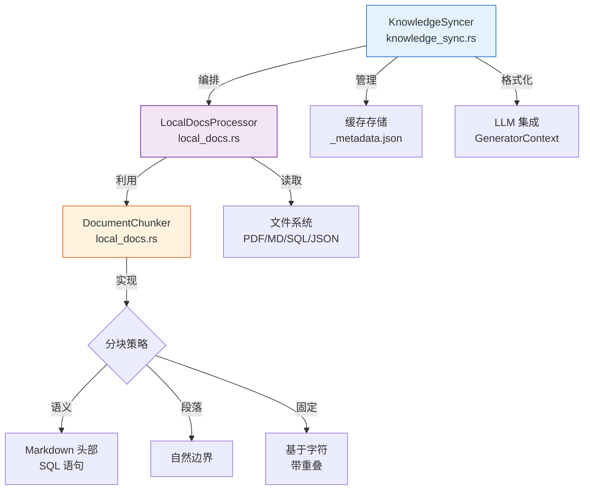
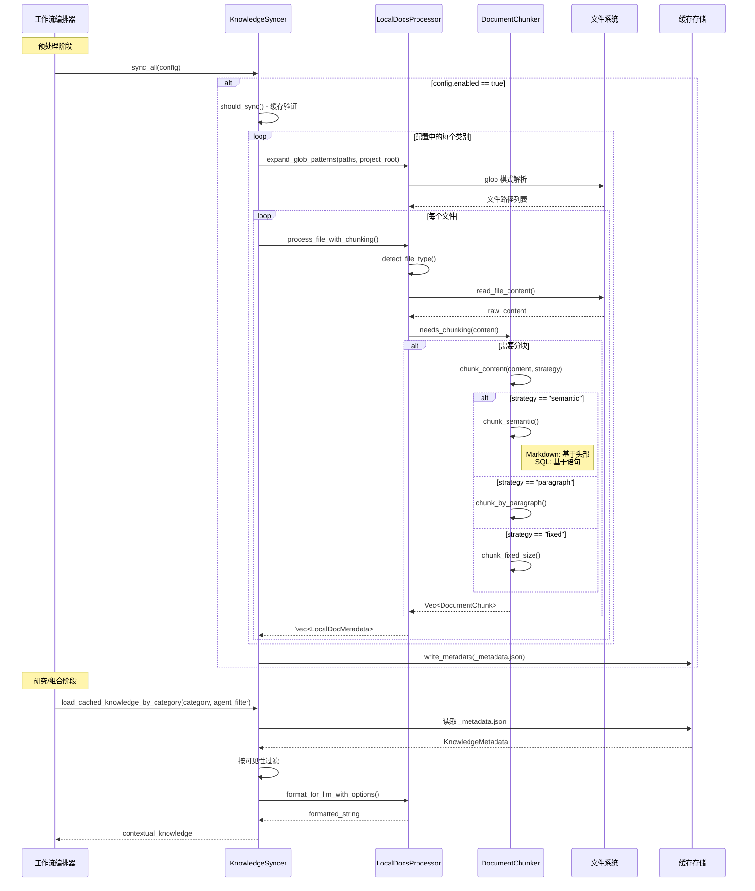

**知识集成领域技术文档**

**版本:** 1.0  
**最后更新:** 2026-02-01 06:40:13 (UTC)  
**系统:** deepwiki-rs  
**分类:** 工具支持领域

---

## 1. 执行概述

**知识集成领域**提供了一个全面的外部知识摄取和检索系统，在 deepwiki-rs 架构中将本地文档源与 AI/LLM 消费桥接。作为**工具支持领域**运行，该模块实现了一个 RAG（检索增强生成）风格的流水线，使文档生成系统能够利用现有的技术文档、架构决策记录 (ADR)、API 规范和数据库模式。

### 1.1 主要能力

| 能力 | 描述 | 业务价值 |
|------|------|---------|
| **多格式摄取** | 处理 PDF、Markdown、SQL、YAML、JSON 和纯文本文件 | 无需格式转换即可利用现有文档资产 |
| **智能分块** | 语义、段落和固定大小分块策略 | 防止 LLM 上下文窗口溢出，同时保持文档连贯性 |
| **增量同步** | 文件修改时间跟踪和基于 HashSet 的变更检测 | 通过避免不必要的重新处理最小化 API 成本 |
| **基于智能体的访问控制** | 对特定 AI 智能体的细粒度文档定位 | 实现安全知识隔离 |
| **分类组织** | 基于分类学的文档分类（架构、数据库、API、ADR、工作流、部署、通用） | 用于专业研究智能体的上下文感知检索 |

### 1.2 系统位置

在 deepwiki-rs 的领域驱动设计架构中，知识集成领域位于**支持领域层**，为**核心生成领域**提供基础设施能力。它与配置管理领域接口以进行路径解析，与内存管理领域接口以在智能体执行期间进行缓存知识检索。



---

## 2. 架构与组件

该领域遵循模块化流水线架构，由三个主要组件组成，协调从原始文档文件到 LLM 优化知识段的流程。

### 2.1 组件架构



### 2.2 核心组件

#### 2.2.1 KnowledgeSyncer

负责同步生命周期的中央编排器：
- **变更检测**: 将文件修改时间 (`mtime`) 与 `last_synced` 时间戳进行比较，使用 HashSet 对称差集检测添加/删除
- **元数据持久化**: 管理 `KnowledgeMetadata` JSON 序列化到 `_metadata.json`
- **智能体过滤**: 基于 `target_agents` 配置实现 `doc_visible_to_agent()` 进行访问控制
- **分类检索**: 为领域特定知识注入提供 `load_cached_knowledge_by_category()`

#### 2.2.2 LocalDocsProcessor

处理文件系统操作和内容转换的静态实用程序结构：
- **Glob 解析**: 使用 `fs::canonicalize` 进行路径规范化，相对于项目基础路径扩展 glob 模式
- **多格式提取**: 
  - 通过 `pdf_extract` crate 进行 PDF 处理
  - 通过标准文件 I/O 处理基于文本的格式（Markdown、SQL、YAML、JSON、文本）
- **LLM 格式化**: `format_for_llm_with_options()` 生成具有头部、时间戳和分块元数据的结构化输出，针对上下文窗口消费优化

#### 2.2.3 DocumentChunker

封装内容分段策略以管理 LLM token 约束：
- **配置驱动**: 接受指定大小、重叠和策略参数的 `ChunkingConfig`
- **内容感知处理**: 文件类型检测触发专门解析：
  - **Markdown**: 按 H1/H2/H3 头部层次拆分
  - **SQL**: 语句边界检测（CREATE、ALTER、DROP、INSERT、UPDATE、DELETE）
  - **通用文本**: 回退到段落或固定大小策略

---

## 3. 数据模型

该领域维护结构化元数据以实现增量同步和精确检索。

### 3.1 核心数据结构

```rust
// KnowledgeMetadata: 顶级同步状态
struct KnowledgeMetadata {
    last_synced: DateTime<Utc>,
    categories: HashMap<String, Vec<LocalDocMetadata>>
}

// LocalDocMetadata: 单个文档跟踪
struct LocalDocMetadata {
    file_path: PathBuf,
    file_type: String,
    modified_at: SystemTime,
    content: String,
    category: String,
    target_agents: Vec<String>,
    chunk_info: Vec<ChunkInfo>
}

// ChunkInfo: 分段元数据
struct ChunkInfo {
    chunk_index: usize,
    total_chunks: usize,
    section_context: Option<String>
}

// ChunkingConfig: 处理参数
struct ChunkingConfig {
    strategy: ChunkingStrategy,  // 语义 | 段落 | 固定
    chunk_size: usize,
    chunk_overlap: usize
}
```

### 3.2 存储布局

```
{internal_cache_dir}/
└── knowledge/
    └── local_docs/
        ├── _metadata.json           # KnowledgeMetadata 序列化
        ├── architecture/
        │   └── [document_chunks]
        ├── database/
        ├── api/
        └── ...
```

---

## 4. 处理流水线

### 4.1 知识同步工作流

同步过程作为文档生成工作流中的可选初始阶段执行，在预处理之前。



### 4.2 分块策略

系统实现三种针对不同内容特征的分块算法：

| 策略 | 用例 | 实现细节 |
|------|------|---------|
| **语义型** | 结构化文档（Markdown、SQL） | • Markdown: 在 H1/H2/H3 头部拆分保留层次结构<br/>• SQL: 在语句边界拆分（CREATE/ALTER/DROP/INSERT/UPDATE/DELETE）<br/>• 通过章节头部保留上下文 |
| **段落型** | 自然语言文本 | 在双换行符 (`\n\n`) 上拆分，保持段落边界 |
| **固定大小** | 任意二进制或文本内容 | 基于字符的分段，可配置重叠以保持连续性 |

---

## 5. 配置接口

该领域通过 `LocalDocsConfig` 结构消费配置，通常在主应用程序配置 TOML 文件中定义。

### 5.1 配置模式

```toml
[local_docs]
enabled = true
cache_dir = "target/.deepwiki/knowledge"
watch_for_changes = true

[[local_docs.categories]]
name = "architecture"
patterns = ["docs/arch/**/*.md", "docs/adr/*.md"]
target_agents = ["ArchitectureResearcher", "OverviewEditor"]

[[local_docs.categories]]
name = "database"
patterns = ["schema/*.sql", "migrations/**/*.sql"]
target_agents = ["DatabaseOverviewAnalyzer"]

[local_docs.chunking_config]
strategy = "semantic"
chunk_size = 4000
chunk_overlap = 200
```

### 5.2 配置参数

| 参数 | 类型 | 描述 | 默认值 |
|------|------|------|--------|
| `enabled` | 布尔值 | 知识集成主开关 | `false` |
| `cache_dir` | 路径 | 处理文档的持久存储位置 | `{internal_path}/knowledge/local_docs/` |
| `watch_for_changes` | 布尔值 | 为增量同步启用文件系统监控 | `true` |
| `categories` | 数组 | 具有 glob 模式和智能体定位的文档分类 | 必需 |
| `chunking_config.strategy` | 枚举 | `semantic` \| `paragraph` \| `fixed` | `semantic` |
| `chunking_config.chunk_size` | 整数 | 每块最大字符数 | 4000 |
| `chunking_config.chunk_overlap` | 整数 | 块之间的字符重叠 | 200 |

---

## 6. 集成模式

### 6.1 外部接口

**文件系统接口**
- **读取操作**: 用于 `mtime` 跟踪的 `fs::read_to_string`、`fs::metadata`、用于 PDF 二进制处理的 `pdf_extract::extract_text_from_mem`
- **路径解析**: `fs::canonicalize` 确保跨平台的一致路径比较
- **Glob 扩展**: 针对项目相对路径的模式匹配

**LLM 集成接口**
- **检索 API**: `load_cached_knowledge_by_category(category, agent_filter)` 返回为提示注入优化的格式化字符串
- **格式化**: Markdown 头部包括类别显示名称、同步时间戳和文档计数以提供时间上下文
- **智能体范围**: 文档按 `target_agents` 向量过滤以限制敏感或无关知识

### 6.2 内部通信

| 源 | 目标 | 接口 | 目的 |
|------|------|------|------|
| **KnowledgeSyncer** | **LocalDocsProcessor** | `process_file_with_chunking()` | 文件摄取和分段 |
| **KnowledgeSyncer** | **LocalDocsProcessor** | `expand_glob_patterns()` | 路径解析 |
| **KnowledgeSyncer** | **缓存存储** | JSON Serde 序列化 | 元数据持久化 |
| **LocalDocsProcessor** | **DocumentChunker** | `ChunkingConfig` | 分块参数传播 |
| **核心生成** | **KnowledgeSyncer** | `sync_all()`、`load_cached_*()` | 工作流协调 |

---

## 7. 实现规范

### 7.1 变更检测算法

系统通过多层变更检测最小化冗余处理：

1. **时间戳比较**: 文件 `mtime` 与 `KnowledgeMetadata.last_synced` 比较
2. **集合差分分析**: 使用 HashSet 对称差集将当前文件路径与缓存路径比较以检测添加/删除
3. **路径规范化**: `fs::canonicalize` 解析符号链接和相对路径以进行一致比较

### 7.2 文件类型检测

基于文件扩展名的自动检测：
- `.pdf` → PDF 处理流水线
- `.md`、`.markdown` → Markdown 语义分块
- `.sql` → SQL 语句分块
- `.yaml`、`.yml`、`.json` → 带段落分块的结构化文本
- `.txt` 和其他 → 纯文本处理

### 7.3 并发与安全

- **线程安全**: `KnowledgeSyncer` 在核心生成领域的 `Arc<RwLock<T>>` 上下文模式中运行
- **I/O 限制**: 文件处理通常是 I/O 限制；分块操作是 CPU 限制但在小文本段上操作
- **一致性**: 元数据写入是原子的（写入后重命名）以防止中断期间损坏

---

## 8. 使用示例

### 8.1 同步触发器

```rust
// 在工作流编排器内
if config.local_docs.enabled {
    let syncer = KnowledgeSyncer::new(config.internal_path.clone());
    syncer.sync_all(&config.local_docs).await?;
}
```

### 8.2 智能体知识检索

```rust
// 在研究智能体执行期间
let knowledge_base = context.knowledge_base.as_ref()?;
let architecture_context = knowledge_base
    .load_cached_knowledge_by_category("architecture", Some(agent_name))
    .await?;

let prompt = format!("{}\n\n上下文:\n{}", base_prompt, architecture_context);
```

---

## 9. 性能考虑

| 指标 | 优化策略 | 影响 |
|------|---------|------|
| **API 成本** | 处理块的积极缓存；基于 mtime 的失效 | 通过重用处理的文档减少 LLM token 使用 |
| **内存使用** | 大型 PDF 的流式文件读取；分块处理 | 防止大型文档存储库的 OOM 错误 |
| **启动时间** | 并行 glob 扩展和文件处理 | 在文档生成工作流中摊销 |
| **存储** | JSON 压缩；选择性类别同步 | 可配置的缓存保留策略 |

---

## 10. 附录

### 10.1 术语表

| 术语 | 定义 |
|------|------|
| **RAG** | 检索增强生成；结合外部知识检索与生成式 AI 的技术 |
| **语义分块** | 尊重文档结构（头部、语句）的内容感知拆分 |
| **目标智能体** | 被授权访问特定知识类别的特定 AI 智能体 |
| **HashSet 对称差集** | 识别任一集合独有元素的数学运算（用于文件添加/删除检测） |

### 10.2 依赖

- `pdf_extract`: PDF 文本提取
- `serde`: 元数据持久化的 JSON 序列化
- `chrono`: UTC 时间戳管理
- 标准库: `std::fs`、`std::path`、`std::collections::HashSet`

---

**文档结束**
