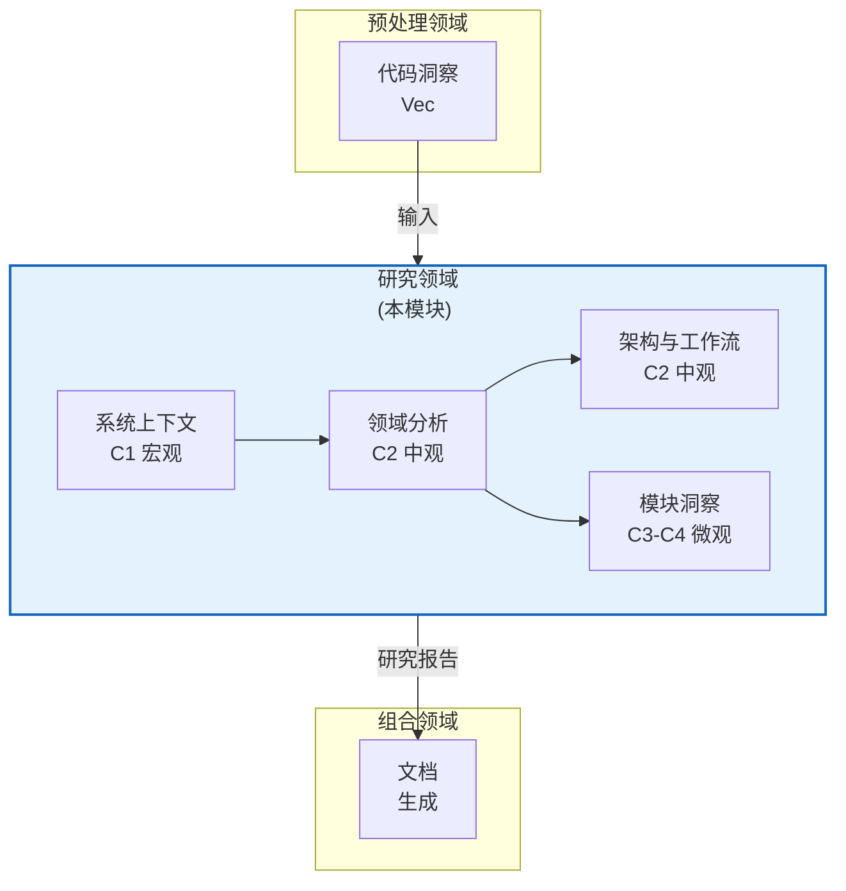
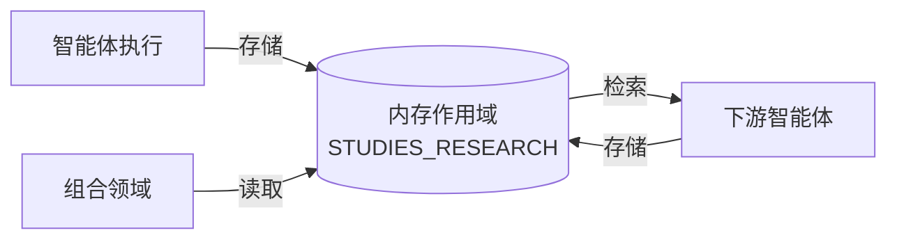
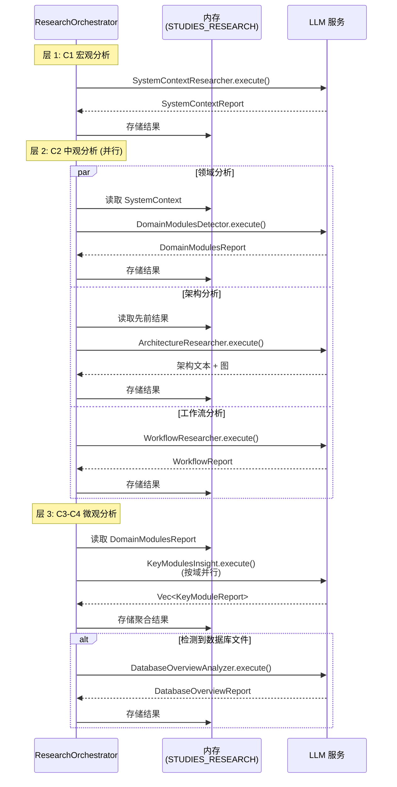

**技术文档：研究领域模块**

**版本:** 1.0  
**最后更新:** 2026-02-01 06:43:25 (UTC)  
**分类:** 内部技术文档  
**置信度评分:** 0.92 (高)

---

## 1. 执行摘要

**研究领域**是 deepwiki-rs 文档生成流水线的分析引擎，实现复杂的智能体架构，对软件项目进行全面架构分析。作为文档生成工作流的第二阶段，该领域将来自预处理领域的原始代码洞察通过 8 智能体研究流水线转换为结构化架构智能，与 C4 模型抽象级别对齐。

该领域执行分阶段分析，从宏观系统上下文 (C1) 到中观领域架构 (C2) 再到微观实现细节 (C3-C4)，确保高级架构上下文通知详细技术分析。通过利用 `StepForwardAgent` trait 框架和内存作用域状态管理，研究领域支持声明式智能体定义、在依赖允许的情况下并行执行，以及通过研究流水线的系统上下文传播。

---

## 2. 架构概述

### 2.1 在系统架构中的位置

研究领域位于核心生成流水线的中心，作为原始代码分析和文档组合之间的桥梁：



### 2.2 C4 抽象层架构

研究领域实现对应于 C4 模型抽象级别的三层分析架构：

| 层 | C4 级别 | 智能体 | 抽象焦点 |
|-----|---------|--------|---------|
| **宏观** | C1 (系统上下文) | SystemContextResearcher | 业务价值、利益相关者、外部系统、系统边界 |
| **中观** | C2 (容器/组件) | DomainModulesDetector、ArchitectureResearcher、WorkflowResearcher | 领域边界、架构模式、业务工作流 |
| **微观** | C3-C4 (组件/代码) | KeyModulesInsight、BoundaryAnalyzer、DatabaseOverviewAnalyzer | 实现细节、接口、数据库模式 |

这种分层方法确保下游智能体从上游分析接收上下文基础，防止断开的架构观察。

---

## 3. 核心组件

### 3.1 研究编排器

`ResearchOrchestrator` 作为中央协调中心，实现分阶段依赖管理和智能体生命周期编排。

**关键职责：**
- **依赖驱动执行**: 管理智能体执行顺序，确保 C1 分析在 C2 之前完成，C2 通知 C3-C4
- **条件逻辑**: 评估项目特征（例如，`.sql` 文件的存在）以触发条件智能体如 `DatabaseOverviewAnalyzer`
- **资源管理**: 控制 `KeyModulesInsight` 的并行性限制以防止 LLM 速率限制
- **状态聚合**: 将单个智能体输出收集到统一的 `STUDIES_RESEARCH` 内存作用域

**执行流程：**
```rust
// 确保依赖满足的分阶段执行
execute_research_pipeline()
├── 层 1: SystemContextResearcher (顺序)
├── 层 2: DomainModulesDetector → ArchitectureResearcher、WorkflowResearcher (并行)
└── 层 3: KeyModulesInsight → BoundaryAnalyzer → DatabaseOverviewAnalyzer (条件)
```

### 3.2 八个研究智能体

该领域实现八个专门智能体，每个针对特定架构关注：

#### 层 1: 系统上下文 (C1)
**SystemContextResearcher**
- **目的**: 按照 C4 模型标准建立高级系统上下文
- **输入**: `PROJECT_STRUCTURE`、`CODE_INSIGHTS`、`README_CONTENT`
- **输出**: 包含业务价值、用户角色、外部系统、系统边界的 `SystemContextReport`
- **执行模式**: 结构化提取（JsonSchema 验证）

#### 层 2: 领域与架构 (C2)
**DomainModulesDetector**
- **目的**: 执行领域驱动设计 (DDD) 分析以识别限界上下文和领域模块
- **方法论**: 分析代码组织模式、命名空间结构和依赖图
- **输出**: 具有置信评分的域分类和域间关系的 `DomainModulesReport`

**ArchitectureResearcher**
- **目的**: 针对文档化模式验证实现并生成架构图
- **专业化**: 检测架构漂移、识别设计模式、生成 Mermaid 图
- **执行模式**: 工具增强分析 (`PromptWithTools`) 以增强探索

**WorkflowResearcher**
- **目的**: 识别核心业务工作流和执行路径
- **分析范围**: 主工作流、次要流程、异常处理模式
- **输出**: 具有 Mermaid 序列图的 `WorkflowReport`

#### 层 3: 实现细节 (C3-C4)
**KeyModulesInsight**
- **目的**: 单个领域模块的并行深入分析
- **并发**: 使用可配置并行性同时处理多个域
- **Token 管理**: 实现文件大小限制（排除 50KB、截断 10KB）和基于重要性的过滤（前 50 洞察）
- **输出**: 具有技术实现细节的 `Vec<KeyModuleReport>`

**BoundaryAnalyzer**
- **目的**: 提取系统边界接口，包括 CLI 命令、API 端点和路由定义
- **输入处理**: 按边界相关关键字（CLI、API、路由、配置）过滤代码洞察
- **输出**: 具有接口契约和集成建议的 `BoundaryAnalysisReport`

**DatabaseOverviewAnalyzer** (条件)
- **目的**: 以数据库为中心项目的 SQL 模式分析
- **触发条件**: `.sql`、`.sqlproj` 文件的存在或 `CodePurpose::Database` 分类
- **Token 保护**: 激进过滤以在 LLM 上下文限制内处理大型 SQL 模式
- **输出**: 具有 ER 图、表关系和数据流分析的 `DatabaseOverviewReport`

---

## 4. 技术实现

### 4.1 StepForwardAgent 框架

所有研究智能体实现 `StepForwardAgent` trait，为智能体定义提供声明式、数据源驱动的方法：

```rust
pub trait StepForwardAgent {
    // 智能体分类用于路由和日志记录
    fn agent_type(&self) -> AgentType;
    
    // 数据依赖声明
    fn data_config(&self) -> AgentDataConfig;
    
    // 提示工程配置
    fn prompt_template(&self) -> PromptTemplate;
    
    // 执行生命周期
    async fn execute(&self, context: Arc<GeneratorContext>) -> Result<AgentOutput>;
}
```

**关键设计模式：**

1. **数据源抽象**: 智能体通过 `AgentDataConfig` 声明依赖，指定必需源（`PROJECT_STRUCTURE`、`CODE_INSIGHTS`）和可选知识库类别（架构、数据库、ADR）

2. **内存集成**: 智能体通过 `DataSource::ResearchResult(agent_type)` 检索先前的研究结果，实现下游智能体消费上游输出的上下文链

3. **提示模板**: 标准化 `PromptTemplate`，具有系统提示（定义分析者角色）、开场/结尾指令和格式化程序配置，控制代码包含和洞察限制

### 4.2 内存管理与状态转移

研究领域利用内存管理领域的范围存储进行智能体间通信：

**内存作用域:** `STUDIES_RESEARCH`

**状态流：**


**数据持久化策略：**
- **瞬态中间结果**: 执行后立即存储单个智能体输出
- **类型化检索**: 使用 Serde 反序列化的强类型访问模式
- **作用域隔离**: 研究数据与 `PREPROCESSING`（上游）和 `DOCUMENTATION`（下游）作用域隔离

### 4.3 LLM 集成模式

智能体利用两种主要 LLM 交互模式：

**1. 结构化提取 (`Extract`)**
- 用于: SystemContextResearcher、DomainModulesDetector、BoundaryAnalyzer
- 机制: 使用 `JsonSchema` 派生宏的 JSON 模式约束生成
- 好处: 类型安全输出、自动验证、确定性结构

**2. 工具增强分析 (`PromptWithTools`)**
- 用于: ArchitectureResearcher（复杂图生成）
- 机制: 具有文件探索和内容读取工具的 ReAct 模式
- 好处: 增强推理能力、动态上下文收集

---

## 5. 数据流与执行模型

### 5.1 流水线执行序列



### 5.2 依赖解析

编排器实现严格的依赖管理以确保分析一致性：

**硬依赖（顺序）：**
- `SystemContextResearcher` → 所有其他智能体（提供基础上下文）
- `DomainModulesDetector` → `KeyModulesInsight`（需要领域边界）

**软依赖（并行）：**
- C1 完成后 `ArchitectureResearcher` 和 `WorkflowResearcher` 并发执行
- 单个 `KeyModuleReport` 生成与信号量控制并发并行执行

---

## 6. 集成接口

### 6.1 上游依赖（预处理领域）

研究领域通过内存作用域 `PREPROCESS` 消费来自预处理领域的输出：

| 输入 | 源 | 使用 |
|------|-----|------|
| `PROJECT_STRUCTURE` | StructureExtractor | 目录层次结构和文件组织 |
| `CODE_INSIGHTS` | CodeAnalyze 智能体 | 具有依赖和分类的详细文件分析 |
| `DEPENDENCY_ANALYSIS` | RelationshipsAnalyze | 架构关系图 |

### 6.2 下游消费者（组合领域）

研究输出作为文档组合的主要输入：

| 输出 | 消费者 | 目的 |
|------|--------|------|
| `SystemContextReport` | OverviewEditor | C4 系统上下文文档 |
| `DomainModulesReport` | ArchitectureEditor | 领域组织和模块层次结构 |
| `WorkflowReport` | WorkflowEditor | 流程文档和序列图 |
| `KeyModuleReport[]` | KeyModulesInsightEditor | 技术模块深入分析 |
| `BoundaryAnalysisReport` | BoundaryEditor | 接口文档 |
| `DatabaseOverviewReport` | DatabaseEditor | 模式文档（条件） |

### 6.3 知识集成

智能体可选地通过知识集成领域消费外部知识库：

**支持的类别：**
- `architecture`: 架构决策记录 (ADR)、设计文档
- `database`: 现有数据库文档、ER 图
- `api`: API 规范、OpenAPI 文档
- `workflow`: 业务流程文档

**访问模式：**
```rust
AgentDataConfig {
    required: vec![DataSource::ProjectStructure, DataSource::CodeInsights],
    optional: vec![
        DataSource::KnowledgeBase("architecture"),
        DataSource::KnowledgeBase("database")
    ],
}
```

---

## 7. 配置与可扩展性

### 7.1 智能体配置

研究智能体支持通过 `FormatterConfig` 结构进行配置：

```rust
pub struct FormatterConfig {
    pub include_code: bool,           // 包含源代码片段
    pub max_insights: usize,          // 每个提示限制 CodeInsights（默认：50）
    pub directory_only: bool,         // 对于大型项目排除文件内容
    pub target_language: TargetLanguage, // AI 提示的本地化
}
```

### 7.2 Token 管理策略

为防止 LLM 上下文窗口溢出：

**文件大小阈值：**
- **>50KB**: 从分析中排除（记录为超大）
- **>10KB**: 内容截断并带省略号标记
- **重要性评分**: 仅包含前 N 个最重要文件（默认：50）

**提示压缩：**
与工具领域的 `PromptCompressor` 集成，在接近 token 限制时进行激进文本压缩。

### 7.3 扩展研究流水线

添加新研究智能体需要：

1. **实现 `StepForwardAgent` trait**：
   - 为路由定义 `agent_type()`
   - 指定 `data_config()` 声明上游依赖
   - 提供具有系统提示和格式化规则的 `prompt_template()`

2. **在编排器中注册**：
   - 在 `ResearchOrchestrator` 中添加智能体实例化
   - 相对于现有智能体定义执行顺序
   - 如适用指定条件触发器

3. **定义报告类型**：
   - 为结构化提取实现 `JsonSchema` 派生
   - 添加到 `AgentOutput` 枚举变体
   - 为组合领域消费实现显示/格式化逻辑

---

## 8. 性能特征

### 8.1 并发模型

- **层 1**: 顺序（基础构建）
- **层 2**: 并行（3 个智能体并发）
- **层 3**: 具有有界并行的并行（可配置信号量，默认：3 个并发领域分析）

### 8.2 缓存集成

研究智能体输出受益于缓存领域的 LLM 响应缓存：
- **缓存键**: 提示 + 模型配置的 MD5 哈希
- **范围**: 跨流水线执行缓存研究结果
- **失效**: 通过项目结构更改隐式（预处理缓存失效）

### 8.3 资源利用

**LLM Token 预算分配：**
- 系统上下文: ~2-4k token（高级分析）
- 领域检测: ~4-6k token（适度代码检查）
- 模块洞察: ~8-16k token（深度技术分析，因模块大小而异）
- 数据库分析: 可变，对大型模式进行激进截断

**执行时间估算**（因项目大小而异）：
- 小型项目 (<100 文件): 2-4 分钟
- 中型项目 (100-1000 文件): 5-10 分钟
- 大型项目 (>1000 文件): 10-20 分钟（高度并行化）

---

## 9. 错误处理与弹性

### 9.1 优雅降级

- **缺失依赖**: 如果上游研究失败，下游智能体接收空集合而非失败
- **知识库缺失**: 如果未配置，可选知识源静默跳过
- **条件智能体**: 对于非 SQL 项目优雅跳过数据库分析器

### 9.2 重试逻辑

从 LLM 集成领域继承：
- **自动重试**: 速率限制上的指数退避
- **回退模型**: 关键智能体的辅助模型配置
- **部分成功**: 记录个体智能体失败但不停止流水线（在依赖允许的情况下）

---

## 10. 最佳实践与使用指南

### 10.1 对于智能体开发者

1. **声明最小依赖**: 仅指定必需的上游智能体以最大化并行化机会
2. **实现 Token 保护**: 始终对具有 >50 个重要文件的项目使用基于重要性的过滤
3. **模式验证**: 利用 `JsonSchema` 派生确保所有报告类型的输出一致性
4. **幂等性**: 给定相同输入，智能体执行应该是确定性的

### 10.2 对于配置

1. **并行化调整**: 基于 LLM 提供程序速率限制调整 `KeyModulesInsight` 并发（默认：3）
2. **知识库定位**: 使用智能体特定的知识库过滤以减少 token 消耗
3. **语言本地化**: 尽早设置 `TargetLanguage` 以确保所有智能体一致的 AI 提示本地化

---

## 11. 附录：数据结构

### 11.1 核心类型

```rust
// 存储在 STUDIES_RESEARCH 作用域中的研究流水线输出
pub enum ResearchResult {
    SystemContext(SystemContextReport),
    DomainModules(DomainModulesReport),
    Architecture(String, Vec<MermaidDiagram>),
    Workflows(WorkflowReport),
    KeyModules(Vec<KeyModuleReport>),
    Boundaries(BoundaryAnalysisReport),
    Database(DatabaseOverviewReport),
}
```

### 11.2 智能体类型

```rust
pub enum AgentType {
    SystemContextResearcher,
    DomainModulesDetector,
    ArchitectureResearcher,
    WorkflowResearcher,
    KeyModulesInsight,
    BoundaryAnalyzer,
    DatabaseOverviewAnalyzer,
}
```

---

**文档控制：**
- **作者:** 架构团队
- **审查者:** 核心生成领域负责人
- **状态:** 针对 v1.0 实现验证
- **下次审查:** 在添加新研究智能体或 C4 级别修改时

**文档结束**
