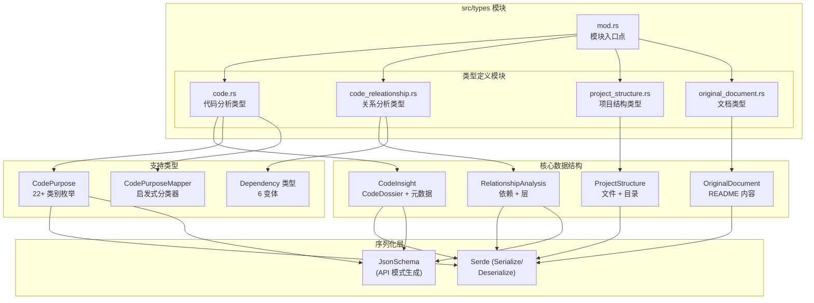
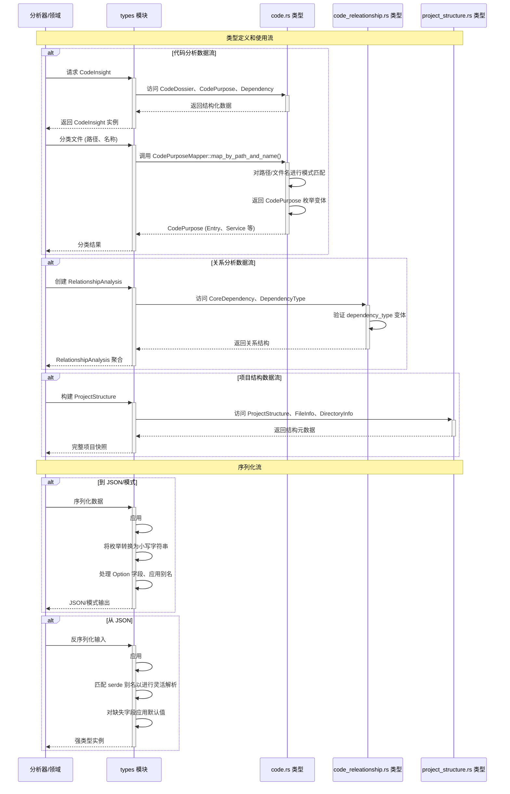

**类型领域**
=============

**位置:** `src/types/`  
**领域类型:** 工具支持领域（共享内核）  
**版本:** 1.0  
**最后更新:** 2026-02-01 06:41:18 (UTC)

## 1. 概述

**类型领域**作为整个 deepwiki-rs 系统的基础数据层和**共享类型契约**。它为表示代码分析结果、架构关系、项目层次结构和提取的文档提供全面的数据结构。

作为系统领域驱动设计 (DDD) 架构中共享内核的关键组件，该领域通过内存系统在预处理、研究和组合领域之间实现类型安全通信，同时维护用于持久化和 API 互操作性的严格序列化契约。

### 关键职责

- **代码分析表示**: 通过 `CodeInsight` 和支持结构对源代码进行深度语义建模
- **架构关系建模**: 依赖跟踪和架构层表示
- **项目结构抽象**: 具有元数据和评分的层次文件系统建模
- **文档提取**: 外部文档（README 等）的结构化存储
- **序列化基础设施**: 通过 Serde 和 JsonSchema 进行 JSON 编组和 OpenAPI 模式生成

## 2. 模块结构

该领域组织成四个专门子模块，每个解决分析数据模型的特定方面：



### 文件组织

| 文件 | 职责 | 关键导出 |
|------|------|---------|
| `mod.rs` | 公共 API 聚合和模块重新导出 | 公共子模块 |
| `code.rs` | 代码分析数据结构和目的分类 | `CodeInsight`、`CodePurpose`、`CodePurposeMapper` |
| `code_releationship.rs` | 依赖和架构关系模型 | `RelationshipAnalysis`、`CoreDependency`、`ArchitectureLayer` |
| `project_structure.rs` | 项目层次结构和文件元数据 | `ProjectStructure`、`FileInfo`、`DirectoryInfo` |
| `original_document.rs` | 外部文档容器 | `OriginalDocument` |

## 3. 核心数据结构

### 3.1 代码分析类型 (`code.rs`)

`code.rs` 模块为表示静态分析结果提供综合结构：

**`CodeInsight`**  
代码文件分析的主聚合，组合：
- **`CodeDossier`**: 文件元数据（名称、路径、源摘要、目的分类、重要性评分）
- **`InterfaceInfo`**: API 表面定义（名称、类型、可见性、参数、返回类型）
- **`Dependency`**: 具有来源跟踪的外部/内部依赖（名称、路径、`is_external` 标志、行号、依赖类型、版本约束）
- **`CodeComplexity`**: 包括圈复杂度、代码行数、函数/类计数的静态指标
- **详细描述和职责分配**

**`CodePurpose` 枚举**  
用于架构分类的 22 层层次分类法：
```
Entry、Agent、Page、Widget、Controller、Service、Database、Dao、
Middleware、Config、Util、Tool、Module、Lib、Api、Types、Model、
Plugin、Router、Test、Doc、Command、Other、SpecificFeature、Context
```

**`CodePurposeMapper`**  
实现基于路径和基于文件名的模式匹配的智能启发式分类器：
- 基于模式的检测（例如，`/pages/` → `Page`、`/utils/` → `Util`、`main.rs` → `Entry`）
- 不区分大小写匹配
- 基于扩展名的识别（例如，`.sql` → `Database`）

### 3.2 关系分析类型 (`code_releationship.rs`)

建模架构依赖和系统分层：

**`RelationshipAnalysis`**  
包含以下内容的架构洞察容器：
- **`CoreDependency`**: 具有重要性评分（1-5）、类型分类和描述性元数据的方向性依赖
- **`ArchitectureLayer`**: 具有组件聚合和基于级别的排序的层次系统层
- **关键架构洞察和模式分类**

**`DependencyType` 枚举**  
捕获关系语义的六个变体：
```rust
Import、FunctionCall、Inheritance、Composition、DataFlow、Module
```

### 3.3 项目结构类型 (`project_structure.rs`)

**`ProjectStructure`** (聚合根)  
包含以下内容的完整项目快照：
- **`FileInfo`**: 路径、大小、扩展名、`is_core` 标志、重要性/复杂度评分
- **`DirectoryInfo`**: 路径、递归文件/子目录计数、总大小、聚合重要性评分
- **统计分布**: 文件类型分布、大小直方图、语言细分

### 3.4 文档类型 (`original_document.rs`)

**`OriginalDocument`**  
用于提取项目文档的结构化容器：
- README 内容保留
- 来源跟踪（源路径、提取时间戳）
- 格式元数据（Markdown、纯文本）

## 4. 序列化架构

该领域中的所有类型实现支持多种消费模式的综合序列化策略：

### 4.1 Serde 集成

**标准派生：**
- `Serialize` / `Deserialize`: 用于 API 响应和持久化的 JSON 编组
- `JsonSchema` (通过 `schemars`): 自动 OpenAPI 模式生成
- 标准 Rust trait：`Debug`、`Clone`、`PartialEq`、`Eq`、`Hash`

**序列化配置：**
```rust
#[serde(rename_all = "lowercase")]  // 一致的 JSON 命名约定
#[serde(alias = "configuration", alias = "Config")]  // 向后兼容
#[serde(default)]  // 对缺失字段的优雅处理
#[schemars(skip)]  // 内部字段的模式排除（例如，source_summary）
```

### 4.2 灵活反序列化

类型系统通过广泛的别名适应多种输入格式：
- 跨枚举和结构的 **40+ Serde 别名** 用于遗留格式支持
- 用于健壮解析的 **不区分大小写枚举反序列化**
- 使用 `Option<T>` 和 `#[serde(default)]` 的 **默认值回退**

### 4.3 显示和转换 Trait

- **`Display`**: 用于 `Dependency` 和 `CodePurpose` 的人类可读格式化
- **静态字符串转换**: 枚举变体的零分配 `&'static str` 返回
- **类型安全分类**: 22 层 `CodePurpose` 分类法的穷尽匹配强制执行

## 5. 设计模式与特征

### 5.1 数据传输对象 (DTO) 模式

所有结构为直接序列访问公开公共字段，针对以下方面优化：
- JSON 序列化流水线
- 通过内存系统的领域间通信
- API 响应构造

### 5.2 聚合根模式

- **`ProjectStructure`** 作为文件系统表示的聚合根
- **`CodeInsight`** 聚合档案、复杂度和依赖数据

### 5.3 类型安全与分类

- **穷尽枚举**: 22 目的分类法防止无效架构状态
- **重要性评分**: 1-5 等级支持大型代码库中的过滤和优先级
- **核心文件识别**: `is_core` 标志区分关键路径组件

### 5.4 API 优先设计

- **JsonSchema 生成**: 自动 OpenAPI 文档支持
- **模式验证**: LLM 集成层中的结构化提取验证
- **跨语言兼容性**: Serde 别名适应各种源格式

## 6. 集成流

类型领域作为系统组件之间的数据契约层运行：



### 6.1 跨领域依赖

**类型领域的消费者：**
- **预处理领域**: 产生 `CodeInsight` 和 `ProjectStructure` 实例
- **研究领域**: 消费预处理输出；产生 `RelationshipAnalysis`
- **组合领域**: 将研究数据转换为文档结构
- **内存管理领域**: 处理作用域存储的序列化

**数据流：**
1. **预处理**创建 `CodeInsight` → 存储在内存中 (PREPROCESSING 作用域)
2. **研究**读取洞察 → 创建 `RelationshipAnalysis` → 存储在内存中 (STUDIES_RESEARCH 作用域)
3. **组合**读取关系 → 生成文档元数据

### 6.2 公共 API 表面

该模块通过 `mod.rs` 公开统一的公共接口：

```rust
pub mod code;
pub mod code_releationship;
pub mod project_structure;
pub mod original_document;
```

**关键公共接口：**
```rust
// 智能分类
impl CodePurposeMapper {
    pub fn map_by_path_and_name(file_path: &str, file_name: &str) -> CodePurpose
}

// 枚举转换
impl DependencyType {
    pub fn as_str(&self) -> &'static str
}

impl CodePurpose {
    pub fn display_name(&self) -> &'static str
}
```

## 7. 实现特征

### 7.1 性能考虑

- **零成本抽象**: 显示名称的静态字符串返回
- **高效序列化**: 针对编译速度优化的 Serde 派生宏
- **内存布局**: 为最佳缓存局部性排序的结构字段

### 7.2 可扩展性

- **新语言支持**: 添加语言处理器不需要更改类型领域
- **额外分类**: `CodePurpose` 枚举支持特性门控扩展
- **自定义元数据**: `Option<T>` 字段允许稀疏数据而不破坏更改

### 7.3 验证与约束

- **无循环依赖**: 干净的模块边界防止类型递归问题
- **不可变数据**: 类型设计用于构造后消费模式
- **线程安全**: 所有类型实现 `Send` 和 `Sync` 以进行并发流水线处理

## 8. 使用指南

### 8.1 添加新代码分类

当扩展 `CodePurpose` 枚举时：
1. 添加变体到枚举定义
2. 更新 `display_name()` 实现
3. 在 `CodePurposeMapper::map_by_path_and_name()` 中添加映射逻辑
4. 如果支持遗留格式则更新 Serde 别名

### 8.2 序列化兼容性

- 对新可选字段使用 `#[serde(default)]` 以保持向后兼容
- 优先使用 `rename_all = "lowercase"` 以保持一致的 JSON 输出
- 在支持多种输入格式时利用 `alias` 属性

### 8.3 内存作用域集成

类型设计用于特定内存作用域：
- **PREPROCESSING**: `CodeInsight`、`ProjectStructure`
- **STUDIES_RESEARCH**: `RelationshipAnalysis`
- **DOCUMENTATION**: 文档树结构（在组合域中定义）

---

**技术联系人:** 架构团队  
**相关文档:** 预处理领域、研究领域、内存管理领域
