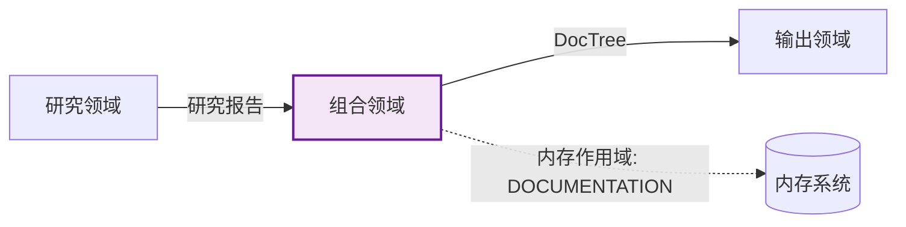
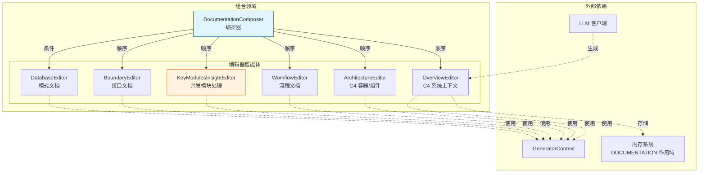

**组合领域技术文档**

**版本:** 1.0  
**模块:** `src/generator/compose/`  
**分类:** 核心业务领域  
**复杂度评分:** 8.0/10  
**关键性:** 高 (重要性: 9.0/10)

---

## 1. 概述

**组合领域**是文档生成流水线的第三阶段，负责将架构研究输出转换为全面的、结构化的 C4 架构文档。它作为一个复杂的多智能体文档合成系统运行，将原始分析数据（CodeInsights、研究报告）转换为专业的 markdown 文档和 Mermaid 图表。

### 1.1 目的
- **主要功能:** 从研究制品生成符合 C4 的架构文档
- **处理模型:** 具有选择性并发执行的顺序流水线
- **输出格式:** 带有嵌入 Mermaid 图表的结构化 markdown
- **目标受众:** 软件开发人员、架构师和技术文档撰写者

### 1.2 架构定位

组合领域位于研究领域（输入）和输出领域（持久化）之间，充当"文档工厂"，实现将机器可读的研究数据转换为人类可读的技术文档的转换层。



---

## 2. 系统架构

### 2.1 核心设计模式

**基于 Trait 的智能体架构**
所有文档编辑器实现 `StepForwardAgent` trait，为声明式智能体定义提供标准化接口。这实现了多态执行，同时保持类型安全和一致的生命周期管理。

**编排流水线模式**
`DocumentationComposer` 作为中心编排器，实现责任链模式。它执行五阶段顺序流水线，确保每个文档部分都基于先前生成的上下文构建。

**双重执行策略**
该领域采用两种截然不同的执行模式：
- **LLM 驱动生成:** 用于需要架构解释的创造性合成（概述、架构、工作流、关键模块）
- **确定性代码生成:** 用于结构化数据转换（数据库、边界文档）

### 2.2 组件层次结构



---

## 3. 核心组件

### 3.1 DocumentationComposer (`mod.rs`)

协调文档生成工作流的中心编排器。

**职责：**
- 流水线阶段排序和依赖管理
- 条件执行逻辑（数据库文件检测）
- DocTree 初始化和管理
- 错误处理和结果聚合

**执行流程：**
1. 检索代码洞察以检测数据库文件 (`has_database_files()`)
2. 按依赖顺序顺序调用编辑器智能体
3. 管理生成文件路径的 DocTree 更新
4. 处理条件性 DatabaseEditor 执行

### 3.2 编辑器智能体

#### OverviewEditor (`agents/overview_editor.rs`)
**范围:** C4 系统上下文（第 1 级）  
**执行模式:** LLM 驱动  
**数据源：**
- SystemContextResearcher 结果
- DomainModulesDetector 结果
- 项目元数据和 README

**输出:** 项目概述，包括业务价值、用户角色、系统边界和带系统上下文图的外部系统交互。

#### ArchitectureEditor (`agents/architecture_editor.rs`)
**范围:** C4 容器/组件视图（第 2-3 级）  
**执行模式:** LLM 驱动  
**数据源：**
- ArchitectureResearcher 结果
- DomainModulesDetector 结果
- 代码洞察和关系

**输出:** 全面的架构文档，包括容器图、组件层次结构、技术栈描述和架构决策记录。

#### WorkflowEditor (`agents/workflow_editor.rs`)
**范围:** 业务流程文档  
**执行模式:** LLM 驱动  
**数据源：**
- WorkflowResearcher 结果
- SystemContextResearcher 结果

**输出:** 执行路径文档、流程协调机制、异常处理策略和关键业务流程的序列图。

#### KeyModulesInsightEditor (`agents/key_modules_insight_editor.rs`)
**范围:** 详细模块分析（C4 代码级别）  
**执行模式:** 并发 LLM 驱动  
**架构:** 两级层次结构
- **编排器级别:** 检索洞察报告、管理并发限制、聚合结果
- **执行级别:** 每个域模块的单个 `KeyModuleInsightEditor` 智能体

**并发控制:** 基于 LLM 配置限制利用 `do_parallel_with_limit()` 防止资源耗尽，同时最大化吞吐量。

**输出:** 存储在 `deep_exploration/` 目录中的每个关键模块的单个 markdown 文件，包含技术实现细节。

#### BoundaryEditor (`agents/boundary_editor.rs`)
**范围:** 接口文档  
**执行模式:** 确定性代码生成（自定义 `execute()`）  
**数据源：**
- BoundaryAnalyzer 结果 (BoundaryAnalysisReport)

**实现:** 绕过 LLM 调用；直接使用模板方法将结构化边界分析转换为格式化 markdown。

**输出:** CLI 命令文档、API 端点规范、路由定义和配置结构文档。

#### DatabaseEditor (`agents/database_editor.rs`)
**范围:** 数据库模式文档  
**执行模式:** 确定性代码生成（条件性）  
**触发条件:** `has_database_files()` 返回 true（检测到数据库目的代码洞察或 `.sql`/`.sqlproj` 扩展名）

**数据源：**
- DatabaseOverviewAnalyzer 结果 (DatabaseOverviewReport)

**实现:** 直接基于格式化程序的生成，创建 ER 图、表文档和存储过程描述。

---

## 4. 数据流与集成

### 4.1 输入接口

该领域从内存系统（作用域：`STUDIES_RESEARCH`）消费研究制品：

| 编辑器 | 必需研究输入 | 可选上下文 |
|--------|-------------|-----------|
| OverviewEditor | SystemContextResearcher, DomainModulesDetector | README, 项目结构 |
| ArchitectureEditor | ArchitectureResearcher, DomainModulesDetector | 代码洞察, 关系 |
| WorkflowEditor | WorkflowResearcher, SystemContextResearcher | 业务流程定义 |
| KeyModulesInsightEditor | KeyModulesInsight | 域模块元数据 |
| BoundaryEditor | BoundaryAnalyzer | N/A |
| DatabaseEditor | DatabaseOverviewAnalyzer | N/A |

### 4.2 输出接口

生成的文档持久化到：
- **内存系统:** 流水线执行期间临时存储的作用域 `DOCUMENTATION`
- **DocTree:** 用于输出领域消费的层次文件路径注册表
- **文件系统:** 输出领域（Outlet）处理的最终持久化

### 4.3 外部知识集成

编辑器可选地集成外部知识库类别：
- **架构:** ADR 和设计模式
- **数据库:** SQL 模式定义和迁移
- **API:** OpenAPI 规范和端点文档
- **部署:** 基础设施和 DevOps 文档

---

## 5. 技术实现细节

### 5.1 StepForwardAgent Trait 实现

所有 LLM 驱动的编辑器使用关联类型 `Output = String` 实现 `StepForwardAgent` trait：

```rust
pub trait StepForwardAgent {
    type Output;
    fn agent_type(&self) -> AgentType;
    fn memory_scope_key(&self) -> MemoryScope;
    fn data_config(&self) -> AgentDataConfig;
    fn prompt_template(&self) -> PromptTemplate;
    fn execute(&self, context: &GeneratorContext) -> Result<Self::Output>;
}
```

**关键配置：**
- **AgentDataConfig:** 定义必需和可选数据源（研究结果、项目结构、知识类别）
- **PromptTemplate:** 系统提示、开场指令、结尾指令和格式化程序配置
- **LLMCallMode:** 仅提示或 PromptWithTools 执行的配置

### 5.2 提示工程框架

标准化提示架构确保一致的输出质量：

1. **系统提示:** 定义专业角色（专家技术文档撰写者）和 C4 建模标准
2. **开场指令:** 分析指南、研究数据集成和图表要求
3. **内容主体:** 注入的研究数据和代码洞察
4. **结尾指令:** 输出格式要求、文档结构模板和质量约束

### 5.3 内存管理策略

**读取操作:** 智能体通过 `GeneratorContext::get_research::<T>()` 检索研究数据  
**写入操作:** 结果通过 `store_to_memory()` 存储到 `MemoryScope::DOCUMENTATION`  
**状态隔离:** 每个智能体在不可变研究输入上操作，产生不可变文档输出

### 5.4 并发架构

KeyModulesInsightEditor 实现受控并行：

```rust
// 伪代码表示
let tasks = insight_reports.into_iter().map(|report| {
    let editor = KeyModuleInsightEditor::new(report);
    async move { editor.execute(context).await }
});

do_parallel_with_limit(tasks, llm_config.concurrency_limit).await
```

**安全机制：**
- 并发限制派生自 LLM 提供程序速率限制
- 单个错误隔离（一个模块的失败不会级联）
- 结果聚合与错误报告

---

## 6. 配置与扩展

### 6.1 智能体扩展点

可以通过以下方式添加新的文档部分：
1. 为 LLM 驱动的部分实现 `StepForwardAgent` trait
2. 为确定性部分实现自定义 `execute()`
3. 在 `DocumentationComposer::execute()` 流水线中注册

### 6.2 条件执行逻辑

数据库文档生成取决于：
- **静态分析:** 预处理中 CodePurpose::Database 检测
- **文件扩展名:** 存在 `.sql`、`.sqlproj` 或 `.db` 文件
- **配置:** 未来支持强制启用/禁用标志

### 6.3 国际化支持

所有生成的文档遵守 `TargetLanguage` 配置：
- 目录命名本地化
- 文件名本地化
- AI 提示语言注入用于非英语输出

---

## 7. 性能特征

| 指标 | 值 | 说明 |
|------|-----|------|
| **顺序阶段** | 5-6 | 概述 → 架构 → 工作流 → 关键模块 → 边界 → [数据库] |
| **并发任务** | N 模块 | KeyModulesInsightEditor 按域模块数量并行化 |
| **LLM 调用效率** | 高 | 基于模板的提示与压缩研究数据 |
| **内存占用** | 中 | 执行期间在内存中存储完整文档树 |
| **典型执行时间** | 30-120s | 取决于项目大小和 LLM 延迟 |

---

## 8. 错误处理与弹性

**优雅降级：**
- 缺失的研究数据导致占位符部分而非流水线失败
- LLM 超时回退到缓存响应或简化模板
- KeyModulesInsightEditor 中的单个模块失败不会中止其他模块

**验证：**
- 结构化研究输入的 JSON 模式验证
- 生成输出的 Markdown 检查兼容性
- DocTree 中的文件路径冲突检测

---

## 9. 依赖

**上游依赖：**
- 研究领域 (STUDIES_RESEARCH 内存作用域)
- GeneratorContext (LLM 客户端、内存、配置)
- 知识集成领域（可选外部文档）

**下游依赖：**
- 输出领域（消费 DocTree 和 DOCUMENTATION 作用域）
- Mermaid 修复器（生成图表的后处理）

---

## 10. 代码映射

```
src/generator/compose/
├── mod.rs                      # DocumentationComposer 编排器
└── agents/
    ├── mod.rs                  # 智能体导出
    ├── overview_editor.rs      # C4 系统上下文生成
    ├── architecture_editor.rs  # C4 容器/组件生成
    ├── workflow_editor.rs      # 流程文档
    ├── key_modules_insight_editor.rs  # 并发模块文档
    ├── boundary_editor.rs      # 接口文档
    └── database_editor.rs      # SQL 模式文档
```

---

**文档结束**
