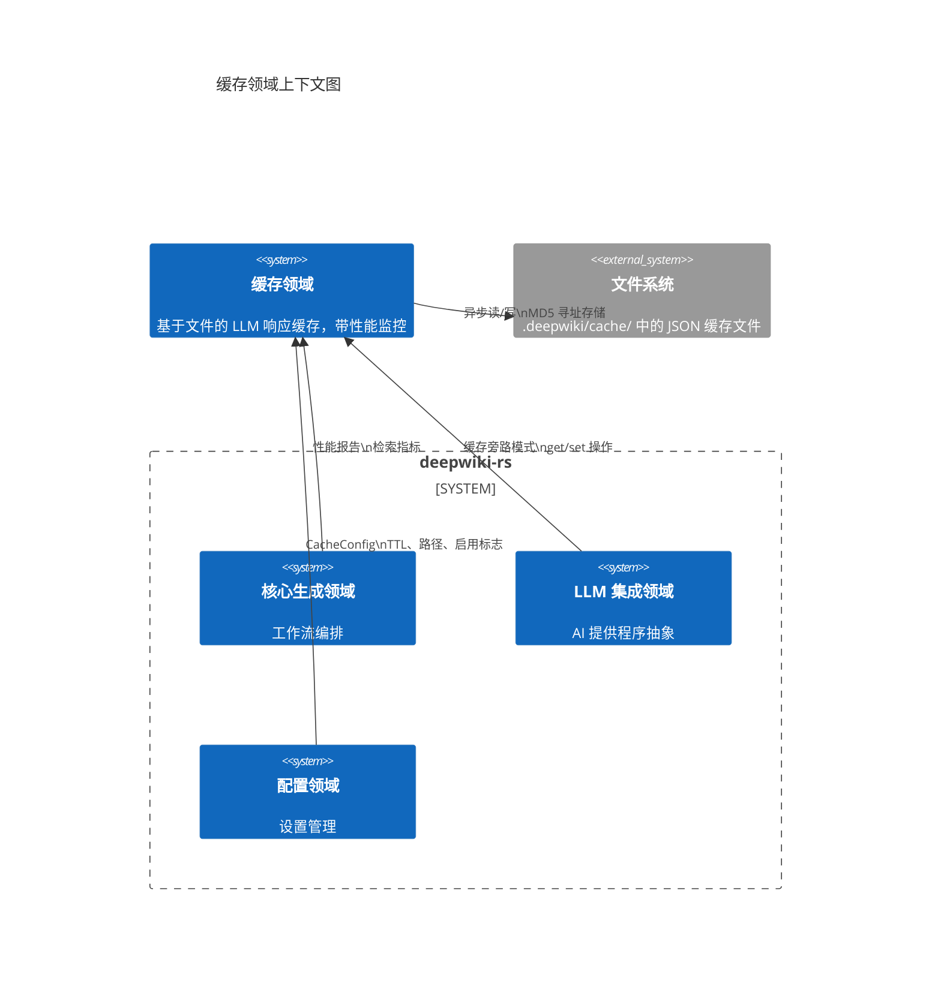
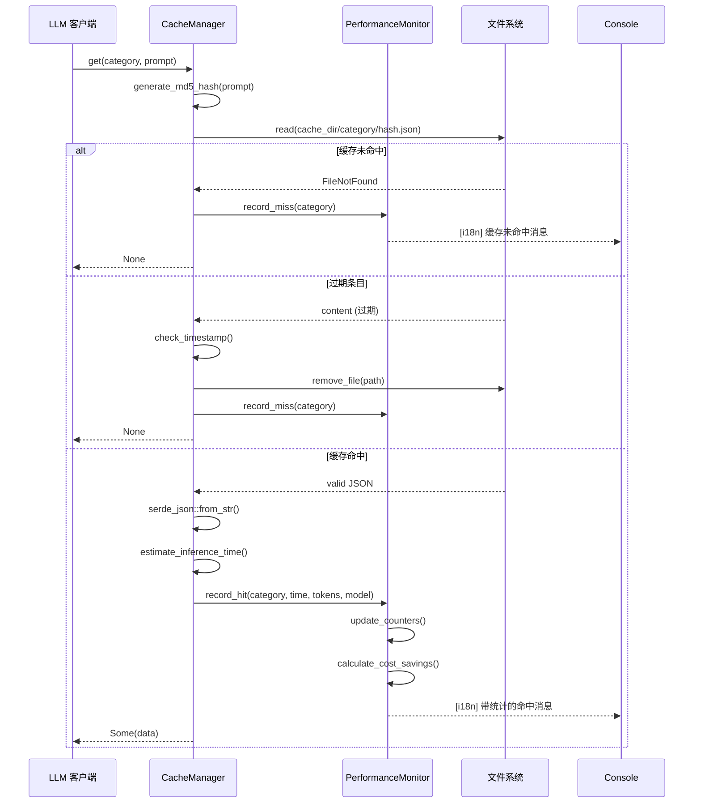
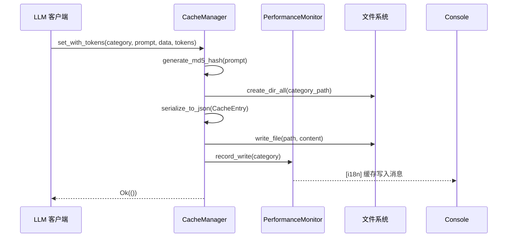

**缓存领域技术文档**

**版本:** 1.0  
**最后更新:** 2024  
**领域类型:** 基础设施领域  
**置信度评分:** 0.92 (高)

---

## 1. 执行摘要

**缓存领域**提供了一个高性能的、基于文件的持久化层，旨在通过智能响应缓存优化大型语言模型 (LLM) API 的使用。该领域通过存储序列化的 LLM 响应以及确定性键生成、基于时间的过期策略和全面的成本跟踪能力，消除冗余的 API 调用。

该领域实现了**缓存旁路模式**与异步文件 I/O，支持通用数据序列化，同时保持线程安全的性能指标。它通过减少 API 成本、最小化重复查询的推理延迟，并提供缓存效率和成本节省的详细分析，提供可衡量的业务价值。

---

## 2. 架构定位

### 2.1 系统上下文

缓存领域在 LLM 集成层中作为关键基础设施运行，作为文档生成流水线中 AI 生成输出的持久存储。



### 2.2 领域依赖
- **上游依赖:** 配置管理领域（缓存设置、TTL 策略）
- **下游消费者:** LLM 集成领域（主要消费者）、核心生成领域（指标检索）
- **横切关注点:** 国际化领域（双语日志记录）、类型领域（TokenUsage 结构）

---

## 3. 组件架构

该领域由两个主要组件协同工作，提供具有可观察性的缓存能力。

### 3.1 CacheManager
**职责:** 核心缓存操作，包括键生成、存储检索和 TTL 管理。

**关键能力：**
- **确定性键生成:** 基于 MD5 哈希的寻址（32 字符十六进制），确保相同的提示解析到一致的存储位置
- **分层存储:** 类别范围的目录组织 (`{cache_dir}/{category}/{hash}.json`)
- **TTL 执行:** 基于 Unix 时间戳的可配置过期，自动清理过期条目
- **通用序列化:** 通过 Serde 实现类型安全存储，JSON 美化打印以便调试
- **Token 感知缓存:** 对 LLM token 使用元数据的专门支持，实现准确的成本核算

### 3.2 CachePerformanceMonitor
**职责:** 用于缓存效率分析的线程安全指标收集和报告。

**关键能力：**
- **原子计数器:** 使用 `Arc<AtomicUsize>` 和 `AtomicU64` 实现无锁并发，用于命中/未命中/写入/错误跟踪
- **成本分析:** 基于模型特定 token 定价实时计算节省的推理时间和估计的成本节省
- **本地化报告:** 通过与国际化领域集成实现双语控制台输出（英语/中文）
- **按类别指标:** 允许按操作类型分析缓存效率的粒度跟踪（研究、组合、预处理）

---

## 4. 数据模型与存储格式

### 4.1 缓存条目模式
```rust
pub struct CacheEntry<T> {
    pub data: T,                    // 通用载荷（JSON 可序列化）
    pub timestamp: u64,             // Unix 纪元秒数（创建时间）
    pub prompt_hash: String,        // MD5 验证哈希
    pub token_usage: Option<TokenUsage>,  // 输入/输出 token + 成本
    pub model_name: Option<String>, // LLM 模型标识符
}
```

### 4.2 文件系统布局
```
.deepwiki/
└── cache/
    ├── research/              # 类别：研究智能体
    │   ├── a1b2c3d4...json   # 提示的 MD5 哈希
    │   └── e5f6g7h8...json
    ├── composition/           # 类别：文档编辑器
    ├── preprocess/            # 类别：代码分析
    └── compression/           # 类别：提示压缩
```

### 4.3 性能指标结构
```rust
pub struct CacheMetrics {
    hits: AtomicUsize,          // 成功检索
    misses: AtomicUsize,        // 缓存未命中
    writes: AtomicUsize,        // 成功存储
    errors: AtomicUsize,        // I/O 或反序列化失败
    inference_time_saved_ms: AtomicU64,  // 累积节省的时间
    tokens_saved: AtomicUsize,  // 未重新处理的总 token
}
```

---

## 5. 操作流程

### 5.1 缓存检索流程（缓存旁路模式）


### 5.2 缓存存储流程


---

## 6. 技术实现细节

### 6.1 键生成策略
该领域使用 **MD5 加密哈希**（通过 `md5` crate）生成确定性缓存键。这种方法提供：
- **确定性:** 相同的提示在会话中产生相同的哈希
- **均匀分布:** 最小化目录聚类
- **抗碰撞性:** 32 字符十六进制空间（16^32 种组合）适用于非安全用例

**哈希组合:** 对于专门的缓存场景（例如，提示压缩），复合键组合多个输入参数：`hash(format!("{}-{}", prompt, compression_params))`

### 6.2 并发模型
- **异步 I/O:** 所有文件操作使用 `tokio::fs` 以防止阻塞异步运行时
- **线程安全指标:** `CachePerformanceMonitor` 使用原子操作，允许来自并行智能体的并发更新，无需互斥锁争用
- **无锁读取:** 缓存检索操作完全可并行化，无需锁定机制

### 6.3 过期策略
- **TTL 基础:** 存储在条目元数据中的 Unix 纪元时间戳
- **惰性过期:** 条目在检索时验证；过期条目触发删除而非后台清理
- **配置:** TTL 小时在 `CacheConfig.expire_hours` 中指定（0 = 永不过期）

### 6.4 错误处理策略
- **优雅降级:** 文件 I/O 错误或反序列化失败被记录为指标，但不会使调用操作失败
- **回退行为:** 在任何缓存错误时，系统返回 `None`（缓存未命中），强制新的 LLM 调用
- **指标捕获:** 所有错误条件都会递增原子错误计数器以进行运营可见性

---

## 7. 配置与集成

### 7.1 配置模式
```rust
pub struct CacheConfig {
    pub enabled: bool,           // 缓存主开关
    pub cache_dir: PathBuf,      // 基础目录（默认：.deepwiki/cache）
    pub expire_hours: u64,       // TTL（小时）（0 = 无限）
}
```

### 7.2 公共接口
**主要方法：**
- `async fn get<T>(&self, category: &str, prompt: &str) -> Result<Option<T>>`  
  通用检索，自动反序列化和 TTL 验证
  
- `async fn set<T>(&self, category: &str, prompt: &str, data: T) -> Result<()>`  
  不带 token 跟踪的基本存储
  
- `async fn set_with_tokens<T>(&self, category: &str, prompt: &str, data: T, usage: TokenUsage)`  
  带成本跟踪元数据的存储
  
- `fn generate_performance_report(&self) -> CachePerformanceReport`  
  当前指标的快照，包括命中率和估计的节省

### 7.3 集成点
1. **LLM 集成领域:** 实现缓存旁路逻辑的主要消费者；在 API 调用前检查缓存，使用 token 使用存储响应
2. **核心生成领域:** 检索最终摘要生成的性能报告
3. **国际化领域:** 缓存操作的本地化消息模板（命中/未命中/写入/错误）
4. **配置领域:** 缓存路径和策略的分层设置管理

---

## 8. 性能特征

### 8.1 吞吐量
- **读取延迟:** 缓存命中约 1-5ms（取决于文件系统）
- **写入延迟:** 约 2-10ms（异步，非阻塞）
- **并发:** 通过 Tokio 的线程池支持数百个并发缓存操作

### 8.2 效率指标
该领域跟踪四个关键性能指标：
1. **命中率:** `hits / (hits + misses)` - 成本优化目标 >60%
2. **时间节省:** 避免的 LLM 推理延迟累积毫秒数
3. **成本节省:** 从 `(tokens_input * price_input + tokens_output * price_output) * hits` 计算
4. **错误率:** `errors / total_operations` - 应保持 <0.1%

### 8.3 存储开销
- **每条目开销:** 约 200 字节（JSON 结构 + 元数据）
- **磁盘使用:** 与唯一提示数量成线性关系；无自动压缩（如果需要，手动清理缓存目录）

---

## 9. 运营考虑

### 9.1 缓存失效
- **自动:** 基于 TTL 的过期在访问时删除过期条目
- **手动:** 删除 `{cache_dir}` 子目录以进行类别范围的失效
- **知识同步:** 外部知识库更新通过知识集成领域触发选择性缓存失效

### 9.2 监控与可观察性
- **控制台输出:** 工作流执行期间缓存操作的实时双语日志记录
- **摘要报告:** 显示节省的总 API 成本和效率指标的结束运行统计
- **可调试性:** 美化的 JSON 缓存文件允许手动检查存储的响应

### 9.3 安全与隐私
- **本地存储:** 所有缓存数据仅持久化到本地文件系统（无远程存储）
- **无 PII 处理:** 缓存键已哈希；原始提示不存储在文件名中
- **访问控制:** 适用标准文件系统权限；静态无额外加密

---

## 10. 设计决策与权衡

| 决策 | 理由 | 权衡 |
|------|------|------|
| **基于文件 vs 内存中** | 跨进程重启的持久性；运行之间的共享状态 | 比 Redis/Memcached 延迟更高；部署更简单 |
| **MD5 vs SHA-256** | 哈希生成速度；非安全用例可接受碰撞风险 | 比加密哈希的碰撞抗性低 |
| **JSON vs 二进制 (bincode)** | 可人工阅读以便调试；模式演化灵活性 | 文件大小更大；序列化更慢 |
| **惰性 vs 主动过期** | 减少后台 CPU 使用；实现更简单 | 过期条目占用磁盘空间直到被访问 |
| **原子计数器 vs 互斥锁** | 无锁并发；更高吞吐量 | 指标的最终一致性（分析可接受） |

---

## 11. 附录：术语表

| 术语 | 定义 |
|------|------|
| **Cache-Aside 模式** | 应用程序代码管理缓存填充/检索；缓存不直接与主存储交互 |
| **MD5 哈希** | 生成 32 字符十六进制摘要的 128 位哈希函数，用于缓存寻址 |
| **TokenUsage** | 跟踪 LLM 输入/输出 token 数量以进行成本计算的结构 |
| **TTL** | Time-To-Live；缓存条目的过期持续时间 |
| **原子操作** | 保证线程安全计数器递增无需锁的 CPU 指令 |

---

**文档控制：**  
- **作者:** 系统架构团队  
- **审查周期:** 每个主要版本或缓存策略更改  
- **相关文档:** LLM 集成领域规范、配置管理领域规范
