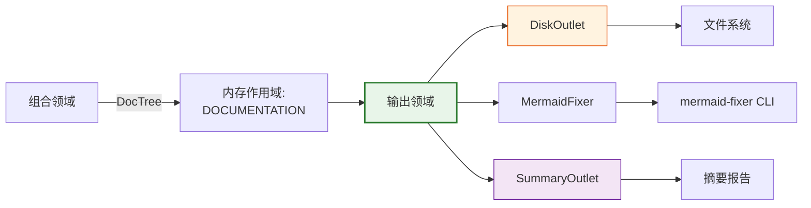
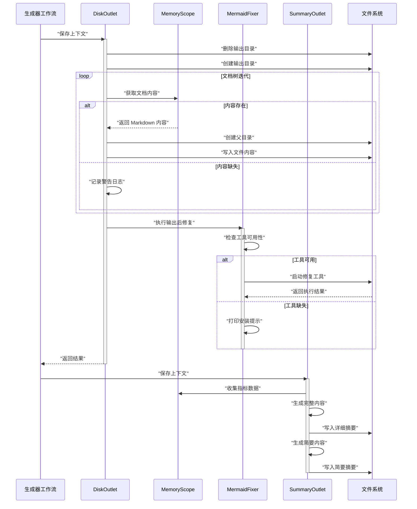

**技术文档：输出领域**

**模块:** `src/generator/outlet`  
**系统:** deepwiki-rs  
**分类:** 核心业务领域 – 基础设施适配器层  
**最后更新:** 2026-02-01 06:44:41 (UTC)

---

## 1. 概述

**输出领域**作为 deepwiki-rs 文档生成流水线内的最终持久化和交付层。作为四阶段工作流（预处理 → 研究 → 组合 → 输出）的终端阶段，该领域负责将生成的文档从临时内存结构物化到持久存储，执行后处理优化，并生成流水线性能分析。

在**基础设施适配器模式**下运行，该领域通过基于 trait 的接口抽象持久化机制，实现可插拔输出目标，同时提供具体的文件系统实现。该领域确保跨国际化输出结构的数据完整性，编排图表优化的外部工具集成，并交付全面的执行摘要。

---

## 2. 架构定位

### 2.1 领域上下文

输出领域占据文档生成引擎和外部文件系统之间的边界。它通过内存管理领域从组合领域接收结构化文档树，将它们转换为本地化的文件制品，并管理输出目录操作的完整生命周期。



### 2.2 设计理念

- **关注点分离**: 不同子模块处理持久化 (`outlet`)、后处理 (`fixer`) 和分析 (`summary_generator`)
- **基于 Trait 的抽象**: `Outlet` trait 无需耦合到具体实现即可实现多态持久化策略
- **异步优先 I/O**: 使用 Tokio 进行非阻塞文件系统操作以进行并发文档处理
- **国际化原生**: 与 `TargetLanguage` 系统深度集成，用于语言特定的文件命名和目录结构

---

## 3. 核心组件

### 3.1 Outlet 子系统 (`src/generator/outlet/mod.rs`)

#### 3.1.1 Outlet Trait

定义持久化契约的基础抽象：

```rust
pub trait Outlet {
    async fn save(&self, context: &GeneratorContext) -> Result<()>;
}
```

这种最小接口支持多样的持久化实现（文件系统、云存储、API 传输），同时与工作流编排器保持统一集成。

#### 3.1.2 DiskOutlet

管理完整持久化生命周期的具体文件系统实现：

**职责：**
- **目录生命周期管理**: 使用 `remove_dir_all` 后跟 `create_dir_all` 进行输出目录的原子清理和重建
- **文档树遍历**: 遍历 `DocTree` 结构，将 `AgentType` 范围的内存键映射到国际化文件路径
- **内容水合**: 通过 `get_from_memory<T>()` 从 `MemoryScope::DOCUMENTATION` 检索 markdown 内容
- **分层文件写入**: 根据需要构造父目录并原子地将 markdown 内容写入磁盘

**DocTree 结构：**

该领域维护一个 `HashMap`，将范围的内存键与国际化输出路径相关联，支持五个文档部分：
- **概述** (C4 系统上下文)
- **架构** (C4 容器/组件视图)
- **工作流** (业务流程文档)
- **边界** (接口文档)
- **数据库** (模式文档)

文件本地化通过 `TargetLanguage::get_doc_filename()` 处理，确保跨 8 种支持语言的文化适当目录名和文件名。

### 3.2 MermaidFixer (`src/generator/outlet/fixer.rs`)

实现图表语法修正的**外部工具编排模式**的专门后处理实用程序。

#### 3.2.1 功能

- **可用性检测**: 在系统 PATH 中对 `mermaid-fixer` CLI 工具的运行时探测
- **LLM 配置代理**: 将 LLM 参数（`--llm-model`、`--llm-api-key`、`--llm-base-url`）传递给外部进程以进行 AI 驱动的图表修复
- **目录范围执行**: 通过 `--directory` 标志针对整个输出目录进行批处理
- **优雅降级**: 如果工具不可用，继续流水线执行并记录警告日志

#### 3.2.2 进程管理

利用 `tokio::process::Command` 进行异步进程生成，继承 stdio，在保持非阻塞操作的同时实现来自外部工具的实时反馈。

### 3.3 摘要生成系统

由 `SummaryOutlet` 协调的、包含 `SummaryDataCollector` 和 `SummaryContentGenerator` 的两阶段分析引擎。

#### 3.3.1 SummaryDataCollector

跨四个流水线阶段和四种研究材料类型聚合指标：

**数据源：**
- **时间指标**: 来自 `MemoryScope::TIMING` 的流水线阶段持续时间
- **缓存性能**: 通过 `cache_manager.generate_performance_report()` 获取的命中率和成本节省
- **内存利用**: 来自内存系统内省的存储统计
- **研究制品**: 
  - 系统上下文报告 (`STUDIES_RESEARCH` 作用域)
  - 领域模块分析
  - 工作流定义
  - 代码洞察 (`PREPROCESS` 作用域)

#### 3.3.2 SummaryContentGenerator

将收集的数据转换为双格式报告：

**完整模式 (`SummaryMode::Full`):**
- 详细的 JSON 数据结构
- 原始统计聚合
- 完整研究材料引用
- 粒度时间分解

**简要模式 (`SummaryMode::Brief`):**
- 带视觉指示器的执行摘要
- 效率比率和成本估算
- 高级流水线健康指标
- 可操作的优化洞察

#### 3.3.3 SummaryOutlet

实现 `Outlet` trait 以持久化两种报告变体：
- `__Litho_Summary_Detail__.md` – 综合技术报告
- `__Litho_Brief_Summary__.md` – 执行仪表板视图

---

## 4. 数据流与执行序列

输出领域作为终端流水线阶段执行，具有以下操作流程：



---

## 5. 集成接口

### 5.1 GeneratorContext 依赖

所有 outlet 实现接收对 `GeneratorContext` 的引用，提供对以下内容的访问：
- **配置**: 输出基础路径、LLM 设置、目标语言首选项
- **内存系统**: 用于跨作用域数据访问的类型化检索方法
- **缓存管理器**: 性能指标聚合

### 5.2 内存作用域交互

| 作用域 | 目的 | 内容类型 |
|-------|------|---------|
| `MemoryScope::DOCUMENTATION` | 生成 markdown 的源 | AgentType 范围的 markdown 字符串 |
| `MemoryScope::PREPROCESS` | 代码分析洞察 | `CodeInsight` 集合 |
| `MemoryScope::STUDIES_RESEARCH` | 研究阶段输出 | 结构化报告 (SystemContext、DomainModules 等) |
| `TimingScope::TIMING` | 性能指标 | 阶段持续时间时间戳 |

### 5.3 国际化接口

与 `TargetLanguage` 的集成启用：
- 语言特定的目录生成（例如，中文为 `文档/`，德语为 `dokumentation/`）
- 使用 `get_doc_filename()` 的本地化文件名映射
- 语言感知的摘要报告格式化

### 5.4 外部系统接口

**MermaidFixer CLI 契约：**
- **输入**: 包含具有 Mermaid 图表的 markdown 文件的目录路径
- **配置**: 用于 AI 驱动语法修正的 LLM 提供程序参数
- **输出**: 图表定义的就地修改
- **错误处理**: 非零退出状态传播与 stderr 捕获

---

## 6. 实现细节

### 6.1 异步并发模型

该领域利用 Tokio 的异步运行时进行：
- **并发文件 I/O**: 独立文档部分的并行写入
- **进程管理**: 外部 CLI 工具的非阻塞执行
- **内存访问**: 上下文共享的 `Arc<RwLock<T>>` 异步锁定模式

### 6.2 错误处理策略

- **传播**: 全面使用 `anyhow::Result` 进行错误上下文链接
- **弹性**: 缺失内容的优雅处理（记录警告，流水线继续）
- **原子性**: 目录操作使用清理前重建模式以防止部分状态
- **外部工具弹性**: 对 `mermaid-fixer` 的软依赖（可选增强，非关键路径）

### 6.3 序列化与数据完整性

- **Serde 集成**: 摘要报告中的研究数据 JSON 序列化
- **Chrono 时间戳**: 所有时间指标的 ISO 8601 格式化
- **内容验证**: 特定语言环境的 UTF-8 markdown 输出强制执行，带 BOM 处理

### 6.4 资源管理

- **内存效率**: 大文档的流式文件写入（避免内存缓冲）
- **目录清理**: 持久化前移除确保干净的输出状态（幂等执行）
- **句柄管理**: 文件句柄的显式丢弃模式，确保重命名操作前的刷新

---

## 7. 配置与使用模式

### 7.1 Outlet 实例化

```rust
// 标准文件系统 outlet
let outlet = DiskOutlet::new();

// 带双模式生成的摘要 outlet
let summary_outlet = SummaryOutlet::new();
```

### 7.2 MermaidFixer 配置

修复器自动从 `GeneratorContext` 继承 LLM 配置：

```rust
fixer.configure()
    .with_model(config.llm.model)
    .with_api_key(config.llm.api_key)
    .with_base_url(config.llm.base_url)
    .execute_on(&output_directory)
    .await?;
```

### 7.3 输出目录结构

```
output_directory/
├── [语言特定文件夹]/
│   ├── overview.md
│   ├── architecture.md
│   ├── workflow.md
│   ├── boundary.md
│   └── database.md
├── diagrams/ (由 mermaid-fixer 生成)
├── __Litho_Summary_Detail__.md
└── __Litho_Brief_Summary__.md
```

---

## 8. 可观察性与监控

### 8.1 性能指标

摘要生成器公开：
- **吞吐量**: 每秒处理的文档数
- **I/O 延迟**: 文件系统操作计时
- **缓存效率**: 跨流水线阶段的命中/未命中率
- **成本分析**: 通过缓存估算的 API 成本节省

### 8.2 日志约定

- **Info 级别**: 流水线阶段转换、文件创建事件
- **Warn 级别**: 缺失内容引用、不可用的外部工具
- **Debug 级别**: 目录遍历细节、内存检索诊断
- **Error 级别**: 文件系统 I/O 故障、序列化错误

### 8.3 健康检查

- **磁盘空间验证**: 通过文件系统错误处理隐式
- **写入权限**: 目录创建阶段的早期失败
- **外部工具存在**: 运行时检测与优雅降级

---

## 9. 技术约束与考虑

### 9.1 文件系统约束

- **只读保证**: 该领域严格遵守对源项目的只读分析；所有写操作针对指定输出目录
- **路径长度限制**: 尊重 Windows MAX_PATH 和 Unix 限制的跨平台路径处理
- **原子写入**: 临时文件创建后跟原子重命名以防止部分文件状态

### 9.2 并发安全

- **目录锁定**: 无显式文件锁定；依赖文件系统原子性和清理前写入模式
- **共享状态**: 通过 `Arc<RwLock<T>>` 包装器对 `GeneratorContext` 的线程安全访问

### 9.3 外部依赖

- **可选增强**: `mermaid-fixer` CLI 是软依赖；如果缺失功能优雅降级
- **进程隔离**: 外部工具执行在单独的 OS 进程中发生，继承 stdio

---

## 10. 附录：模块结构

```
src/generator/outlet/
├── mod.rs                  # Outlet trait、DiskOutlet 实现、DocTree
├── fixer.rs               # MermaidFixer CLI 编排
├── summary_generator.rs   # SummaryDataCollector、SummaryContentGenerator
└── summary_outlet.rs      # SummaryOutlet Outlet trait 实现
```

**关键依赖：**
- `tokio`: 异步运行时和进程管理
- `anyhow`: 错误处理和上下文传播
- `serde` / `serde_json`: 摘要报告的数据序列化
- `chrono`: 指标的时间戳生成

---

**文档结束**
