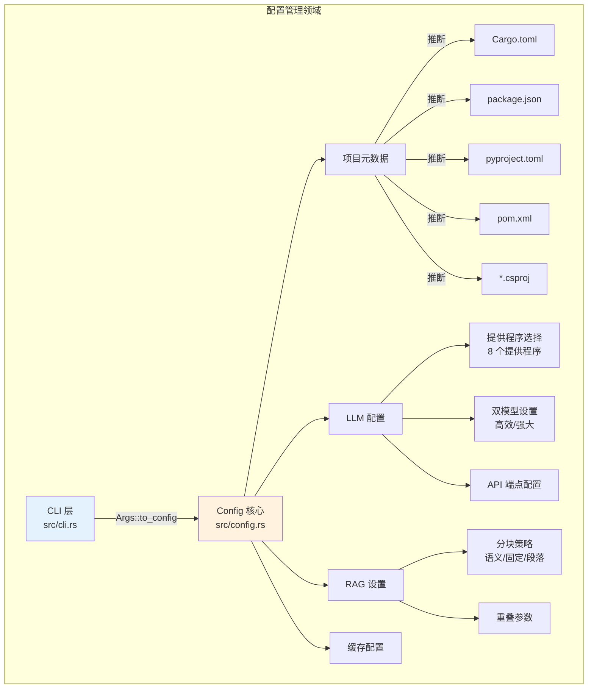
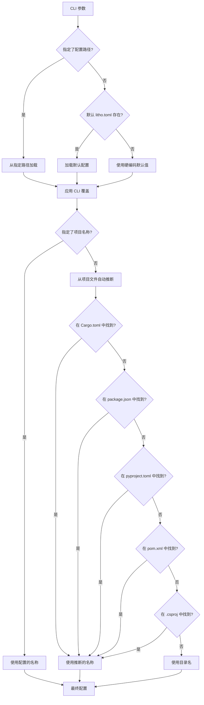
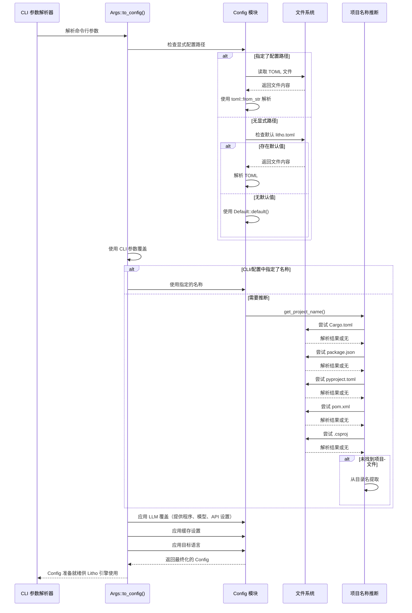

**配置管理领域**

**版本:** 1.0  
**最后更新:** 2026-02-01 06:37:27 (UTC)  
**系统:** deepwiki-rs

---

## 1. 概述

配置管理领域作为 deepwiki-rs 文档生成引擎的中央配置中心。该领域负责从多个来源聚合、验证和规范化配置设置，包括 TOML 配置文件、命令行接口 (CLI) 参数、环境变量和自动推断的项目元数据。

该领域实现了一个分层配置系统，在保持持久配置通过项目级 TOML 文件的同时，平衡灵活性和合理的默认值，使用户能够通过 CLI 参数覆盖特定设置。

---

## 2. 架构与设计原则

### 2.1 设计目标
- **层次与优先级**: 建立清晰的配置优先级以解决来源之间的冲突
- **类型安全**: 利用 Rust 的类型系统在编译时防止无效配置状态
- **多语言支持**: 跨不同技术栈（Rust、Node.js、Python、Java、C#）自动检测项目元数据
- **可扩展性**: 通过标准化配置接口支持可插拔的 LLM 提供程序
- **故障安全默认值**: 提供全面的默认实现，确保工具开箱即用

### 2.2 组件结构

该领域包含两个主要子模块：



---

## 3. 配置层次与优先级

系统使用严格的优先级层次来解析配置值，以确保可预测的行为：

```
优先级（从高到低）：
1. CLI 参数（显式覆盖）
2. 显式配置文件（通过 --config 指定）
3. 默认配置文件（项目根目录中的 litho.toml）
4. 硬编码默认值（Default trait 实现）
```

### 3.1 解析流程



### 3.2 实现策略
- **Serde 集成**: 使用 `serde` 和 TOML 反序列化进行类型安全配置解析
- **路径安全**: 对所有文件系统路径使用 `std::path::PathBuf`，确保跨平台兼容性
- **错误上下文**: 利用 `anyhow::Context` 以文件路径和配置键丰富错误消息
- **可选字段**: 对非强制设置实现 `Option<T>`，允许粒度覆盖检测

---

## 4. 核心配置结构

### 4.1 主配置 (`Config` 结构)

封装所有域设置的顶级配置聚合：

```rust
pub struct Config {
    // 项目元数据
    pub project_name: Option<String>,
    pub project_path: PathBuf,
    
    // LLM 集成
    pub llm_provider: LLMProvider,
    pub model_efficient: String,
    pub model_powerful: String,
    pub api_key: Option<String>,
    pub api_base_url: Option<String>,
    pub temperature: f32,
    pub max_tokens: Option<u32>,
    
    // 分析参数
    pub analysis_depth: AnalysisDepth,
    pub include_patterns: Vec<String>,
    pub exclude_patterns: Vec<String>,
    
    // 缓存
    pub cache_enabled: bool,
    pub cache_path: PathBuf,
    pub cache_ttl_hours: Option<u64>,
    
    // RAG / 知识集成
    pub knowledge_base_path: Option<PathBuf>,
    pub chunking_strategy: ChunkingStrategy,
    pub chunk_size: usize,
    pub chunk_overlap: usize,
    
    // 国际化
    pub target_language: TargetLanguage,
}
```

### 4.2 LLM 提供程序枚举

通过标准化接口支持八个后端提供程序：

| 提供程序 | 类型 | 配置说明 |
|----------|------|---------|
| **OpenAI** | 云端 | GPT-4/GPT-3.5 模型，标准 API 密钥认证 |
| **Anthropic** | 云端 | Claude 模型，x-api-key 头部认证 |
| **Gemini** | 云端 | Google AI Studio 模型 |
| **Moonshot** | 云端 | 中文优化模型 |
| **DeepSeek** | 云端 | 高性价比推理模型 |
| **Mistral** | 云端 | 欧洲 AI 模型 |
| **OpenRouter** | 云端 | 多提供程序聚合 |
| **Ollama** | 本地 | 自托管推理，默认 URL: `http://localhost:11434` |

**实现细节**：
- 枚举实现 `Display` 和 `FromStr` 以进行字符串序列化/反序列化
- 当 `api_base_url` 未指定时，Ollama 默认 URL 的特殊处理
- 双模型配置允许成本优化：例行任务的 `model_efficient` 和复杂推理的 `model_powerful`，自动回退

---

## 5. 项目名称推断引擎

系统实现智能项目名称检测，以消除标准项目布局的手动配置。

### 5.1 支持的项目格式

推断引擎执行标准配置文件的目标解析：

| 语言 | 文件 | 解析策略 | 提取字段 |
|------|------|---------|---------|
| **Rust** | `Cargo.toml` | 手动逐行 | `[package].name` |
| **Node.js** | `package.json` | JSON 解析 | `"name"` 字段 |
| **Python** | `pyproject.toml` | TOML 解析 | `[project].name` 或 `[tool.poetry].name` |
| **Java (Maven)** | `pom.xml` | XML 解析 | `<name>` 或 `<artifactId>` |
| **C# (.NET)** | `*.csproj` | XML 解析 | `<AssemblyName>` 或文件名 |

### 5.2 回退解析

如果未检测到项目文件，系统从被分析代码库的父目录名中提取项目名称。

### 5.3 实现模式
```rust
impl Config {
    pub fn get_project_name(&self) -> String {
        // 优先级 1: 显式配置
        if let Some(name) = &self.project_name {
            return name.clone();
        }
        
        // 优先级 2: 自动推断链
        Self::infer_from_cargo_toml()
            .or_else(Self::infer_from_package_json)
            .or_else(Self::infer_from_pyproject)
            .or_else(Self::infer_from_pom_xml)
            .or_else(Self::infer_from_csproj)
            // 优先级 3: 目录名回退
            .unwrap_or_else(|| Self::extract_dir_name())
    }
}
```

---

## 6. RAG 与文档分块配置

该领域为检索增强生成 (RAG) 系统提供复杂配置，支持外部知识库的集成。

### 6.1 分块策略

三种互补策略支持不同的文档类型：

| 策略 | 描述 | 用例 |
|------|------|------|
| **语义型** | Markdown/SQL 感知拆分，保留结构头部和代码块 | 技术文档、SQL 模式 |
| **段落型** | 自然语言段落边界 | 散文文档、规范 |
| **固定型** | 可配置重叠的固定 token/字符大小 | 通用文档、配置文件 |

### 6.2 配置参数
- `chunk_size`: 每个块的最大大小（取决于策略的 token/字符）
- `chunk_overlap`: 连续块之间的重叠以保持上下文连续性
- `knowledge_base_path`: 外部文档摄取的根目录

---

## 7. CLI 接口 (`cli.rs`)

CLI 层利用 `clap` 派生宏进行声明式参数定义和编译时验证。

### 7.1 参数类别

20+ 个 CLI 选项按功能类别组织：

**项目配置：**
- `--config`, `-c`: 显式配置文件路径
- `--project-path`: 目标代码库目录
- `--project-name`: 覆盖自动推断的项目名称
- `--include` / `--exclude`: 文件过滤模式

**LLM 配置：**
- `--llm-provider`: 提供程序选择（openai、anthropic、ollama 等）
- `--model-efficient`: 用于例行分析的模型
- `--model-powerful`: 用于复杂推理的模型
- `--api-key`: 认证凭证
- `--api-base-url`: 自定义端点（Ollama 或代理必需）
- `--temperature`: 采样温度（创造力控制）
- `--max-tokens`: 输出限制

**执行控制：**
- `--analysis-depth`: 浅层/标准/深度分析模式
- `--cache-enabled`: 切换响应缓存
- `--target-language`: 输出本地化（en、zh、ja、de、fr、es、ru、ko）

**知识集成：**
- `--knowledge-sync`: 触发外部知识库同步
- `--chunking-strategy`: 文档拆分方法
- `--chunk-size`: 分块的大小参数

### 7.2 子命令架构

`Commands` 枚举支持不同的操作模式：
- **默认 (生成):** 标准文档生成工作流
- **SyncKnowledge:** 无需完整生成的外部知识库同步

### 7.3 配置合并逻辑

`Args::to_config()` 方法实现合并策略：
1. 加载基础配置（文件或默认值）
2. 对基元字段应用 CLI 覆盖（非 None 值）
3. 处理特殊逻辑：
   - Ollama 默认 URL 注入
   - 模型回退验证
   - 目标语言解析和验证

---

## 8. 错误处理与验证

### 8.1 验证策略
- **编译时**: 类型系统确保有效的 LLM 提供程序选择和路径格式
- **运行时**: 文件存在检查、TOML 解析验证、API 连接验证
- **优雅降级**: 缺失的可选配置回退到默认值而非失败

### 8.2 错误上下文

错误消息包括上下文信息以便于调试：
```rust
let config = std::fs::read_to_string(&path)
    .with_context(|| format!("无法读取配置文件: {}", path.display()))?;
    
let parsed: Config = toml::from_str(&config)
    .with_context(|| format!("配置中的 TOML 语法无效: {}", path.display()))?;
```

---

## 9. 与其他领域的集成

### 9.1 下游依赖

配置管理领域作为以下领域的基础：

| 领域 | 集成点 | 使用的配置 |
|------|--------|-----------|
| **LLM 集成** | `LLMClient` 初始化 | 提供程序、API 密钥、模型、温度 |
| **缓存领域** | `CacheManager` 设置 | 缓存路径、TTL、启用标志 |
| **知识集成** | `KnowledgeSyncer` | 文档路径、分块参数 |
| **国际化** | `TargetLanguage` 选择 | 输出语言代码 |
| **核心生成** | `GeneratorContext` | 所有聚合设置 |

### 9.2 配置流程


---

## 10. 使用示例

### 10.1 基本配置文件 (`litho.toml`)
```toml
# 项目元数据
project_name = "my-awesome-service"
project_path = "./src"

# LLM 配置 - 使用 OpenAI 和回退
llm_provider = "openai"
model_efficient = "gpt-3.5-turbo"
model_powerful = "gpt-4-turbo"
api_key = "${OPENAI_API_KEY}"  # 环境变量插值
temperature = 0.1

# 分析设置
analysis_depth = "standard"
exclude = ["tests/", "vendor/", "*.generated.rs"]

# RAG 知识集成
[knowledge_base]
path = "./docs/architecture"
chunking_strategy = "semantic"
chunk_size = 2000
chunk_overlap = 200

# 国际化
target_language = "en"
```

### 10.2 CLI 使用模式
```bash
# 使用自动检测的基本生成
deepwiki-rs ./my-project

# 带覆盖的显式配置
deepwiki-rs ./my-project --config ./custom.toml --model-powerful gpt-4

# 本地 LLM 使用 (Ollama)
deepwiki-rs ./my-project --llm-provider ollama --model-efficient llama3 --model-powerful llama3:70b

# 仅同步外部知识
deepwiki-rs ./my-project --knowledge-sync

# 非英语输出
deepwiki-rs ./my-project --target-language zh
```

---

## 11. 最佳实践

1. **版本控制**: 将 `litho.toml` 提交到版本控制，以确保团队成员之间的文档生成一致
2. **环境变量**: 对敏感 API 密钥使用环境变量插值而不是硬编码在配置文件中
3. **排除模式**: 利用 `exclude_patterns` 防止分析生成的代码、第三方依赖和测试夹具
4. **双模型优化**: 配置 `model_efficient` 以进行成本效益的例行任务，同时保留 `model_powerful` 用于复杂架构分析
5. **分块调整**: 对于大型知识库，基于外部文件中记录的架构决策的复杂性调整 `chunk_size` 和 `chunk_overlap`

---

## 12. 扩展点

要添加对其他 LLM 提供程序的支持：
1. 使用新提供程序变体扩展 `LLMProvider` 枚举
2. 实现 `Display` 和 `FromStr` trait 以进行字符串序列化
3. 在 `Args::to_config()` 中添加提供程序特定的默认 URL 逻辑
4. 更新 LLM 集成领域以处理新提供程序的 API 特性

要支持项目名称推断的其他项目格式：
1. 在 `get_project_name()` 中扩展推断链
2. 按照现有模式实现格式特定的解析逻辑，进行目标字段提取
3. 保持优先级顺序：Rust → Node.js → Python → Java → C# → 目录名

---

**文档结束**
