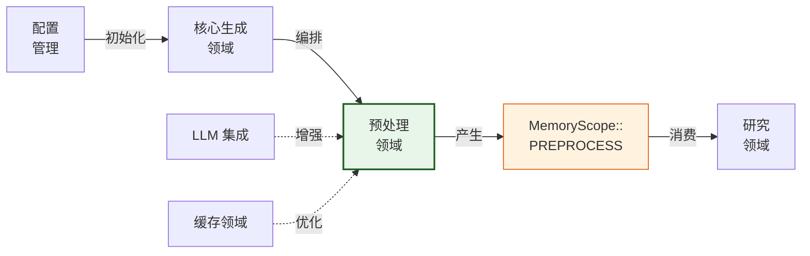
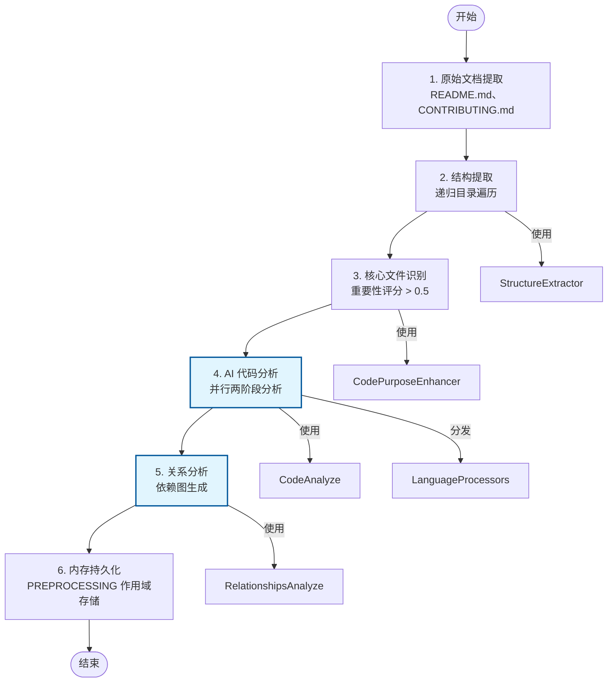

**技术文档：预处理领域**

**版本:** 1.0  
**系统:** deepwiki-rs  
**分类:** 核心业务领域  
**最后更新:** 2026-02-01 06:42:41 (UTC)

---

## 1. 概述

**预处理领域**构成 deepwiki-rs 文档生成流水线的基础阶段。作为四阶段工作流（预处理 → 研究 → 组合 → 输出）中的第一个可执行阶段，该领域负责将原始源代码存储库转换为结构化的、机器可读的分析制品。

该领域实现混合静态和 AI 分析策略，以从 12+ 种编程语言中提取项目拓扑、代码依赖、接口定义和架构关系。其主要输出—`Vec<CodeInsight>`—作为下游研究域智能体执行 C4 级架构分析的关键数据基础。

**关键特征：**
- **语言无关**: 基于 trait 的抽象支持 Rust、Java、Python、JavaScript、TypeScript、C#、PHP、Kotlin、Swift、React、Vue 和 Svelte
- **混合分析**: 结合高性能静态正则解析与 LLM 增强语义分析
- **并行执行**: 使用 Tokio 异步运行时与基于信号量的资源限制进行受控并发
- **有状态流水线**: 将结果持久化到作用域内存 (`MemoryScope::PREPROCESS`) 以进行跨领域数据传输

---

## 2. 架构定位

在系统的领域驱动设计 (DDD) 架构中，预处理领域位于**核心业务领域**层。它保持对基础设施域（配置、LLM 集成、缓存）的严格上游依赖，以及与研究域的下游数据契约。



**执行模式:**  
与研究域和组合域使用声明式 `StepForwardAgent` trait 框架不同，预处理采用**命令式执行模式**。该域中的智能体直接调用 `AgentExecutor` 以进行需要复杂过滤、并行化和分阶段持久化逻辑的数据转换任务的精细控制。

---

## 3. 核心组件

### 3.1 PreProcessAgent (编排器)

实现 `Generator<PreprocessingResult>` trait 的中央协调器。它执行确定性的六步工作流，具有结构化进度日志记录和性能检测。

**关键职责：**
- 流水线排序和错误边界管理
- 资源分配（通过 `config.llm.max_parallels` 的并行性限制）
- 跨组件数据编组
- 最终结果聚合和内存持久化

### 3.2 StructureExtractor

执行递归目录遍历的智能文件过滤。在尊重 `.gitignore` 语义和排除模式的同时，实现异步目录遍历的 `BoxFuture` 模式。

**能力：**
- 重要性评分算法（基于路径深度、命名约定、文件大小和扩展类型的多因素启发式）
- 层次项目结构序列化
- 与 `LanguageProcessorManager` 的早期语言检测集成

### 3.3 语言处理子系统

为跨异构代码库的统一分析提供基于 trait 的策略模式实现。

**架构：**
- **Trait 定义**: `LanguageProcessor`，具有 `extract_dependencies()`、`extract_interfaces()`、`determine_component_type()` 和 `complexity_metrics()` 方法
- **外观模式**: `LanguageProcessorManager` 基于扩展名匹配将文件路由到适当的具体处理器
- **具体实现**: 12+ 个专业处理器，利用预编译的正则表达式模式进行高效静态分析（例如，`^\\s*import\\s+([^;]+);` 用于 Java 导入提取）

### 3.4 分析智能体

**CodePurposeEnhancer**  
混合分类智能体，结合基于规则的启发式与 AI 回退。采用置信阈值 (0.7) 确定是使用 LLM 分类还是确定性模式匹配进行文件目的识别。

**CodeAnalyze 智能体**  
实现两阶段分析：
1. **静态阶段**: 基于正则的导入、导出、函数签名和复杂度指标提取
2. **AI 阶段**: 使用 `extract::<CodeInsight>()` 进行 LLM 增强，用于语义职责和架构角色分类

**RelationshipsAnalyze 智能体**  
执行以下操作的项目级架构分析组件：
- 重要性过滤的洞察聚合（保留评分 ≥ 0.6，前 150 个洞察）
- 通过 `PromptCompressor` 进行提示压缩以管理 LLM token 约束
- 具有循环依赖检测的依赖图生成

---

## 4. 处理工作流

预处理领域执行严格顺序的六步流水线：



### 步骤 1: 原始文档提取

使用 `OriginalDocumentExtractor` 从 `README.md`、`CONTRIBUTING.md` 和其他文档文件中提取高级项目元数据。保留原始结构以供后续组合阶段使用。

### 步骤 2: 结构提取

递归遍历项目目录，计算每个文件的重要性评分。评分高于 0.5 的文件被标记为 `is_core` 并优先进行深入分析。过滤器排除二进制文件、测试目录和隐藏配置文件。

### 步骤 3: 核心文件识别

使用 `CodePurposeEnhancer` 增强文件元数据，进行功能分类（例如，Controller、Service、Model、Utility）。基于规则的分类首先执行；模棱两可的情况升级到 LLM 分析。

### 步骤 4: AI 代码分析（并行执行）

计算最密集的阶段。在配置的资源约束 (`max_parallels`) 内执行 `do_parallel_with_limit()` 以并发处理核心文件。

对于每个文件：
- 语言特定处理器提取静态依赖和接口
- `AgentExecutor::extract::<CodeInsight>()` 生成语义分析，包括：
  - 功能职责
  - 检测到的架构模式
  - 复杂度指标（圈复杂度、LOC）
  - 文档注释（Javadoc、JSDoc、RustDoc）

### 步骤 5: 关系分析

将单个文件洞察聚合为项目级架构视图。通过以下方式实现 Token 管理：
- 基于重要性的过滤（从上下文中排除低相关性文件）
- 大型代码库的内容压缩策略
- `RelationshipAnalysis` 的结构化提取（依赖图、模块边界）

### 步骤 6: 内存持久化

将四个主要数据结构持久化到 `MemoryScope::PREPROCESS`：
- `PROJECT_STRUCTURE`: 带元数据的层次文件树
- `CODE_INSIGHTS`: 已分析代码档案的向量
- `RELATIONSHIPS`: 依赖和架构关系图
- `ORIGINAL_DOCUMENT`: 原始文档提取

---

## 5. 技术实现细节

### 5.1 并发模型

实现受控并行以防止 LLM API 调用期间的资源耗尽：

```rust
// 来自实现的模式
do_parallel_with_limit(
    codes_to_analyze,
    context.config.llm.max_parallels,
    |code| async move {
        // 使用克隆上下文的分析逻辑
    }
).await
```

**线程安全:**  
组件利用 `Arc<RwLock<T>>` 进行共享状态访问。`LanguageProcessorManager` 通过重新创建处理器实例实现 `Clone`，确保线程安全分发而不会污染解析器状态。

### 5.2 提示压缩策略

为了在关系分析期间适应 LLM 上下文窗口限制：

1. **过滤**: 仅保留 `importance_score >= 0.6` 的洞察
2. **截断**: 限制为前 150 个洞察和每个文件 20 个依赖
3. **语义压缩**: 具有可配置 `CompressionConfig` 的 `PromptCompressor`，在保留架构意义的同时减少 token 计数

### 5.3 重要性评分算法

确定分析优先级的多因素启发式：

```
重要性 = f(位置、命名、大小、扩展名、内容类型)

因素：
- 位置: src/、lib/ 路径权重更高 (0.3)
- 命名: main.*、index.*、mod.rs 获得奖励 (0.25)
- 大小: 最佳范围 1KB-50KB（范围外递减回报）
- 扩展名: 核心语言加权 0.3 vs 配置文件
- 数据库: SQL 相关路径被标记以进行条件分析
```

超过阈值 0.5 的文件接收完整 AI 分析；其他文件仅接收静态分析。

### 5.4 数据契约

**PreprocessingResult** (输出 DTO)：
```rust
pub struct PreprocessingResult {
    pub original_document: OriginalDocument,
    pub project_structure: ProjectStructure,
    pub code_insights: Vec<CodeInsight>,
    pub relationships: RelationshipAnalysis,
}
```

**CodeInsight** (核心制品)：

聚合静态分析 (`CodeDossier`) 与 AI 生成的语义理解：
- 接口（公共 API、导出）
- 依赖（导入、外部引用）
- 复杂度指标（圈复杂度、认知复杂度）
- 职责（目的的自然语言描述）
- 组件类型分类（领域服务、存储库、控制器等）

---

## 6. 集成接口

### 6.1 上游依赖

该领域通过 `Generator` trait 接收执行上下文：

```rust
pub trait Generator<T> {
    async fn execute(&self, context: GeneratorContext) -> Result<T>;
}
```

**GeneratorContext 提供：**
- `config`: 执行参数（并行性限制、排除模式）
- `llm_client`: 用于 AI 操作的 Arc 包装 LLM 客户端
- `cache_manager`: 结构提取的响应缓存
- `memory`: 用于结果持久化的作用域存储

### 6.2 下游消费

研究域智能体通过内存作用域访问检索预处理结果：

```rust
// 研究智能体使用的模式
let insights: Vec<CodeInsight> = context
    .memory
    .get_scoped(MemoryScope::PREPROCESS, ScopedKeys::CODE_INSIGHTS)
    .await?;
```

**契约稳定性:**  
`CodeInsight` 模式作为预处理和研究领域之间的稳定接口。此结构的更改需要跨两个域的同步更新。

---

## 7. 配置参数

影响预处理行为的关键配置值：

| 参数 | 领域 | 描述 | 默认值 |
|------|------|------|--------|
| `max_parallels` | LLM | 并发文件分析限制 | 5 |
| `max_depth` | 预处理 | 最大目录遍历深度 | 无限制 |
| `excluded_dirs` | 预处理 | 要排除的模式（例如，`tests/`、`target/`） | `[".git", "node_modules"]` |
| `importance_threshold` | 预处理 | 核心文件指定的最低评分 | 0.5 |
| `ai_confidence_threshold` | 预处理 | AI 分类的最低置信度 | 0.7 |

---

## 8. 错误处理与弹性

**快速失败策略:**  
代码分析中的关键错误（例如，LLM API 故障、解析 panic）通过 `anyhow::Result` 立即传播以停止流水线，防止损坏状态到达研究智能体。

**优雅降级：**
- 语言处理器对不支持的文件类型回退到通用文本分析
- 当置信度不足时，AI 分类回退到基于规则的启发式
- 单个文件分析失败不会级联（记录并跳过）

**资源保护：**
- 基于信号量的并发防止 LLM 速率限制违规
- Token 估算在 LLM 调用前防止提示溢出
- 文件系统操作上的超时处理防止深层目录结构上的挂起

---

## 9. 性能考虑

**优化策略：**
1. **缓存**: 通过目录状态的 MD5 哈希缓存结构提取结果
2. **惰性求值**: 语言处理器仅解析被标记为核心（重要性 > 0.5）的文件
3. **并行 I/O**: 整个过程中的异步文件操作；在必要时将阻塞系统调用卸载到 `tokio::task::spawn_blocking`
4. **内存效率**: 大型 `CodeInsight` 向量的流式 JSON 序列化；提示压缩将 LLM token 成本降低 40-60%

**瓶颈：**
- LLM API 延迟主导执行时间（通过并行化缓解）
- 具有数千个文件的深度递归目录影响内存使用（通过重要性过滤缓解）
- 语言处理器中的正则编译开销（通过惰性静态初始化缓解）

---

## 10. 扩展点

**添加语言支持：**
1. 为新语言实现 `LanguageProcessor` trait
2. 在 `LanguageProcessorManager` 扩展映射中注册处理器
3. 定义文件扩展名映射和导入/接口提取的正则模式

**自定义分析智能体：**
可以通过以下方式在步骤 4 和步骤 5 之间插入新的分析阶段：
1. 实现具有 `execute(context, inputs)` 接口的智能体结构
2. 在 `PreProcessAgent::execute` 工作流中添加调用
3. 为内存持久化定义新的 `ScopedKeys` 常量

---

**文档结束**
